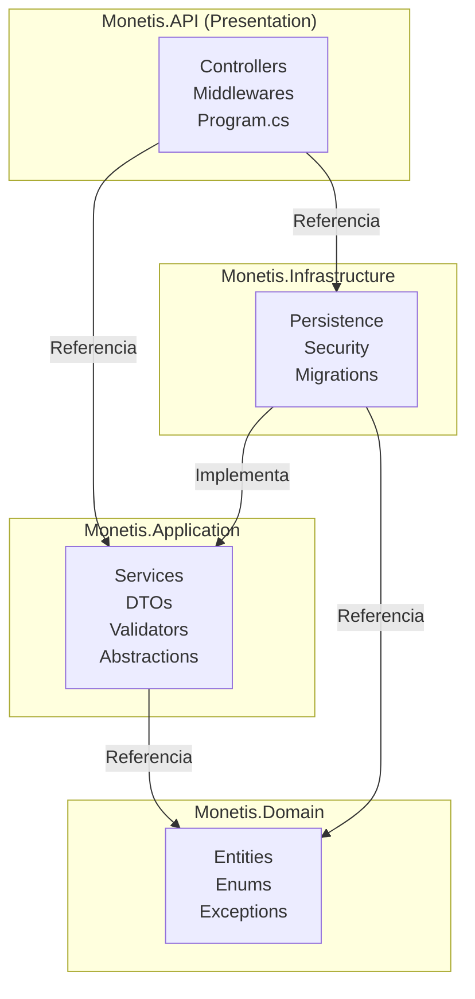
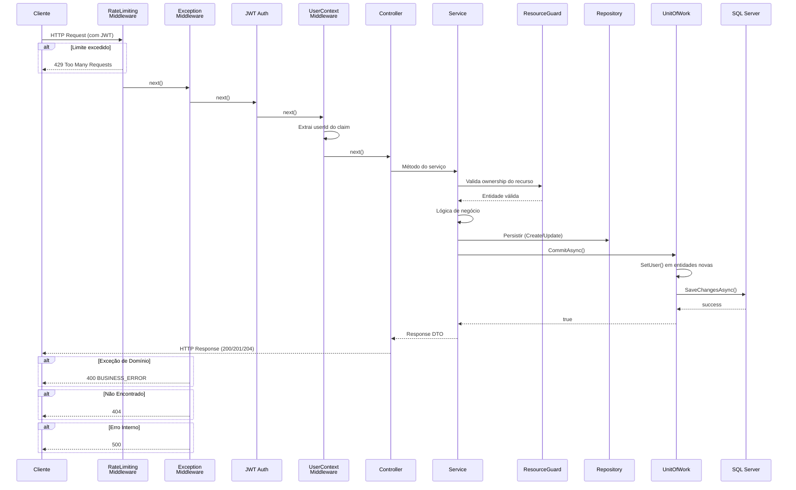

# 🏦 Monetis — Visão Geral do Backend

> **Sistema de Gestão Financeira Pessoal**  
> **Versão:** 1.0.0  
> **Arquitetura:** Clean Architecture (4 camadas)  
> **Stack:** .NET 8, EF Core, SQL Server, JWT, FluentValidation, Scalar/Swagger

---

## 1. Sobre o Projeto

Monetis é um sistema de gestão financeira pessoal que permite aos usuários gerenciar suas **contas**, **despesas**, **receitas**, **transferências** e **assinaturas** de forma organizada e segura.

### Principais funcionalidades

- **Contas** — Gerenciar contas correntes, poupança e cartão de crédito com saldo
- **Despesas** — Registrar gastos simples ou parcelados (2 a 24x), pagar à vista ou no crédito
- **Receitas** — Registrar entradas de dinheiro (salário, freela, etc.)
- **Transferências** — Transferir valores entre contas do mesmo usuário com opção de cancelamento (mesmo dia)
- **Assinaturas** — Gerenciar gastos recorrentes (mensal, semanal, anual, etc.) com geração automática de despesas
- **Categorias** — Categorizar despesas e receitas (sistema + categorias personalizadas)
- **Autenticação JWT** — Login seguro com tokens

---

## 2. Stack Tecnológica

| Tecnologia | Versão | Finalidade |
|-----------|--------|-----------|
| .NET | 8.0 | Runtime principal |
| ASP.NET Core | 8.0 | API REST |
| Entity Framework Core | 8.0 | ORM / Persistência |
| SQL Server | 2022+ | Banco de dados |
| JWT Bearer | — | Autenticação stateless |
| FluentValidation | 11.x | Validação de requests |
| Scalar | — | UI da documentação OpenAPI |
| Swagger / OpenAPI | — | Especificação da API |

---

## 3. Arquitetura em Camadas



### 3.1 Camada de Domínio (`Monetis.Domain`)
- **Responsabilidade:** Regras de negócio e entidades
- **Dependências:** Nenhuma (projeto puro C#)
- **Contém:** Entities, Enums, Exceptions

### 3.2 Camada de Aplicação (`Monetis.Application`)
- **Responsabilidade:** Casos de uso, validação, orquestração
- **Dependências:** Domain
- **Contém:** Services, DTOs, Validators, Abstractions (interfaces)

### 3.3 Camada de Infraestrutura (`Monetis.Infrastructure`)
- **Responsabilidade:** Implementações concretas (banco, segurança)
- **Dependências:** Application, Domain
- **Contém:** Persistence (EF Core), Security, Migrations

### 3.4 Camada de API (`Monetis.API`)
- **Responsabilidade:** Exposição REST, pipeline HTTP
- **Dependências:** Application, Infrastructure
- **Contém:** Controllers, Middlewares, Background Services, Program.cs

---

## 4. Projetos da Solution

```
Monetis.slnx
├── src/
│   ├── Monetis.Domain/           # Regras de negócio (0 dependências)
│   ├── Monetis.Application/      # Casos de uso (depende: Domain)
│   ├── Monetis.Infrastructure/   # Implementações (depende: Application, Domain)
│   └── Monetis.API/              # API REST (depende: Application, Infrastructure)
└── tests/
    └── Monetis.Domain.Tests/     # Testes unitários (previously referenced)
```

---

## 5. Estrutura de Pastas (Código Fonte)

```
src/
├── Monetis.Domain/
│   ├── Entities/              # Entidades de domínio
│   │   ├── BaseEntity.cs
│   │   ├── UserOwnedEntity.cs
│   │   ├── User.cs
│   │   ├── Account.cs
│   │   ├── Card.cs
│   │   ├── Category.cs
│   │   ├── Transaction.cs
│   │   ├── Subscription.cs
│   │   └── Transactions/      # Hierarquia TPH
│   │       ├── Expense.cs
│   │       ├── Income.cs
│   │       └── Transfer.cs
│   ├── Enums/                 # Enumerações
│   │   ├── AccountType.cs
│   │   ├── Frequency.cs
│   │   ├── PaymentMethod.cs
│   │   └── TransactionStatus.cs
│   └── Exceptions/            # Exceções de domínio (~60)
│       ├── DomainException.cs
│       ├── AccountExceptions.cs
│       ├── UserExceptions.cs
│       ├── ExpenseExceptions.cs
│       └── ...
├── Monetis.Application/
│   ├── Abstractions/
│   │   ├── Persistence/       # Interfaces de repositório
│   │   ├── Security/          # Interfaces de segurança
│   │   └── Services/          # Interfaces de serviço
│   ├── DTOs/                  # Contratos de entrada/saída
│   ├── Services/              # Implementações dos serviços
│   └── Validators/            # FluentValidation validators
├── Monetis.Infrastructure/
│   ├── Persistence/
│   │   ├── Contexts/          # DbContext + Factory
│   │   ├── Configurations/    # EF Core Fluent API
│   │   ├── Repositories/      # Implementações
│   │   ├── UnitOfWork.cs
│   │   └── SeedData.cs
│   ├── Security/              # JWT, Password Hashing
│   └── Migrations/            # EF Core migrations
└── Monetis.API/
    ├── Controllers/           # Endpoints REST
    ├── Middlewares/           # Pipeline HTTP
    └── BackgroundServices/   # Tarefas agendadas
```

---

## 6. Fluxo de uma Requisição Típica



---

## 7. Padrões e Conceitos Importantes

### Multi-tenancy
Cada usuário vê apenas seus próprios dados. O filtro é aplicado automaticamente via `HasQueryFilter` do EF Core em toda entidade que herda `UserOwnedEntity`. O `UserId` é extraído do JWT pelo `UserContextMiddleware` e injetado nos repositories via `UserContextAccessor`.

### TPH — Table Per Hierarchy
As transações (`Expense`, `Income`, `Transfer`) são mapeadas em uma única tabela `Transactions` com um campo `Discriminator` identificando o tipo.

### Resource Guard
Padrão de segurança que garante que um usuário só acesse recursos que lhe pertencem. Implementado em `UserResourceGuard`.

### Unit of Work
Centraliza a persistência e automaticamente atribui o `UserId` a entidades recém-criadas do tipo `UserOwnedEntity` antes de salvar.

---

## 8. Variáveis de Ambiente / Configuração

| Chave | Obrigatório | Descrição |
|-------|-------------|-----------|
| `ConnectionStrings__MonetisConnection` | ✅ | Connection string do SQL Server |
| `Jwt__Key` | ✅ | Chave secreta JWT (mínimo 32 caracteres) |
| `Jwt__Issuer` | ✅ | Emissor do token ("Monetis") |
| `Jwt__Audience` | ✅ | Audiência do token ("MonetisUsers") |

---

> **Próximo documento:** [Entidades de Domínio](01-domain/01-entidades.md)
