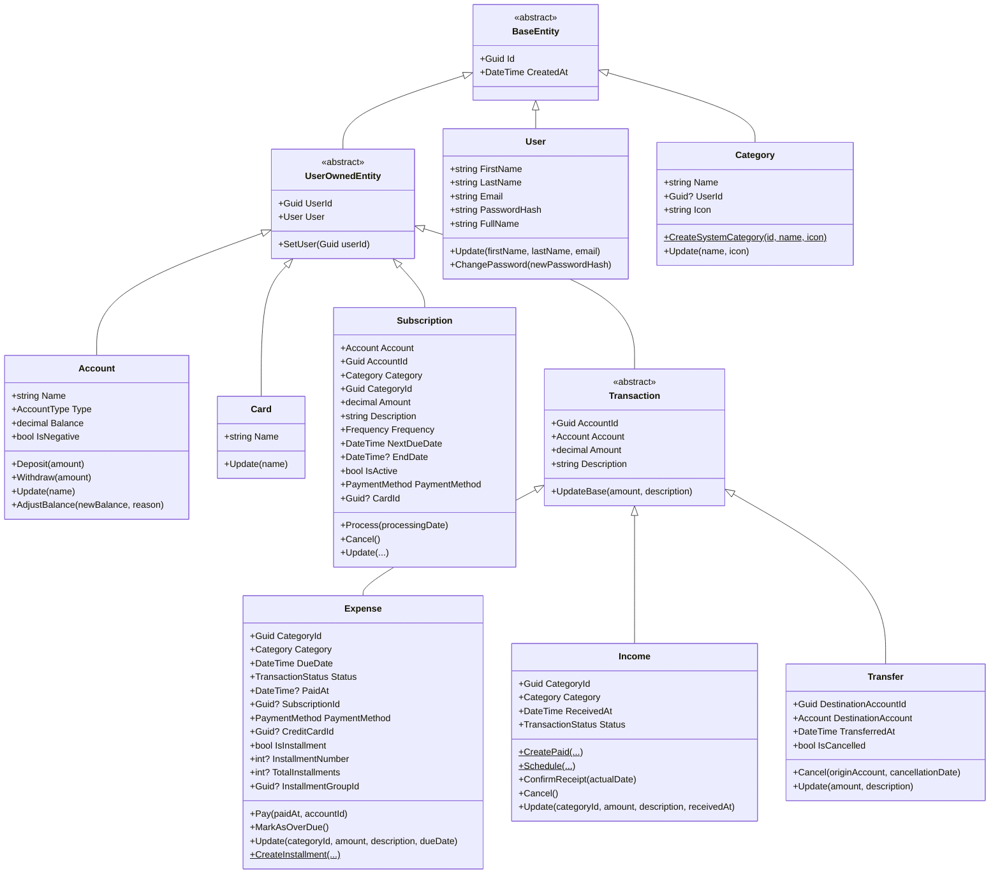
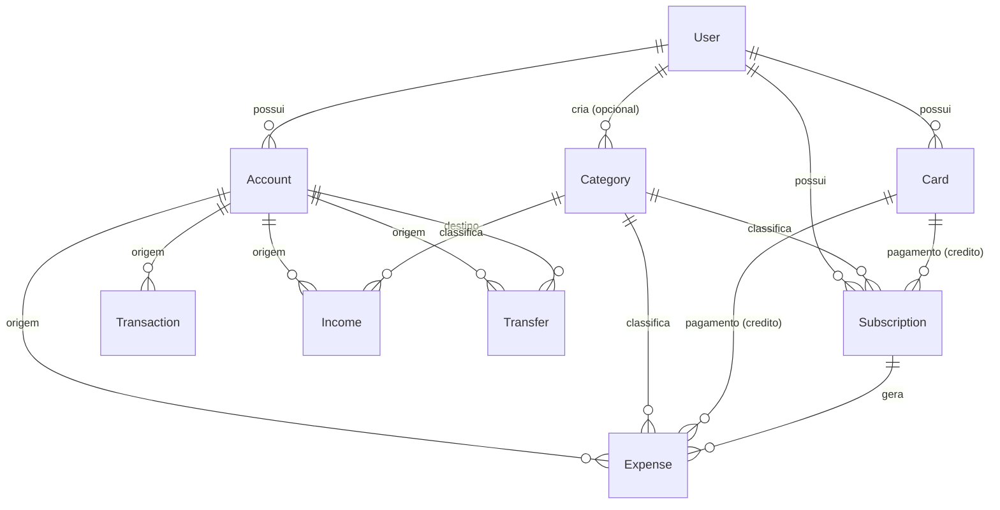
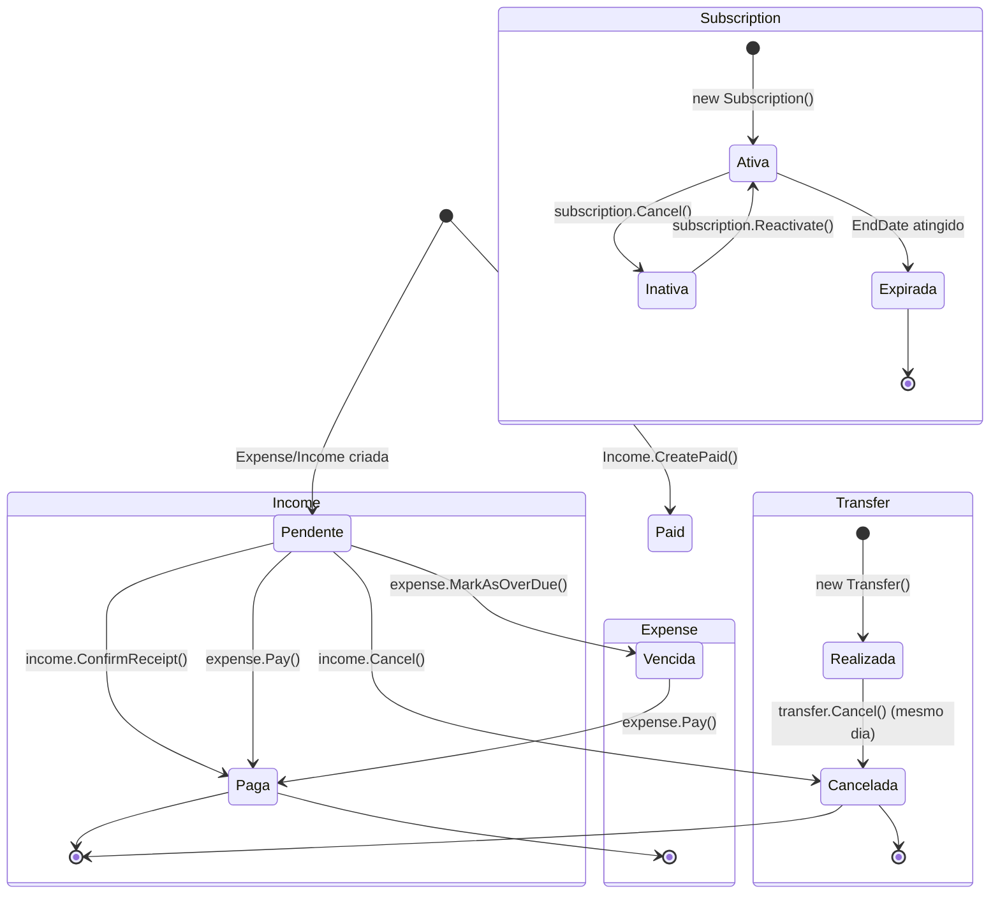

# 🧩 Entidades de Domínio

> **Camada:** Domain (`src/Monetis.Domain/Entities/`)  
> **Propósito:** Modelar as regras de negócio do sistema financeiro pessoal

---

## Índice

1. [BaseEntity](#1-baseentity)
2. [UserOwnedEntity](#2-userownedentity)
3. [User](#3-user)
4. [Account](#4-account)
5. [Card](#5-card)
6. [Category](#6-category)
7. [Transaction (abstract)](#7-transaction-abstract)
8. [Expense](#8-expense)
9. [Income](#9-income)
10. [Transfer](#10-transfer)
11. [Subscription](#11-subscription)

---

## Diagrama de Hierarquia de Classes

---

## 1. BaseEntity

Classe base abstrata para todas as entidades do domínio.

**Arquivo:** `src/Monetis.Domain/Entities/BaseEntity.cs`

**Propriedades:**

| Propriedade | Tipo | Restrições | Descrição |
|------------|------|-----------|-----------|
| `Id` | `Guid` | Gerado automaticamente (`Guid.NewGuid()`) | Identificador único da entidade |
| `CreatedAt` | `DateTime` | UTC, gerado automaticamente | Data de criação da entidade |

**Observações:**
- Construtor protegido — não pode ser instanciada diretamente
- `Id` é um Guid gerado em memória, não pelo banco (configurado como `ValueGeneratedNever()` no EF Core)

---

## 2. UserOwnedEntity

Classe base para entidades que pertencem a um usuário específico (multi-tenancy).

**Arquivo:** `src/Monetis.Domain/Entities/UserOwnedEntity.cs`

**Herda de:** `BaseEntity`

**Propriedades:**

| Propriedade | Tipo | Restrições | Descrição |
|------------|------|-----------|-----------|
| `UserId` | `Guid` | Só pode ser setado uma vez via `SetUser()` | ID do usuário dono da entidade |
| `User` | `User` | Navigation property (EF Core) | Referência ao usuário |

**Regras de Negócio:**
- `SetUser(Guid userId)` só pode ser chamado **uma vez**. Se `UserId` já foi definido (diferente de `Guid.Empty`), lança `UserOwnedEntityUserAlreadySetException`
- O `UserId` é automaticamente atribuído pelo `UnitOfWork.CommitAsync()` em entidades novas

**Métodos Públicos:**

| Método | Parâmetros | Comportamento | Exceções |
|--------|-----------|--------------|----------|
| `SetUser` | `Guid userId` | Define o `UserId` se ainda não foi definido | `UserOwnedEntityUserAlreadySetException` |

---

## 3. User

Representa um usuário do sistema.

**Arquivo:** `src/Monetis.Domain/Entities/User.cs`

**Herda de:** `BaseEntity`  
**Tabela:** `Users`

**Propriedades:**

| Propriedade | Tipo | Restrições | Descrição |
|------------|------|-----------|-----------|
| `FirstName` | `string` | Obrigatório, 2-50 caracteres | Nome do usuário |
| `LastName` | `string` | Obrigatório, 2-50 caracteres | Sobrenome do usuário |
| `Email` | `string` | Obrigatório, formato email, único | Email do usuário |
| `PasswordHash` | `string` | Obrigatório | Hash da senha (ASP.NET Identity PasswordHasher) |
| `FullName` | `string` | Propriedade calculada (read-only) | `$"{FirstName} {LastName}"` |

**Regras de Negócio:**
- Nome e sobrenome: obrigatórios, 2-50 caracteres
- Email: obrigatório, formato válido (regex `^[^@\s]+@[^@\s]+\.[^@\s]+$`), convertido para minúsculo e trimado
- Senha: hash obrigatório na criação
- Email é único no banco (índice único na coluna)

**Métodos Públicos:**

| Método | Parâmetros | Comportamento | Exceções |
|--------|-----------|--------------|----------|
| `Update` | `firstName, lastName, email` | Valida e atualiza dados | `UserFirstNameRequiredException`, `UserLastNameRequiredException`, `UserEmailRequiredException`, `UserEmailInvalidException`, etc. |
| `ChangePassword` | `newPasswordHash` | Atualiza o hash da senha | `UserNewPasswordRequiredException` |

---

## 4. Account

Representa uma conta financeira do usuário (corrente, poupança ou cartão de crédito).

**Arquivo:** `src/Monetis.Domain/Entities/Account.cs`

**Herda de:** `UserOwnedEntity`  
**Tabela:** `Accounts`

**Propriedades:**

| Propriedade | Tipo | Restrições | Descrição |
|------------|------|-----------|-----------|
| `Name` | `string` | Obrigatório, max 25 caracteres | Nome da conta |
| `Type` | `AccountType` | Enum: Checking, Saving, CreditCard | Tipo da conta |
| `Balance` | `decimal` | Pode ser negativo | Saldo atual da conta |
| `IsNegative` | `bool` | Read-only | `Balance < 0` |

**Regras de Negócio:**
- Nome: obrigatório, máximo 25 caracteres
- Saldo inicial é sempre 0
- Saldo **pode** ser negativo (a conta permite ficar negativa)
- Depósitos e saques: valor deve ser positivo
- Ajuste manual de saldo: requer motivo com mínimo 5 caracteres

**Métodos Públicos:**

| Método | Parâmetros | Comportamento | Exceções |
|--------|-----------|--------------|----------|
| `Deposit` | `decimal amount` | Adiciona ao saldo (`Balance += amount`) | `AccountAmountMustBePositiveException` |
| `Withdraw` | `decimal amount` | Subtrai do saldo (`Balance -= amount`) | `AccountAmountMustBePositiveException` |
| `Update` | `string name` | Altera o nome | `AccountNameRequiredException`, `AccountNameTooLongException` |
| `AdjustBalance` | `decimal newBalance, string reason` | Define saldo diretamente | `AccountAdjustmentReasonInvalidException` |

---

## 5. Card

Representa um cartão de crédito do usuário.

**Arquivo:** `src/Monetis.Domain/Entities/Card.cs`

**Herda de:** `UserOwnedEntity`  
**Tabela:** `Cards`

**Propriedades:**

| Propriedade | Tipo | Restrições | Descrição |
|------------|------|-----------|-----------|
| `Name` | `string` | Obrigatório | Nome do cartão |

**Métodos Públicos:**

| Método | Parâmetros | Comportamento | Exceções |
|--------|-----------|--------------|----------|
| `Update` | `string name` | Altera o nome | `CardNameRequiredException` |

---

## 6. Category

Representa uma categoria para classificar transações. Pode ser do sistema (UserId = null) ou do usuário.

**Arquivo:** `src/Monetis.Domain/Entities/Category.cs`

**Herda de:** `BaseEntity` (NÃO herda UserOwnedEntity)  
**Tabela:** `Categories`

> ⚠️ **Importante:** Category NÃO herda `UserOwnedEntity` porque existem categorias do sistema (compartilhadas). O filtro de tenant é especial: `WHERE UserId IS NULL OR UserId = @CurrentUserId`.

**Propriedades:**

| Propriedade | Tipo | Restrições | Descrição |
|------------|------|-----------|-----------|
| `Name` | `string` | Obrigatório | Nome da categoria |
| `UserId` | `Guid?` | Nullable (null = categoria do sistema) | Dono da categoria |
| `User` | `User?` | Navigation property | Referência ao usuário |
| `Icon` | `string` | Obrigatório | Emoji ou ícone da categoria |

**Métodos Públicos:**

| Método | Parâmetros | Comportamento | Exceções |
|--------|-----------|--------------|----------|
| `CreateSystemCategory` | `Guid id, string name, string icon` | Cria categoria do sistema (UserId = null) | — |
| `Update` | `string name, string icon` | Altera nome e ícone | `CategoryNameRequiredException`, `CategoryIconRequiredException` |

**Categorias do Sistema (Seed):**

| Nome | Ícone | ID |
|------|-------|----|
| Alimentação | 🍽️ | `28e61ce8-8149-4c81-a570-c0085eefa121` |
| Transporte | 🚗 | `e29e79d5-7844-491f-a9bd-9e744890555b` |
| Salário | 💰 | `96d53840-9752-4f2b-a522-c7357cdc4986` |

---

## 7. Transaction (abstract)

Classe base abstrata para todas as transações financeiras.

**Arquivo:** `src/Monetis.Domain/Entities/Transaction.cs`

**Herda de:** `UserOwnedEntity`  
**Tabela:** `Transactions` (TPH — Table per Hierarchy)

**Propriedades:**

| Propriedade | Tipo | Restrições | Descrição |
|------------|------|-----------|-----------|
| `AccountId` | `Guid` | Obrigatório | Conta de origem |
| `Account` | `Account` | Navigation property | Referência à conta |
| `Amount` | `decimal` | > 0 | Valor da transação |
| `Description` | `string` | 1-200 caracteres | Descrição da transação |

**Regras de Negócio:**
- Amount deve ser positivo (> 0)
- Description: obrigatória, máximo 200 caracteres
- AccountId: obrigatório (diferente de Guid.Empty)

**Métodos Protegidos:**

| Método | Parâmetros | Comportamento | Exceções |
|--------|-----------|--------------|----------|
| `UpdateBase` | `decimal amount, string description` | Valida e atualiza amount/description | `TransactionAmountMustBePositiveException`, `TransactionDescriptionRequiredException`, `TransactionDescriptionTooLongException` |
| `ChangeAccount` | `Guid newAccountId` | Altera a AccountId | `TransactionInvalidAccountException` |

---

## 8. Expense

Representa uma despesa (gasto) do usuário.

**Arquivo:** `src/Monetis.Domain/Entities/Transactions/Expense.cs`

**Herda de:** `Transaction`  
**Discriminator TPH:** `"Expense"`

**Propriedades:**

| Propriedade | Tipo | Restrições | Descrição |
|------------|------|-----------|-----------|
| `CategoryId` | `Guid` | Obrigatório | Categoria da despesa |
| `Category` | `Category` | Navigation property | — |
| `DueDate` | `DateTime` | ≥ -1 ano de hoje | Data de vencimento |
| `Status` | `TransactionStatus` | Pending, Paid, Overdue, Cancelled | Status atual |
| `PaidAt` | `DateTime?` | Nullable | Data de pagamento |
| `SubscriptionId` | `Guid?` | Nullable | Assinatura que gerou esta despesa |
| `PaymentMethod` | `PaymentMethod` | Cash, Debit, CreditCard, Pix, Transfer | Forma de pagamento |
| `CreditCardId` | `Guid?` | Obrigatório se for crédito | Cartão de crédito |
| `IsInstallment` | `bool` | — | É uma parcela? |
| `InstallmentNumber` | `int?` | 1-N | Número da parcela |
| `TotalInstallments` | `int?` | 2-24 | Total de parcelas |
| `InstallmentGroupId` | `Guid?` | — | Grupo de parcelas |
| `IsPaidInCash` | `bool` | Read-only | `PaymentMethod == Cash \|\| Debit \|\| Pix` |

**Regras de Negócio:**
- CategoryId: obrigatório
- DueDate: não pode ser anterior a 1 ano atrás
- Se for pagamento em crédito, CreditCardId é obrigatório
- Se NÃO for crédito, CreditCardId deve ser null
- Parcelas: mínimo 2, máximo 24, obrigatório cartão de crédito
- Despesa paga não pode ser atualizada
- Parcela individual não pode ser atualizada (deve atualizar o grupo todo)

**Métodos Públicos:**

| Método | Parâmetros | Comportamento | Exceções |
|--------|-----------|--------------|----------|
| `Pay` | `DateTime paidAt, Guid actualAccountId` | Marca como paga, altera conta se necessário | `ExpenseAlreadyPaidException` |
| `MarkAsOverDue` | — | Marca como vencida se `Pending && DueDate < today` | — |
| `Update` | `categoryId, amount, description, dueDate` | Atualiza dados (apenas se não paga/não parcela) | `PaidExpenseCannotBeUpdatedException`, `InstallmentExpenseCannotBeUpdatedException` |
| `CreateInstallment` (static) | `accountId, categoryId, totalAmount, description, firstDueDate, numberOfInstallments, creditCardId` | Cria N despesas parceladas com mesmo `InstallmentGroupId` | `ExpenseInstallmentRangeException`, `ExpenseTotalAmountMustBePositiveException`, `ExpenseCreditCardRequiredForInstallmentsException` |

---

## 9. Income

Representa uma receita (entrada de dinheiro).

**Arquivo:** `src/Monetis.Domain/Entities/Transactions/Income.cs`

**Herda de:** `Transaction`  
**Discriminator TPH:** `"Income"`

**Propriedades:**

| Propriedade | Tipo | Restrições | Descrição |
|------------|------|-----------|-----------|
| `CategoryId` | `Guid` | Obrigatório | Categoria da receita |
| `Category` | `Category` | Navigation property | — |
| `ReceivedAt` | `DateTime` | ≤ data atual (se paga), > data atual (se agendada) | Data de recebimento |
| `Status` | `TransactionStatus` | Pending, Paid, Cancelled | Status atual |

**Regras de Negócio:**
- Dois modos de criação:
  - `CreatePaid()` — receita já recebida (ReceivedAt ≤ hoje)
  - `Schedule()` — receita futura agendada (expectedDate > hoje)
- Receita já recebida não pode ser cancelada (`ReceivedIncomeCannotBeCancelledException`)
- Receita agendada pode ser confirmada via `ConfirmReceipt()`

**Métodos Públicos:**

| Método | Parâmetros | Comportamento | Exceções |
|--------|-----------|--------------|----------|
| `CreatePaid` (static) | `accountId, categoryId, amount, description, receivedAt` | Cria receita já recebida (Status = Paid) | `IncomeReceivedDateInFutureException` |
| `Schedule` (static) | `accountId, categoryId, amount, description, expectedDate` | Cria receita agendada (Status = Pending) | `IncomeExpectedDateMustBeFutureException` |
| `ConfirmReceipt` | `DateTime? actualDate` | Confirma recebimento, define Status = Paid | `IncomeAlreadyReceivedException` |
| `Cancel` | — | Cancela receita (apenas Pendente) | `ReceivedIncomeCannotBeCancelledException` |
| `Update` | `categoryId, amount, description, receivedAt` | Atualiza dados | `IncomeAmountMustBePositiveException`, `IncomeCategoryRequiredException` |

---

## 10. Transfer

Representa uma transferência entre contas do mesmo usuário.

**Arquivo:** `src/Monetis.Domain/Entities/Transactions/Transfer.cs`

**Herda de:** `Transaction`  
**Discriminator TPH:** `"Transfer"`

**Propriedades:**

| Propriedade | Tipo | Restrições | Descrição |
|------------|------|-----------|-----------|
| `DestinationAccountId` | `Guid` | Obrigatório, diferente de AccountId | Conta de destino |
| `DestinationAccount` | `Account` | Navigation property | — |
| `TransferredAt` | `DateTime` | ≤ now + 5 minutos | Data da transferência |
| `IsCancelled` | `bool` | — | Foi cancelada? |

**Regras de Negócio:**
- Conta de origem e destino devem ser diferentes
- Ambas as contas devem pertencer ao **mesmo usuário**
- Amount deve ser positivo
- Data não pode ser futura (tolerância de 5 minutos)
- Saldo da origem deve ser suficiente no momento da criação
- **O cancelamento transfere o valor de volta** e só pode ser feito no mesmo dia
- O construtor **já executa** a transferência de saldo (`Withdraw` na origem, `Deposit` no destino)

**Métodos Públicos:**

| Método | Parâmetros | Comportamento | Exceções |
|--------|-----------|--------------|----------|
| `Cancel` | `Account originAccount, DateTime cancellationDate` | Estorna valores, marca como cancelada | `TransferAlreadyCancelledException`, `TransferCancellationSameDayOnlyException`, `TransferOriginAccountMismatchException` |
| `Update` | `decimal amount, string description` | Atualiza dados (apenas se não cancelada) | `TransferAlreadyCancelledException` |

---

## 11. Subscription

Representa uma assinatura ou gasto recorrente.

**Arquivo:** `src/Monetis.Domain/Entities/Subscription.cs`

**Herda de:** `UserOwnedEntity`  
**Tabela:** `Subscriptions`

**Propriedades:**

| Propriedade | Tipo | Restrições | Descrição |
|------------|------|-----------|-----------|
| `AccountId` | `Guid` | Obrigatório | Conta de débito |
| `Account` | `Account` | Navigation property | — |
| `CategoryId` | `Guid` | Obrigatório | Categoria |
| `Category` | `Category` | Navigation property | — |
| `Amount` | `decimal` | > 0 | Valor da recorrência |
| `Description` | `string` | Obrigatório, max 200 | Descrição |
| `Frequency` | `Frequency` | Enum | Periodicidade |
| `NextDueDate` | `DateTime` | Data do próximo vencimento |
| `EndDate` | `DateTime?` | Nullable | Data de término |
| `IsActive` | `bool` | Default: true | Está ativa? |
| `LastProcessedAt` | `DateTime?` | Nullable | Último processamento |
| `PaymentMethod` | `PaymentMethod` | Forma de pagamento |
| `CardId` | `Guid?` | Nullable | Cartão de crédito (se for crédito) |
| `Card` | `Card` | Navigation property | — |
| `GeneratedExpenses` | `ICollection<Expense>` | Navigation property | Despesas geradas |

**Regras de Negócio:**
- Ao criar, **já processa a primeira despesa** automaticamente
- `Process()` gera uma `Expense`, calcula a próxima data, e atualiza `LastProcessedAt`
- Se a subscription atingir o `EndDate`, é desativada automaticamente
- Não pode processar subscription inativa ou já encerrada
- Frequências: Weekly, Biweekly, Monthly, Bimonthly, Quarterly, Semiannual, Yearly
- Método de pagamento: se for crédito, CardId é obrigatório; se não for crédito, CardId deve ser null

**Métodos Públicos:**

| Método | Parâmetros | Comportamento | Exceções |
|--------|-----------|--------------|----------|
| `Process` | `DateTime? processingDate` | Gera Expense + calcula próxima data | `SubscriptionInactiveProcessException`, `SubscriptionEndedException`, `SubscriptionNotDueYetException` |
| `Cancel` | — | Define `IsActive = false` | — |
| `Reactivate` | `DateTime? newNextDueDate` | Reativa subscription, recalcula próxima data | `SubscriptionCannotReactivateAfterEndDateException` |
| `Update` | `amount, description, frequency, nextDueDate, isActive, paymentMethod, accountId, endDate?, creditCardId?` | Atualiza todos os dados | `SubscriptionAmountMustBePositiveException`, `SubscriptionDescriptionRequiredException`, etc. |

### Frequências e Cálculo da Próxima Data

| Frequency | Cálculo |
|-----------|--------|
| Weekly | +7 dias |
| Biweekly | +15 dias |
| Monthly | +1 mês |
| Bimonthly | +2 meses |
| Quarterly | +3 meses |
| Semiannual | +6 meses |
| Yearly | +1 ano |

---

## Diagrama de Relacionamentos (MER)

---

## Diagrama de Ciclo de Vida

---

> **Próximo:** [Enums](02-enums.md)
