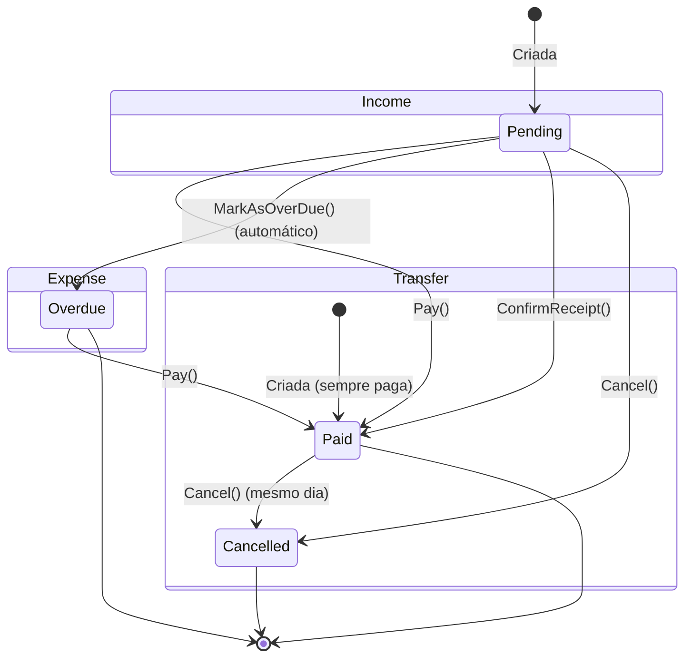

# 🔢 Enums de Domínio

> **Camada:** Domain (`src/Monetis.Domain/Enums/`)  
> **Propósito:** Enumerações que definem os tipos e estados do sistema

---

## Índice

1. [AccountType](#1-accounttype)
2. [Frequency](#2-frequency)
3. [PaymentMethod](#3-paymentmethod)
4. [TransactionStatus](#4-transactionstatus)

---

## 1. AccountType

Define os tipos de conta financeira.

**Arquivo:** `src/Monetis.Domain/Enums/AccountType.cs`

| Valor | Descrição | Uso |
|-------|-----------|-----|
| `Checking` | Conta corrente | Conta para despesas do dia a dia |
| `Saving` | Poupança | Conta para reservas e economias |
| `CreditCard` | Cartão de crédito | Conta especial para faturas de cartão |

**Onde é usado:**
- `Account.Type`

**Mapeamento no banco:** Armazenado como string (`nvarchar(25)`) via `HasConversion<string>()`.

---

## 2. Frequency

Define a periodicidade de recorrência de assinaturas.

**Arquivo:** `src/Monetis.Domain/Enums/Frequency.cs`

| Valor | Descrição | Cálculo da próxima data |
|-------|-----------|------------------------|
| `Weekly` | Semanal | +7 dias |
| `Biweekly` | Quinzenal | +15 dias |
| `Monthly` | Mensal | +1 mês |
| `Bimonthly` | Bimestral | +2 meses |
| `Quarterly` | Trimestral | +3 meses |
| `Semiannual` | Semestral | +6 meses |
| `Yearly` | Anual | +1 ano |

**Onde é usado:**
- `Subscription.Frequency`

**Mapeamento no banco:** Armazenado como inteiro (default do EF Core para enums).

---

## 3. PaymentMethod

Define as formas de pagamento disponíveis.

**Arquivo:** `src/Monetis.Domain/Enums/PaymentMethod.cs`

| Valor | Descrição | Cartão necessário? |
|-------|-----------|-------------------|
| `Cash` | Dinheiro | ❌ |
| `Debit` | Débito | ❌ |
| `CreditCard` | Cartão de crédito | ✅ `CardId` obrigatório |
| `Pix` | Pix | ❌ |
| `Transfer` | Transferência | ❌ |

**Onde é usado:**
- `Expense.PaymentMethod`
- `Subscription.PaymentMethod`

**Regras de Negócio associadas:**
- **Expense:** Se `PaymentMethod == CreditCard`, `CreditCardId` é obrigatório. Se for outro método e `CreditCardId` foi informado, lança `ExpenseCreditCardOnlyForCreditCardPaymentException`.
- **Subscription:** Similar ao Expense — se crédito, `CardId` obrigatório; se não for crédito, `CardId` deve ser null.
- **Pagamento à vista (IsPaidInCash):** `Cash || Debit || Pix` — quando uma despesa é criada com esses métodos, o valor é automaticamente debitado da conta.

---

## 4. TransactionStatus

Define os estados possíveis de uma transação.

**Arquivo:** `src/Monetis.Domain/Enums/TransactionStatus.cs`

| Valor | Descrição | Aplicável a |
|-------|-----------|-------------|
| `Pending` | Pendente (não processada) | Expense, Income (agendada) |
| `Paid` | Paga / Recebida | Expense, Income |
| `Cancelled` | Cancelada | Income, Transfer |
| `Overdue` | Vencida (atrasada) | Expense |

### Diagrama de Estados

### Matriz de Transições de Estado

| Entidade | Estado Inicial | Transições Possíveis |
|----------|---------------|---------------------|
| **Expense** | `Pending` | → `Paid` (via Pay), → `Overdue` (via MarkAsOverDue) |
| **Expense (Overdue)** | `Overdue` | → `Paid` (via Pay) |
| **Income (CreatePaid)** | `Paid` | (terminal) |
| **Income (Schedule)** | `Pending` | → `Paid` (via ConfirmReceipt), → `Cancelled` (via Cancel) |
| **Transfer** | `Paid` | → `Cancelled` (via Cancel, mesmo dia apenas) |

---

> **Próximo:** [Exceções de Domínio](03-excecoes.md) *(Fase 2)*
