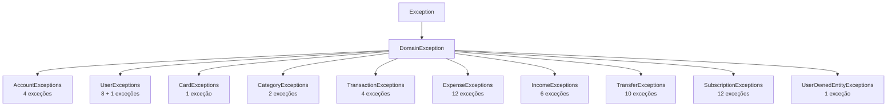

# ❌ Exceções de Domínio

> **Camada:** Domain (`src/Monetis.Domain/Exceptions/`)  
> **Total:** ~60 exceções  
> **Base:** `DomainException` → `Exception`

---

## Índice

1. [Hierarquia](#1-hierarquia)
2. [Account Exceptions](#2-account-exceptions)
3. [User Exceptions](#3-user-exceptions)
4. [Card Exceptions](#4-card-exceptions)
5. [Category Exceptions](#5-category-exceptions)
6. [Transaction Exceptions](#6-transaction-exceptions)
7. [Expense Exceptions](#7-expense-exceptions)
8. [Income Exceptions](#8-income-exceptions)
9. [Transfer Exceptions](#9-transfer-exceptions)
10. [Subscription Exceptions](#10-subscription-exceptions)
11. [UserOwnedEntity Exceptions](#11-userownedentity-exceptions)

---

## 1. Hierarquia

### Mapeamento HTTP (ExceptionMiddleware)

| Exceção | Status HTTP | Error Code |
|---------|------------|------------|
| `DomainException` | 400 | `BUSINESS_ERROR` |
| `ArgumentException` | 400 | `04X0` |
| `KeyNotFoundException` | 404 | `04X4` |
| Outras (`Exception`) | 500 | `07X0` |

---

## 2. Account Exceptions

**Arquivo:** `src/Monetis.Domain/Exceptions/AccountExceptions.cs`

| Exceção | Mensagem | Quando ocorre |
|---------|----------|--------------|
| `AccountNameRequiredException` | "Account name is required" | Nome vazio ao criar/atualizar conta |
| `AccountNameTooLongException` | "Account name must be less than 100 characters" | Nome > 25 caracteres (validação de domínio) |
| `AccountAmountMustBePositiveException` | "Amount must be greater than zero" | Tentativa de depositar/sacar valor ≤ 0 |
| `AccountAdjustmentReasonInvalidException` | "Adjustment reason is required (min 5 characters)" | Razão do ajuste de saldo vazia ou < 5 caracteres |

> ⚠️ **Nota:** A mensagem do `AccountNameTooLongException` diz "100 characters", mas a validação real no domínio é `> 25`.

---

## 3. User Exceptions

**Arquivo:** `src/Monetis.Domain/Exceptions/UserExceptions.cs`

| Exceção | Mensagem | Quando ocorre |
|---------|----------|--------------|
| `UserPasswordRequiredException` | "A senha é obrigatória." | Senha vazia na criação do usuário |
| `UserNewPasswordRequiredException` | "The new password is required." | Nova senha vazia no `ChangePassword` |
| `UserFirstNameRequiredException` | "The name is required." | Nome vazio |
| `UserFirstNameInvalidException` | "The first name must contain between 2 and 50 characters." | Nome < 2 ou > 50 caracteres |
| `UserLastNameRequiredException` | "The last name is required." | Sobrenome vazio |
| `UserLastNameInvalidException` | "The last name must contain between 2 and 50 characters." | Sobrenome < 2 ou > 50 caracteres |
| `UserEmailRequiredException` | "The email is required." | Email vazio |
| `UserEmailInvalidException` | "The email format is invalid." | Email não passa no regex de validação |

### UserAlreadyExistsException

**Arquivo:** `src/Monetis.Domain/Exceptions/UserAlreadyExistsException.cs`

| Exceção | Mensagem | Quando ocorre |
|---------|----------|--------------|
| `UserAlreadyExistsException(string email)` | $"User with email {email} already exists." | Tentativa de criar usuário com email já cadastrado |

> **Nota:** Esta exceção é lançada pelo `UserService.CreateAsync` (Application), não diretamente pelo domínio, mas está na camada de Domain.

---

## 4. Card Exceptions

**Arquivo:** `src/Monetis.Domain/Exceptions/CardExceptions.cs`

| Exceção | Mensagem | Quando ocorre |
|---------|----------|--------------|
| `CardNameRequiredException` | "The name of card is required." | Nome do cartão vazio |

---

## 5. Category Exceptions

**Arquivo:** `src/Monetis.Domain/Exceptions/CategoryExceptions.cs`

| Exceção | Mensagem | Quando ocorre |
|---------|----------|--------------|
| `CategoryNameRequiredException` | "The name of category is required." | Nome da categoria vazio |
| `CategoryIconRequiredException` | "The icon is required." | Ícone da categoria vazio |

---

## 6. Transaction Exceptions

**Arquivo:** `src/Monetis.Domain/Exceptions/TransactionExceptions.cs`

| Exceção | Mensagem | Quando ocorre |
|---------|----------|--------------|
| `TransactionInvalidAccountException` | "Invalid Account Id" | AccountId é `Guid.Empty` |
| `TransactionAmountMustBePositiveException` | "Transaction amount must be greater than zero" | Amount ≤ 0 |
| `TransactionDescriptionRequiredException` | "Transaction description is required" | Descrição vazia |
| `TransactionDescriptionTooLongException` | "Transaction description must be less than or equal to 200 characters" | Descrição > 200 caracteres |

---

## 7. Expense Exceptions

**Arquivo:** `src/Monetis.Domain/Exceptions/ExpenseExceptions.cs`

| Exceção | Mensagem | Quando ocorre |
|---------|----------|--------------|
| `ExpenseAlreadyPaidException` | "This expense is already paid." | Tentar pagar despesa já paga |
| `PaidExpenseCannotBeUpdatedException` | "Cannot update a paid expense" | Tentar atualizar despesa paga |
| `InstallmentExpenseCannotBeUpdatedException` | "Cannot update individual installment. Update the entire group." | Tentar atualizar parcela individual |
| `ExpenseCategoryRequiredException` | "Category is required" | CategoryId vazio |
| `ExpenseInstallmentRangeException` | "Installments must be between 2 and 24" | Nº de parcelas fora do range |
| `ExpenseTotalAmountMustBePositiveException` | "Total amount must be greater than zero" | Valor total do parcelamento ≤ 0 |
| `ExpenseCreditCardRequiredException` | "Credit card is required for credit card payments" | PaymentMethod=CreditCard sem cartão |
| `ExpenseCreditCardRequiredForInstallmentsException` | "Credit card is required for installments" | Criar parcelas sem cartão de crédito |
| `ExpenseDueDateTooOldException` | "Due date is too far in the past" | DueDate < -1 ano de hoje |
| `ExpenseCreditCardOnlyForCreditCardPaymentException` | "Credit card should only be set for credit card payments" | CreditCardId informado para pagamento não-crédito |
| `ExpenseAmountMustBePositiveException` | "Amount is negative" | Amount ≤ 0 |
| `ExpenseDescriptionInvalidException` | "Description is invalid" | Descrição vazia ou > 100 caracteres |

---

## 8. Income Exceptions

**Arquivo:** `src/Monetis.Domain/Exceptions/IncomeExceptions.cs`

| Exceção | Mensagem | Quando ocorre |
|---------|----------|--------------|
| `IncomeReceivedDateInFutureException` | "Received date cannot be in the future for paid incomes" | `CreatePaid` com data futura |
| `IncomeExpectedDateMustBeFutureException` | "Expected date must be in the future for scheduled incomes" | `Schedule` com data ≤ hoje |
| `IncomeAlreadyReceivedException` | "Income is already received" | `ConfirmReceipt` em receita já recebida |
| `ReceivedIncomeCannotBeCancelledException` | "Cannot cancel an already received income" | `Cancel` em receita com Status = Paid |
| `IncomeAmountMustBePositiveException` | "Income amount must be greater than zero" | Amount ≤ 0 |
| `IncomeCategoryRequiredException` | "Category is required" | CategoryId vazio |

---

## 9. Transfer Exceptions

**Arquivo:** `src/Monetis.Domain/Exceptions/TransferExceptions.cs`

| Exceção | Mensagem | Quando ocorre |
|---------|----------|--------------|
| `TransferOriginAccountRequiredException` | "Origin account is required" | Conta de origem null |
| `TransferDestinationAccountRequiredException` | "Destination account is required" | Conta de destino null |
| `TransferAccountsMustBeDifferentException` | "Origin and destination accounts must be different" | Origem = Destino |
| `TransferAccountsMustBelongToSameUserException` | "Both accounts must belong to the same user" | Contas de usuários diferentes |
| `TransferAmountMustBePositiveException` | "Transfer amount must be greater than zero" | Amount ≤ 0 |
| `TransferDateInFutureException` | "Transfer date cannot be in the future" | Data > now + 5 minutos |
| `TransferInsufficientFundsException(decimal balance, decimal amount)` | $"Insufficient funds for transfer. Current balance: {balance:C}, Transfer amount: {amount:C}, Missing: {amount - balance:C}" | Saldo insuficiente na origem |
| `TransferAlreadyCancelledException` | "Transfer is already cancelled" | Tentar cancelar transferência já cancelada |
| `TransferCancellationSameDayOnlyException` | "Transfer can only be cancelled on the same day" | Tentar cancelar em dia diferente |
| `TransferOriginAccountMismatchException` | "Origin account does not match the transfer's origin account" | Conta de origem do cancelamento não confere |

---

## 10. Subscription Exceptions

**Arquivo:** `src/Monetis.Domain/Exceptions/SubscriptionExceptions.cs`

| Exceção | Mensagem | Quando ocorre |
|---------|----------|--------------|
| `SubscriptionInactiveProcessException` | "Cannot process inactive subscription" | Tentar processar subscription inativa |
| `SubscriptionEndedException` | "Subscription has reached end date" | Tentar processar subscription com EndDate atingido |
| `SubscriptionNotDueYetException(DateTime nextDueDate)` | $"Subscription is not due yet. Next due: {nextDueDate:dd/MM/yyyy}" | Tentar processar antes do vencimento |
| `SubscriptionCannotReactivateAfterEndDateException` | "Cannot reactivate subscription after end date" | Tentar reativar após EndDate |
| `SubscriptionInvalidFrequencyException` | "Invalid frequency" | Frequency inválido (default do switch) |
| `SubscriptionCategoryRequiredException` | "Category is required" | CategoryId vazio |
| `SubscriptionAmountMustBePositiveException` | "Amount must be greater than zero" | Amount ≤ 0 |
| `SubscriptionDescriptionInvalidException` | "Description is required and must be less than 200 characters" | Descrição inválida |
| `SubscriptionDescriptionRequiredException` | "Description is required" | Descrição vazia (no update) |
| `SubscriptionCardRequiredException` | "Card is required for credit card payments" | PaymentMethod=CreditCard sem cardId |
| `SubscriptionAccountRequiredException(PaymentMethod paymentMethod)` | $"Account is required for {paymentMethod} payments" | AccountId vazio |
| `SubscriptionCardOnlyForCreditCardPaymentException` | "Card should only be specified for credit card payments" | CardId informado sem ser crédito |

---

## 11. UserOwnedEntity Exceptions

**Arquivo:** `src/Monetis.Domain/Exceptions/UserOwnedEntityExceptions.cs`

| Exceção | Mensagem | Quando ocorre |
|---------|----------|--------------|
| `UserOwnedEntityUserAlreadySetException` | "UserId já foi definido e não pode ser alterado." | Tentar chamar `SetUser()` duas vezes |

---

## Tabela Resumo

| Categoria | Quantidade | Arquivo |
|-----------|-----------|---------|
| Account | 4 | `AccountExceptions.cs` |
| User | 8 | `UserExceptions.cs` |
| UserAlreadyExists | 1 | `UserAlreadyExistsException.cs` |
| Card | 1 | `CardExceptions.cs` |
| Category | 2 | `CategoryExceptions.cs` |
| Transaction | 4 | `TransactionExceptions.cs` |
| Expense | 12 | `ExpenseExceptions.cs` |
| Income | 6 | `IncomeExceptions.cs` |
| Transfer | 10 | `TransferExceptions.cs` |
| Subscription | 12 | `SubscriptionExceptions.cs` |
| UserOwnedEntity | 1 | `UserOwnedEntityExceptions.cs` |
| **Total** | **~61** | |

---

> **Próximo:** [Estratégia de Testes](../06-testes/01-estrategia.md)
