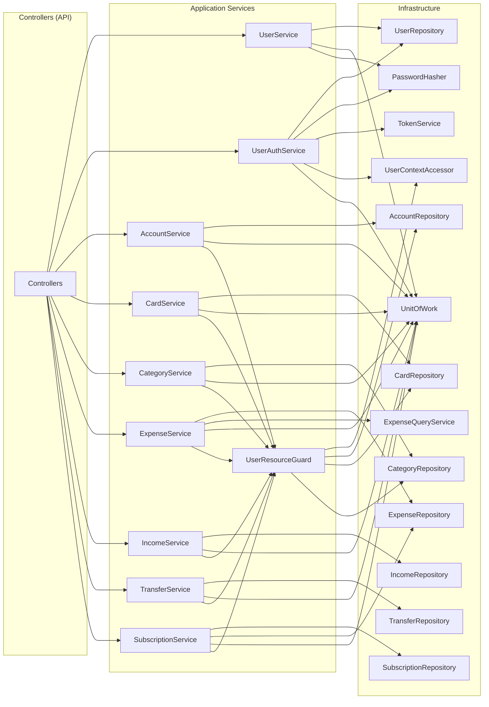

# ⚙️ Serviços de Aplicação

> **Camada:** Application (`src/Monetis.Application/Services/`)  
> **Propósito:** Orquestrar casos de uso, aplicar regras de negócio e coordenar persistência

---

## Índice

1. [UserService](#1-userservice)
2. [UserAuthService](#2-userauthservice)
3. [AccountService](#3-accountservice)
4. [CardService](#4-cardservice)
5. [CategoryService](#5-categoryservice)
6. [ExpenseService](#6-expenseservice)
7. [IncomeService](#7-incomeservice)
8. [TransferService](#8-transferservice)
9. [SubscriptionService](#9-subscriptionservice)
10. [UserResourceGuard](#10-userresourceguard)

---

## Diagrama de Dependências



---

## 1. UserService

**Interface:** `IUserService`  
**Arquivo:** `Services/UserServices/UserService.cs`

**Dependências:**
| Dependência | Finalidade |
|-------------|-----------|
| `IUserRepository` | Persistência de usuários |
| `IUnitOfWork` | Commit (Salvar) |
| `IPasswordHasher` | Hash de senha |
| `ILogger<UserService>` | Log |

**Métodos:**

### `GetByIdAsync(Guid id)`
Obtém um usuário pelo ID (read-only).

```
UserRepository.GetByIdReadOnlyAsync(id)
  → UserResponse ou null
```

### `GetAllAsync()`
Lista todos os usuários (read-only).

```
UserRepository.GetAllReadOnlyAsync()
  → IEnumerable<UserResponse>
```

### `CreateAsync(CreateUserRequest request)`
Cria um novo usuário com senha hasheada.

```
1. Verifica se email já existe → UserAlreadyExistsException
2. PasswordHasher.Hash(request.Password)
3. new User(firstName, lastName, email, hash)
4. UserRepository.Create(user)
5. UnitOfWork.CommitAsync()
  → UserResponse
```

### `UpdateAsync(Guid id, UpdateUserRequest request)`
Atualiza dados do usuário.

```
1. UserRepository.GetByIdAsync(id) → KeyNotFoundException se null
2. user.Update(firstName, lastName, email)
3. UserRepository.Update(user)
4. UnitOfWork.CommitAsync()
```

### `DeleteAsync(Guid id)`
Remove um usuário.

```
1. UserRepository.DeleteAsync(id)
2. UnitOfWork.CommitAsync()
```

---

## 2. UserAuthService

**Interface:** `IUserAuthService`  
**Arquivo:** `Services/UserServices/UserAuthService.cs`

**Dependências:**
| Dependência | Finalidade |
|-------------|-----------|
| `ITokenService` | Geração de JWT |
| `IUserRepository` | Busca de usuário |
| `IPasswordHasher` | Verificação de senha |
| `IUserContextAccessor` | Obter userId atual |
| `IUnitOfWork` | Commit |

**Métodos:**

### `LoginAsync(LoginUserRequest request)`
Autentica usuário e retorna token JWT.

```
1. UserRepository.GetUserByEmailAsync(email) → Unauthorized se null
2. PasswordHasher.Verify(password, user.PasswordHash) → Unauthorized se inválido
3. TokenService.GenerateToken(user.Id, user.Email)
  → "eyJhbGciOiJ..." (token JWT)
```

> 🐛 **Bug conhecido:** `ChangePasswordAsync` usa `GetUserByEmailAsync(userContextAccessor.UserId.ToString())` — deveria usar `GetByIdAsync` em vez de converter Guid para string e buscar por email.

### `ChangePasswordAsync(ChangePasswordRequest request)`
Altera a senha do usuário autenticado.

```
1. UserRepository.GetUserByEmailAsync(userId.ToString()) → ??? (bug)
2. PasswordHasher.Verify(currentPassword, user.PasswordHash) → Unauthorized
3. PasswordHasher.Hash(newPassword)
4. user.ChangePassword(newHash)
5. UserRepository.Update(user)
6. UnitOfWork.CommitAsync()
```

---

## 3. AccountService

**Interface:** `IAccountService`  
**Arquivo:** `Services/AccountService.cs`

**Dependências:** `IAccountRepository`, `IUnitOfWork`, `IUserResourceGuard`, `ILogger`

**Métodos:**

| Método | Fluxo | Exceções |
|--------|-------|----------|
| `GetByIdAsync` | Repository.GetByIdReadOnlyAsync → AccountResponse ou null | — |
| `GetAllAsync` | Repository.GetAllReadOnlyAsync → IEnumerable<AccountResponse> | — |
| `CreateAsync` | new Account(name, type) → Repository.Create → Commit → AccountResponse | `AccountNameRequiredException`, `AccountNameTooLongException` |
| `UpdateAsync` | RG.GetOwnedAccountAsync → account.Update(name) → Commit | `KeyNotFoundException` (404) |
| `DeleteAsync` | RG.GetOwnedAccountAsync → Repository.DeleteAsync → Commit | — |

---

## 4. CardService

**Interface:** `ICardService`  
**Arquivo:** `Services/CardService.cs`

**Dependências:** `ICardRepository`, `IUnitOfWork`, `IUserResourceGuard`, `ILogger`

**Métodos:**

| Método | Fluxo |
|--------|-------|
| `GetByIdAsync` | Repository.GetByIdReadOnlyAsync → CardResponse ou null |
| `GetAllAsync` | Repository.GetAllReadOnlyAsync → IEnumerable<CardResponse> |
| `CreateAsync` | new Card(name) → Repository.Create → Commit → CardResponse |
| `UpdateAsync` | RG.GetOwnedCardAsync → card.Update(name) → Commit |
| `DeleteAsync` | RG.GetOwnedCardAsync → Repository.DeleteAsync → Commit |

---

## 5. CategoryService

**Interface:** `ICategoryService`  
**Arquivo:** `Services/CategoryService.cs`

**Dependências:** `ICategoryRepository`, `IUnitOfWork`, `IUserResourceGuard`, `ILogger`

**Métodos:**

| Método | Fluxo |
|--------|-------|
| `GetByIdAsync` | Repository.GetByIdReadOnlyAsync → CategoryResponse ou null |
| `GetAllAsync` | Repository.GetAllReadOnlyAsync → IEnumerable<CategoryResponse> |
| `CreateAsync` | RG.CurrentUserId → new Category(name, userId, icon) → Repository.Create → Commit → CategoryResponse |
| `UpdateAsync` | RG.GetOwnedCategoryAsync → category.Update(name, icon) → Commit |
| `DeleteAsync` | RG.GetOwnedCategoryAsync → Repository.DeleteAsync → Commit |

---

## 6. ExpenseService

**Interface:** `IExpenseService`  
**Arquivo:** `Services/ExpenseService.cs`

**Dependências:** `IExpenseRepository`, `IUnitOfWork`, `IUserResourceGuard`

**Métodos:**

### `CreateExpenseAsync(CreateExpenseRequest request)`
Cria uma despesa. Se for pagamento à vista (Cash/Debit/Pix), já debita da conta.

```
1. RG.GetOwnedAccountAsync(accountId)
2. RG.GetVisibleCategoryAsync(categoryId)
3. RG.EnsureOptionalCardBelongsToUserAsync(cardId)
4. new Expense(accountId, categoryId, amount, description, dueDate, paymentMethod, creditCardId)
5. Se IsPaidInCash:
     account.Withdraw(amount)
     expense.Pay(UtcNow, account.Id)
6. Repository.Create(expense)
7. Commit()
  → ExpenseResponse
```

### `CreateInstallmentAsync(CreateInstallmentRequest request)`
Cria despesas parceladas (2 a 24x).

```
1. RG.GetOwnedAccountAsync(accountId)
2. RG.GetVisibleCategoryAsync(categoryId)
3. RG.GetOwnedCardAsync(creditCardId)
4. Expense.CreateInstallment(...) → N despesas (static factory)
5. Para cada parcela: Repository.Create(installment)
6. Commit()
  → IReadOnlyCollection<ExpenseResponse>
```

### `PayExpenseAsync(Guid expenseId, PayExpenseRequest request)`
Paga uma despesa.

```
1. Repository.GetByIdAsync(expenseId) → Exception se null
2. Definir targetAccountId (request.AccountId ?? expense.AccountId)
3. RG.GetOwnedAccountAsync(targetAccountId)
4. Se IsPaidInCash || IsInstallment: account.Withdraw(amount)
5. expense.Pay(request.PaidAt, targetAccountId)
6. Repository.Update(expense)
7. Commit()
  → ExpenseResponse
```

### `UpdateExpenseAsync(Guid expenseId, UpdateExpenseRequest request)`
Atualiza uma despesa pendente.

```
1. Repository.GetByIdAsync(expenseId) → Exception se null
2. RG.GetVisibleCategoryAsync(categoryId)
3. expense.Update(categoryId, amount, description, dueDate)
4. Repository.Update(expense)
5. Commit()
  → ExpenseResponse
```

### `ProcessOverdueExpensesAsync()`
Marca despesas vencidas como Overdue.

```
1. Repository.GetOverdueAsync() → despesas com Status=Pending e DueDate < today
2. Para cada: expense.MarkAsOverDue() + Repository.Update(expense)
3. Commit()
```

---

## 7. IncomeService

**Interface:** `IIncomeService`  
**Arquivo:** `Services/IncomeService.cs`

**Dependências:** `IIncomeRepository`, `IUnitOfWork`, `IUserResourceGuard`

**Métodos:**

| Método | Fluxo |
|--------|-------|
| `CreateAsync` | RG.GetOwnedAccountAsync → RG.GetVisibleCategoryAsync → Income.CreatePaid(...) → account.Deposit(amount) → Repository.Create → Commit → IncomeResponse |
| `UpdateAsync` | Repository.GetByIdAsync → get account → get category → ajusta saldo (diferença) → income.Update(...) → Repository.Update → Commit |
| `DeleteAsync` | Repository.GetByIdAsync → get account → account.Withdraw(amount) → Repository.DeleteAsync → Commit |

---

## 8. TransferService

**Interface:** `ITransferService`  
**Arquivo:** `Services/TransferService.cs`

**Dependências:** `ITransferRepository`, `IUnitOfWork`, `IUserResourceGuard`, `ILogger`

**Métodos:**

### `CreateAsync(CreateTransferRequest request)`
Cria transferência entre contas. **Já executa a movimentação** no construtor de `Transfer`.

```
1. RG.GetOwnedAccountAsync(originAccountId)
2. RG.GetOwnedAccountAsync(destinationAccountId)
3. new Transfer(origin, destination, amount, description, transferredAt)
   → Valida: contas diferentes, mesmo user, saldo suficiente
   → Executa: origin.Withdraw(amount), destination.Deposit(amount)
4. Repository.Create(transfer)
5. Commit()
  → TransferResponse
```

### `UpdateAsync(Guid id, UpdateTransferRequest request)`
Atualiza valor e descrição. Ajusta saldos das contas.

```
1. Repository.GetByIdWithAccountsAsync(id) (Include Accounts)
2. Se cancelada → InvalidOperationException
3. Calcula diferença de valor
4. Ajusta saldos: origem e destino (depósito/retirada da diferença)
5. transfer.Update(amount, description)
6. Commit()
```

### `DeleteAsync(Guid id)`
Cancela transferência (mesmo dia).

```
1. Repository.GetByIdWithAccountsAsync(id)
2. transfer.Cancel(originAccount, UtcNow)
   → Valida: mesmo dia, não cancelada, mesma conta
   → Executa: destination.Withdraw(amount), origin.Deposit(amount) (estorno)
3. Commit()
```

---

## 9. SubscriptionService

**Interface:** `ISubscriptionService`  
**Arquivo:** `Services/SubscriptionService.cs`

**Dependências:** `ISubscriptionRepository`, `IUnitOfWork`, `IExpenseRepository`, `IUserResourceGuard`, `ILogger`

**Métodos:**

| Método | Fluxo |
|--------|-------|
| `CreateAsync` | RG.GetOwnedAccountAsync → RG.GetVisibleCategoryAsync → new Subscription(...) → sub.Process() (já gera 1ª Expense) → Repository.Create(sub) → Repository.Create(expense) → Commit → SubscriptionResponse |
| `UpdateAsync` | Repository.GetByIdAsync → sub.Update(...) → Commit |
| `DeleteAsync` | Repository.GetByIdAsync → sub.Cancel() → Commit (apenas desativa, não deleta) |

---

## 10. UserResourceGuard

**Interface:** `IUserResourceGuard`  
**Arquivo:** `Services/UserResourceGuard.cs`

**Dependências:** `IUserContextAccessor`, `IAccountRepository`, `ICardRepository`, `ICategoryRepository`

**Propósito:** Padrão de segurança que garante que um usuário só acesse/altere recursos que lhe pertencem (ou são visíveis a ele).

**Métodos:**

| Método | Descrição | Exceção |
|--------|-----------|---------|
| `CurrentUserId` | Retorna o userId do contexto autenticado | `UnauthorizedAccessException` se não resolvido |
| `GetOwnedAccountAsync(Guid accountId)` | Busca conta (sem filtro de userId — o multi-tenant filter do EF Core já filtra) | `KeyNotFoundException` |
| `GetOwnedCardAsync(Guid cardId)` | Busca cartão | `KeyNotFoundException` |
| `EnsureOptionalCardBelongsToUserAsync(Guid? cardId)` | Se cardId informado, verifica se existe | `KeyNotFoundException` |
| `GetVisibleCategoryAsync(Guid categoryId)` | Busca categoria (sistema ou do usuário) | `KeyNotFoundException` |
| `GetOwnedCategoryAsync(Guid categoryId)` | Busca categoria e verifica se pertence ao usuário | `KeyNotFoundException` (se null ou de outro user) |

```mermaid
flowchart TD
    Start[Service chama ResourceGuard] --> Method{Método?}
    
    Method -->|GetOwnedAccount| A1[AccountRepository.GetByIdAsync]
    A1 --> A2{Existe?}
    A2 -->|Sim| A3[Retorna Account]
    A2 -->|Não| A4[KeyNotFoundException]
    
    Method -->|GetOwnedCard| C1[CardRepository.GetByIdAsync]
    C1 --> C2{Existe?}
    C2 -->|Sim| C3[Retorna Card]
    C2 -->|Não| C4[KeyNotFoundException]
    
    Method -->|GetVisibleCategory| V1[CategoryRepository.GetByIdAsync]
    V1 --> V2{Existe?}
    V2 -->|Sim| V3[Retorna Category<br/>(system ou owned)]
    V2 -->|Não| V4[KeyNotFoundException]
    
    Method -->|GetOwnedCategory| O1[GetVisibleCategoryAsync]
    O1 --> O2{UserId == CurrentUserId?}
    O2 -->|Sim| O3[Retorna Category]
    O2 -->|Não| O4[KeyNotFoundException]
```

---

> **Próximo:** [Validadores](03-validadores.md)
