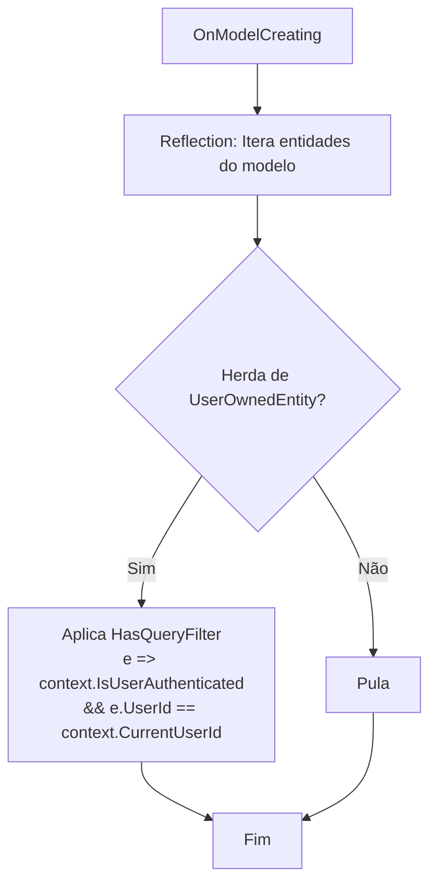
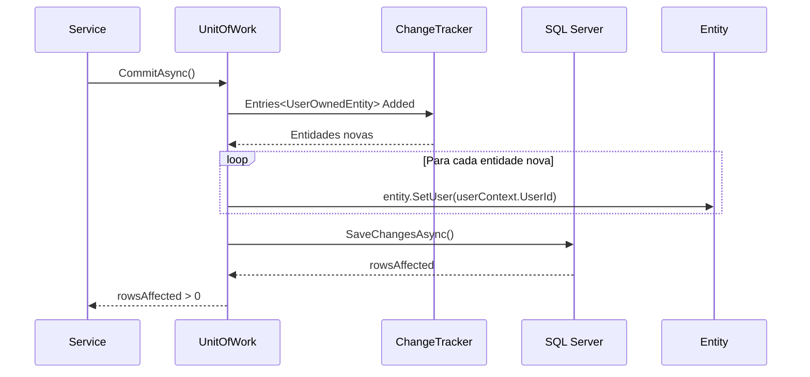
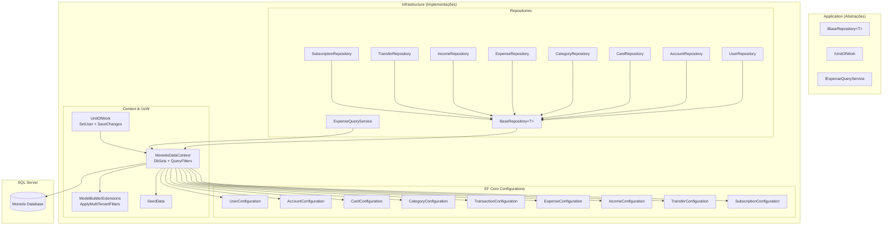

# 🗄️ Persistência — Contexto e Configurações

> **Camada:** Infrastructure (`src/Monetis.Infrastructure/Persistence/`)  
> **Propósito:** Gerenciar o acesso a dados via Entity Framework Core e SQL Server

---

## Índice

1. [MonetisDataContext](#1-monetisdatacontext)
2. [ModelBuilderExtensions (Multi-Tenant Filters)](#2-modelbuilderextensions-multi-tenant-filters)
3. [Entity Type Configurations](#3-entity-type-configurations)
4. [MonetisDataContextFactory](#4-monetisdatacontextfactory)
5. [UnitOfWork](#5-unitofwork)
6. [SeedData](#6-seeddata)
7. [Diagrama Geral da Arquitetura de Persistência](#7-diagrama-geral-da-arquitetura-de-persistência)

---

## 1. MonetisDataContext

**Arquivo:** `src/Monetis.Infrastructure/Persistence/Contexts/MonetisDataContext.cs`

O `MonetisDataContext` é o DbContext principal do Entity Framework Core. Gerencia todas as entidades e suas configurações.

### DbSets

```csharp
public DbSet<User> Users { get; set; }
public DbSet<Account> Accounts { get; set; }
public DbSet<Card> Cards { get; set; }
public DbSet<Category> Categories { get; set; }
public DbSet<Subscription> Subscriptions { get; set; }
public DbSet<Transaction> Transactions { get; set; }
public DbSet<Expense> Expenses { get; set; }
public DbSet<Income> Incomes { get; set; }
public DbSet<Transfer> Transfers { get; set; }
```

### Construtor

```csharp
public MonetisDataContext(
    DbContextOptions<MonetisDataContext> options,
    IUserContextAccessor? userContextAccessor = null)
    : base(options)
```

- Recebe o `IUserContextAccessor` opcionalmente (null em cenários design-time como migrations)
- Expõe `CurrentUserId` e `IsUserAuthenticated` para uso nos query filters

### OnModelCreating

```csharp
protected override void OnModelCreating(ModelBuilder modelBuilder)
{
    modelBuilder.ApplyConfigurationsFromAssembly(Assembly.GetExecutingAssembly());
    SeedData.Seed(modelBuilder);
    modelBuilder.ApplyMultiTenantFilters(this);

    // Filtro especial para Category (sistema + do usuário)
    modelBuilder.Entity<Category>().HasQueryFilter(c =>
        c.UserId == null || (IsUserAuthenticated && c.UserId == CurrentUserId));
}
```

| Etapa | Descrição |
|-------|-----------|
| `ApplyConfigurationsFromAssembly` | Aplica todas as `IEntityTypeConfiguration<>` do assembly |
| `SeedData.Seed` | Insere categorias padrão do sistema |
| `ApplyMultiTenantFilters` | Aplica query filters em entidades `UserOwnedEntity` |
| Filtro Category | Filtro especial: system (UserId=null) OR owned (UserId=current) |

---

## 2. ModelBuilderExtensions (Multi-Tenant Filters)

**Arquivo:** `src/Monetis.Infrastructure/Persistence/Contexts/ModelBuilderExtensions.cs`

Aplica automaticamente filtros de tenant (por usuário) em todas as entidades que herdam `UserOwnedEntity`.

### Funcionamento

```csharp
public static void ApplyMultiTenantFilters(this ModelBuilder modelBuilder, MonetisDataContext context)
```



### SQL Gerado (exemplo para Account)

```sql
SELECT * FROM Accounts
WHERE IsUserAuthenticated = 1
  AND UserId = @CurrentUserId
```

### Entidades Afetadas

| Entidade | Herda UserOwnedEntity? | Filtro Aplicado? |
|----------|----------------------|-----------------|
| `User` | ❌ (herda BaseEntity) | ❌ |
| `Category` | ❌ (herda BaseEntity) | ❌ (filtro manual) |
| `Account` | ✅ | ✅ Automático |
| `Card` | ✅ | ✅ Automático |
| `Subscription` | ✅ | ✅ Automático |
| `Transaction` (abstract) | ✅ | ✅ (afeta Expense, Income, Transfer) |
| `Expense` | ✅ (via Transaction) | ✅ Automático |
| `Income` | ✅ (via Transaction) | ✅ Automático |
| `Transfer` | ✅ (via Transaction) | ✅ Automático |

---

## 3. Entity Type Configurations

Todas as configurações estão em `src/Monetis.Infrastructure/Persistence/Configurations/`.

### UserConfiguration

**Tabela:** `Users`

| Coluna | Tipo | Restrições |
|--------|------|-----------|
| `Id` | `Guid` | PK, `ValueGeneratedNever()` |
| `FirstName` | `nvarchar(50)` | NOT NULL |
| `LastName` | `nvarchar(50)` | NOT NULL |
| `Email` | `nvarchar(160)` | NOT NULL, **Índice Único** |
| `PasswordHash` | `nvarchar(500)` | NOT NULL |
| `CreatedAt` | `datetime` | NOT NULL |

### AccountConfiguration

**Tabela:** `Accounts`

| Coluna | Tipo | Restrições |
|--------|------|-----------|
| `Id` | `Guid` | PK, `ValueGeneratedNever()` |
| `Name` | `nvarchar(25)` | NOT NULL |
| `UserId` | `Guid` | NOT NULL, FK → Users, CASCADE DELETE |
| `Balance` | `decimal(18,2)` | NOT NULL |
| `Type` | `nvarchar(25)` | NOT NULL (enum convertido p/ string) |
| `CreatedAt` | `datetime` | NOT NULL |

**Índices:** `UserId`

### CardConfiguration

**Tabela:** `Cards`  
(Configuração básica, similar às demais)

### CategoryConfiguration

**Tabela:** `Categories`  
(Configuração básica)

### TransactionConfiguration

**Tabela:** `Transactions`

Configuração da **Table per Hierarchy (TPH)**:

| Coluna | Tipo | Restrições |
|--------|------|-----------|
| `Id` | `Guid` | PK |
| `AccountId` | `Guid` | FK → Accounts |
| `Amount` | `decimal(18,2)` | NOT NULL |
| `Description` | `nvarchar(200)` | NOT NULL |
| `Discriminator` | `nvarchar` | TPH: "Expense", "Income", "Transfer" |
| `UserId` | `Guid` | FK → Users |
| Campos específicos | variados | Nullable conforme subtipo |

### ExpenseConfiguration / IncomeConfiguration / TransferConfiguration

Configurações específicas para cada subtipo de transação (propriedades exclusivas).

### SubscriptionConfiguration

**Tabela:** `Subscriptions`

Relacionamentos:
- `Account` (FK)
- `Category` (FK)
- `Card` (FK, opcional)
- `GeneratedExpenses` (collection navigation)

---

## 4. MonetisDataContextFactory

**Arquivo:** `src/Monetis.Infrastructure/Persistence/Contexts/MonetisDataContextFactory.cs`

Factory design-time para criação de migrações EF Core.

```csharp
public class MonetisDataContextFactory : IDesignTimeDbContextFactory<MonetisDataContext>
```

```csharp
public MonetisDataContext CreateDbContext(string[] args)
{
    var basePath = Path.Combine(Directory.GetCurrentDirectory(), "..", "Monetis.API");
    var configuration = new ConfigurationBuilder()
        .SetBasePath(basePath)
        .AddJsonFile("appsettings.Development.json", optional: true)
        .AddJsonFile("appsettings.json", optional: true)
        .Build();

    var builder = new DbContextOptionsBuilder<MonetisDataContext>();
    var connectionString = configuration.GetConnectionString("MonetisConnection");
    builder.UseSqlServer(connectionString);

    return new MonetisDataContext(builder.Options);  // Sem IUserContextAccessor
}
```

| Característica | Detalhe |
|---------------|---------|
| `basePath` | Assume que a factory está sendo executada do projeto Infrastructure |
| `appsettings.Development.json` | Opcional (pode não existir) |
| `appsettings.json` | Opcional |
| `IUserContextAccessor` | Não injetado (null) — migrations não precisam de contexto de usuário |

---

## 5. UnitOfWork

**Arquivo:** `src/Monetis.Infrastructure/Persistence/UnitOfWork.cs`

Implementa o padrão Unit of Work, centralizando a persistência e atribuindo automaticamente o `UserId` a novas entidades.

### Funcionamento



### Código

```csharp
public async Task<bool> CommitAsync(CancellationToken cancellationToken = default)
{
    var entries = monetisDataContext.ChangeTracker
        .Entries<UserOwnedEntity>()
        .Where(e => e.State == EntityState.Added);

    foreach (var entry in entries)
        entry.Entity.SetUser(userContext.UserId);

    return await monetisDataContext.SaveChangesAsync(cancellationToken) > 0;
}
```

### 🐛 Bug Conhecido

```csharp
public void Dispose()
{
    throw new NotImplementedException();
}
```

O método `Dispose()` não foi implementado — lança `NotImplementedException`. Isto significa que o `UnitOfWork` não pode ser usado em blocos `using` sem causar erro.

---

## 6. SeedData

**Arquivo:** `src/Monetis.Infrastructure/Persistence/SeedData.cs`

Popula o banco com categorias padrão do sistema na primeira migração.

### Categorias do Sistema

| Nome | Ícone | ID (Guid) |
|------|-------|-----------|
| **Alimentação** | 🍽️ | `28e61ce8-8149-4c81-a570-c0085eefa121` |
| **Transporte** | 🚗 | `e29e79d5-7844-491f-a9bd-9e744890555b` |
| **Salário** | 💰 | `96d53840-9752-4f2b-a522-c7357cdc4986` |

Todas são criadas com `UserId = null` (categorias de sistema, visíveis para todos os usuários).

---

## 7. Diagrama Geral da Arquitetura de Persistência



---

> **Próximo:** [Repositories](02-repositories.md)
