# 📦 Repositories e Query Services

> **Camada:** Infrastructure (`src/Monetis.Infrastructure/Persistence/Repositories/`)  
> **Propósito:** Implementar o padrão Repository para acesso a dados com suporte a multi-tenancy

---

## Índice

1. [BaseRepository (Genérico)](#1-baserepository-genérico)
2. [UserRepository](#2-userrepository)
3. [AccountRepository](#3-accountrepository)
4. [CardRepository](#4-cardrepository)
5. [CategoryRepository](#5-categoryrepository)
6. [ExpenseRepository](#6-expenserepository)
7. [IncomeRepository](#7-incomerepository)
8. [TransferRepository](#8-transferrepository)
9. [SubscriptionRepository](#9-subscriptionrepository)
10. [TransactionRepository](#10-transactionrepository)
11. [ExpenseQueryService](#11-expensequeryservice)
12. [Diagrama de Hierarquia](#12-diagrama-de-hierarquia)

---

## Diagrama de Hierarquia

```mermaid
graph TB
    subgraph "Interfaces (Application)"
        IBR[IBaseRepository&lt;T&gt;]
        IUR[IUserRepository]
        IAR[IAccountRepository]
        ICR[ICardRepository]
        ICatR[ICategoryRepository]
        IER[IExpenseRepository]
        IIR[IIncomeRepository]
        ITR[ITransferRepository]
        ISR[ISubscriptionRepository]
        ITrR[ITransactionRepository]
        IEQS[IExpenseQueryService]
    end

    subgraph "Implementações (Infrastructure)"
        BR[BaseRepository&lt;T&gt;<br/>implements IBaseRepository]
        UR[UserRepository<br/>extends BaseRepository]
        AR[AccountRepository<br/>extends BaseRepository]
        CR[CardRepository<br/>extends BaseRepository]
        CatR[CategoryRepository<br/>extends BaseRepository]
        ER[ExpenseRepository<br/>extends BaseRepository]
        IR[IncomeRepository<br/>extends BaseRepository]
        TR[TransferRepository<br/>extends BaseRepository]
        SR[SubscriptionRepository<br/>extends BaseRepository]
        TR2[TransactionRepository<br/>extends BaseRepository]
        EQS[ExpenseQueryService<br/>implements IExpenseQueryService]
    end

    IBR -->|implementado por| BR
    IUR -->|implementado por| UR
    IAR -->|implementado por| AR
    ICR -->|implementado por| CR
    ICatR -->|implementado por| CatR
    IER -->|implementado por| ER
    IIR -->|implementado por| IR
    ITR -->|implementado por| TR
    ISR -->|implementado por| SR
    ITrR -->|implementado por| TR2
    IEQS -->|implementado por| EQS

    UR --> BR
    AR --> BR
    CR --> BR
    CatR --> BR
    ER --> BR
    IR --> BR
    TR --> BR
    SR --> BR
    TR2 --> BR
```



---

## 1. BaseRepository (Genérico)

**Interface:** `IBaseRepository<T>`  
**Arquivo:** `src/Monetis.Infrastructure/Persistence/Repositories/BaseRepository.cs`

Implementação genérica para operações CRUD básicas.

### Métodos

| Método | Descrição | Tracking |
|--------|-----------|----------|
| `GetByIdAsync(Guid id)` | Busca por ID | ✅ Tracking (para updates) |
| `GetByIdReadOnlyAsync(Guid id)` | Busca por ID | ❌ `AsNoTracking()` |
| `GetAllReadOnlyAsync()` | Lista todos | ❌ `AsNoTracking()` |
| `Create(T entity)` | Adiciona entidade | ✅ Tracking |
| `Update(T entity)` | Marca como modificada | ✅ Tracking |
| `DeleteAsync(Guid id)` | Remove entidade | ✅ Tracking |

```csharp
public class BaseRepository<T>(MonetisDataContext context) : IBaseRepository<T>
    where T : BaseEntity
```

### Detalhes de Implementação

| Método | Código |
|--------|--------|
| `GetByIdAsync` | `context.Set<T>().FirstOrDefaultAsync(x => x.Id == id)` |
| `GetByIdReadOnlyAsync` | `context.Set<T>().AsNoTracking().FirstOrDefaultAsync(x => x.Id == id)` |
| `GetAllReadOnlyAsync` | `context.Set<T>().AsNoTracking().ToListAsync()` |
| `Create` | `context.Set<T>().Add(entity)` |
| `Update` | `context.Set<T>().Update(entity)` |
| `DeleteAsync` | Busca + `context.Set<T>().Remove(entity)` |

### Multi-tenancy Automático

Todos os métodos que herdam de `BaseRepository<T>` se beneficiam automaticamente dos **query filters** definidos no `MonetisDataContext`. Isso significa que:

- `GetAllReadOnlyAsync()` em `AccountRepository` → SQL gerado inclui `WHERE UserId = @CurrentUserId`
- `GetByIdAsync()` em `ExpenseRepository` → SQL gerado inclui `WHERE UserId = @CurrentUserId`
- O desenvolvedor **não precisa** adicionar manualmente filtros de usuário

---

## 2. UserRepository

**Interface:** `IUserRepository`  
**Herda:** `BaseRepository<User>`

### Métodos Específicos

| Método | Descrição |
|--------|-----------|
| `GetUserByEmailAsync(string email)` | Busca usuário por email (usado no login) |

> ⚠️ O `User` herda de `BaseEntity`, **não** de `UserOwnedEntity`. Portanto, não tem filtro multi-tenant.

---

## 3. AccountRepository

**Interface:** `IAccountRepository`  
**Herda:** `BaseRepository<Account>`

### Métodos Específicos

Nenhum método adicional. Todas as operações são herdadas do `BaseRepository<>`.

> ⚠️ O filtro multi-tenant é aplicado automaticamente via `HasQueryFilter`.

---

## 4. CardRepository

**Interface:** `ICardRepository`  
**Herda:** `BaseRepository<Card>`

- Sem métodos adicionais.
- Filtro multi-tenant automático.

---

## 5. CategoryRepository

**Interface:** `ICategoryRepository`  
**Herda:** `BaseRepository<Category>`

- Sem métodos adicionais.
- Filtro especial: `WHERE UserId IS NULL OR UserId = @CurrentUserId` (definido manualmente no `OnModelCreating`).

---

## 6. ExpenseRepository

**Interface:** `IExpenseRepository`  
**Herda:** `BaseRepository<Expense>`

### Métodos Específicos

| Método | Descrição | SQL Esperado |
|--------|-----------|-------------|
| `GetByUserReadOnlyAsync(Guid userId)` | Despesas por usuário | `WHERE UserId = @userId` |
| `GetByStatusReadOnlyAsync(TransactionStatus status)` | Despesas por status | `WHERE Status = @status` |
| `GetOverdueAsync()` | Despesas vencidas | `WHERE Status = Pending AND DueDate < GETUTCDATE()` |
| `GetByPeriodAsync(DateTime start, DateTime end, bool desc)` | Despesas por período | `WHERE DueDate BETWEEN @start AND @end ORDER BY ...` |
| `GetByCategoryAsync(Guid categoryId)` | Despesas por categoria | `WHERE CategoryId = @categoryId` |

---

## 7. IncomeRepository

**Interface:** `IIncomeRepository`  
**Herda:** `BaseRepository<Income>`

- Sem métodos adicionais.

---

## 8. TransferRepository

**Interface:** `ITransferRepository`  
**Herda:** `BaseRepository<Transfer>`

### Métodos Específicos

| Método | Descrição |
|--------|-----------|
| `GetByIdWithAccountsAsync(Guid id)` | Busca transferência com as contas de origem e destino incluídas (`.Include(x => x.Account).Include(x => x.DestinationAccount)`) |

Este método é usado pelo `TransferService` para:
- Atualizar transferência (precisa das contas para ajustar saldos)
- Cancelar transferência (precisa das contas para estornar)

---

## 9. SubscriptionRepository

**Interface:** `ISubscriptionRepository`  
**Herda:** `BaseRepository<Subscription>`

- Sem métodos adicionais.

---

## 10. TransactionRepository

**Interface:** `ITransactionRepository`  
**Herda:** `BaseRepository<Transaction>`

- Sem métodos adicionais. Usado para consultas genéricas na tabela `Transactions` (TPH).

---

## 11. ExpenseQueryService

**Interface:** `IExpenseQueryService`  
**Arquivo:** `src/Monetis.Infrastructure/Persistence/Repositories/` (pasta repositories)

Diferente dos repositórios, este é um **serviço de consulta separado** para operações de leitura específicas de despesas.

### Métodos

| Método | Descrição |
|--------|-----------|
| `GetByIdAsync(Guid id)` | Busca despesa por ID (tracking) |
| `GetByAccountIdAsync(Guid accountId)` | Despesas de uma conta específica |
| `GetPendingByAccountIdAsync(Guid accountId)` | Despesas pendentes de uma conta |

### Diferença de Repositories

| Característica | Repository | Query Service |
|---------------|-----------|--------------|
| **Propósito** | CRUD completo | Consultas específicas |
| **Tracking** | Tracking para updates | Tracking ou não |
| **Métodos** | Genéricos + específicos | Apenas consultas |
| **Dependências** | DbContext | DbContext |

---

## 12. Mapa de Injeção de Dependência

```csharp
// Infrastructure/DependencyInjection.cs
services.AddScoped<IUserRepository, UserRepository>();
services.AddScoped<IAccountRepository, AccountRepository>();
services.AddScoped<ICardRepository, CardRepository>();
services.AddScoped<ICategoryRepository, CategoryRepository>();
services.AddScoped<ISubscriptionRepository, SubscriptionRepository>();
services.AddScoped<ITransactionRepository, TransactionRepository>();
services.AddScoped<ITransferRepository, TransferRepository>();
services.AddScoped<IExpenseRepository, ExpenseRepository>();
services.AddScoped<IIncomeRepository, IncomeRepository>();
services.AddScoped<IUnitOfWork, UnitOfWork>();
```

> ⚠️ **Nota:** O `ExpenseQueryService` não está registrado no `DependencyInjection.cs` da Infrastructure. O `ExpenseService` na camada Application depende de `IExpenseQueryService`. Se o registro estiver faltando, **a injeção de dependência lançará erro em runtime** (`InvalidOperationException`). Verifique se o `ExpenseQueryService` foi adicionado ao DI ou se a dependência foi removida.

---

> **Próximo:** [Security](03-security.md)
