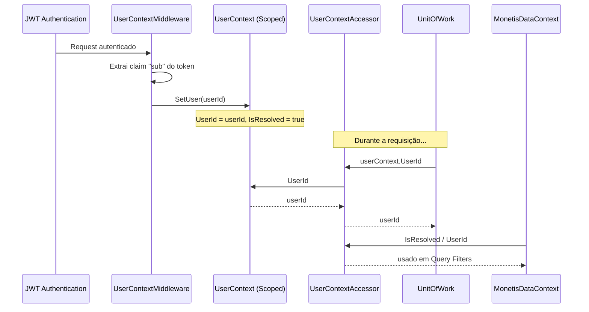
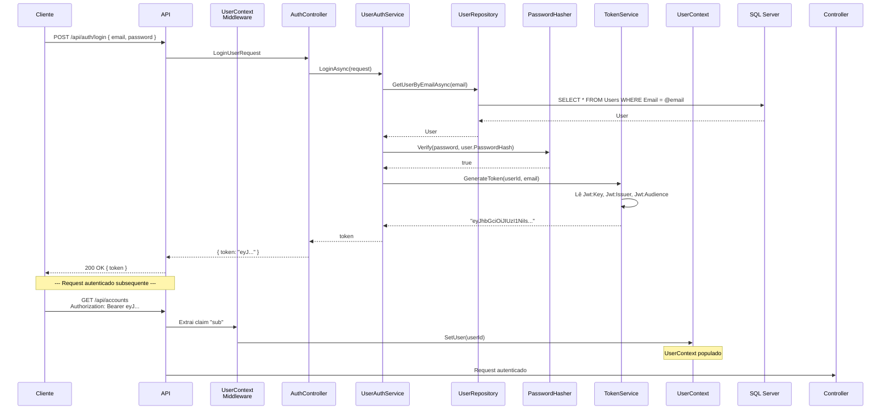

# 🔒 Segurança — Autenticação e Autorização

> **Camada:** Infrastructure (`src/Monetis.Infrastructure/Security/`)  
> **Propósito:** Prover mecanismos de hash de senha, geração de tokens JWT e contexto de usuário

---

## Índice

1. [PasswordHasher](#1-passwordhasher)
2. [TokenService (JWT)](#2-tokenservice-jwt)
3. [UserContext](#3-usercontext)
4. [UserContextAccessor](#4-usercontextaccessor)
5. [Dependency Injection e Configuração JWT](#5-dependency-injection-e-configuração-jwt)

---

## 1. PasswordHasher

**Interface:** `IPasswordHasher`  
**Arquivo:** `src/Monetis.Infrastructure/Security/PasswordHasher.cs`

### Interface

```csharp
public interface IPasswordHasher
{
    string Hash(string password);
    bool Verify(string password, string passwordHash);
}
```

### Implementação

O `PasswordHasher` delega para o `Microsoft.AspNetCore.Identity.PasswordHasher<User>`:

```csharp
public class PasswordHasher : IPasswordHasher
{
    private readonly PasswordHasher<User> _hasher = new();

    public string Hash(string password)
    {
        return _hasher.HashPassword(null!, password);
    }

    public bool Verify(string password, string passwordHash)
    {
        var result = _hasher.VerifyHashedPassword(null!, passwordHash, password);
        return result != PasswordVerificationResult.Failed;
    }
}
```

| Método | Descrição | Algoritmo |
|--------|-----------|-----------|
| `Hash(password)` | Gera hash da senha | PBKDF2 (ASP.NET Core Identity) |
| `Verify(password, hash)` | Verifica senha contra hash | PBKDF2 |

> ⚠️ O primeiro parâmetro `null!` é o 'user' (não usado pelo hasher do Identity). O hash gerado é compatível com o formato do ASP.NET Core Identity.

---

## 2. TokenService (JWT)

**Interface:** `ITokenService`  
**Arquivo:** `src/Monetis.Infrastructure/Security/TokenService.cs`

### Interface

```csharp
public interface ITokenService
{
    string GenerateToken(Guid userId, string email);
}
```

### Implementação

```csharp
public class TokenService(IConfiguration configuration) : ITokenService
```

Gera tokens JWT com as seguintes características:

| Característica | Valor |
|---------------|-------|
| **Algoritmo** | HMAC SHA256 |
| **Claims** | `sub` (userId), `email`, `jti` (unique) |
| **Expiração** | 2 dias |
| **Issuer** | Configurado em `Jwt:Issuer` |
| **Audience** | Configurado em `Jwt:Audience` |
| **Chave** | Configurada em `Jwt:Key` (min 32 caracteres) |

### Estrutura do Token

```json
// HEADER
{
  "alg": "HS256",
  "typ": "JWT"
}

// PAYLOAD
{
  "sub": "3fa85f64-5717-4562-b3fc-2c963f66afa6",
  "email": "joao@email.com",
  "jti": "a1b2c3d4-e5f6-...",
  "exp": 1735689600,
  "iss": "Monetis",
  "aud": "MonetisUsers"
}
```

### Código

```csharp
public string GenerateToken(Guid userId, string email)
{
    var claims = new[]
    {
        new Claim(JwtRegisteredClaimNames.Sub, userId.ToString()),
        new Claim(JwtRegisteredClaimNames.Email, email),
        new Claim(JwtRegisteredClaimNames.Jti, Guid.NewGuid().ToString())
    };

    var key = new SymmetricSecurityKey(Encoding.UTF8.GetBytes(jwtKey));
    var creds = new SigningCredentials(key, SecurityAlgorithms.HmacSha256);

    var tokenDescriptor = new SecurityTokenDescriptor
    {
        Subject = new ClaimsIdentity(claims),
        Expires = DateTime.UtcNow.AddDays(2),
        Issuer = issuer,
        Audience = audience,
        SigningCredentials = creds
    };

    var token = new JwtSecurityTokenHandler().CreateToken(tokenDescriptor);
    return new JwtSecurityTokenHandler().WriteToken(token);
}
```

---

## 3. UserContext

**Arquivo:** `src/Monetis.Infrastructure/Security/UserContext.cs`

Armazena o ID do usuário autenticado durante uma requisição scoped.

```csharp
public class UserContext
{
    public Guid UserId { get; private set; }
    public bool IsResolved { get; private set; }

    public void SetUser(Guid userId)
    {
        UserId = userId;
        IsResolved = true;
    }
}
```

| Característica | Detalhe |
|---------------|---------|
| **Scoped** | Uma instância por requisição HTTP |
| **Resolvido por** | `UserContextMiddleware` |
| **Usado por** | `UserContextAccessor` → `UnitOfWork` → Query Filters |

### Fluxo



---

## 4. UserContextAccessor

**Interface:** `IUserContextAccessor`  
**Arquivo:** `src/Monetis.Infrastructure/Security/UserContextAccessor.cs`

Wrapper scoped que expõe o `UserContext` para a camada de Application.

```csharp
public class UserContextAccessor(UserContext userContext) : IUserContextAccessor
{
    public Guid UserId => userContext.UserId;
    public bool IsResolved => userContext.IsResolved;
}
```

### Interface (Application Layer)

```csharp
public interface IUserContextAccessor
{
    Guid UserId { get; }
    bool IsResolved { get; }
}
```

### Consumidores

| Consumidor | Propósito |
|-----------|-----------|
| `UserResourceGuard` | Obter `CurrentUserId` para validar ownership |
| `UnitOfWork` | Atribuir `UserId` a entidades novas |
| `MonetisDataContext` | Aplicar query filters multi-tenant |
| `UserAuthService` | Obter userId para ChangePassword |

---

## 5. Dependency Injection e Configuração JWT

**Arquivo:** `src/Monetis.Infrastructure/DependencyInjection.cs`

### Registro de Serviços

```csharp
services.AddScoped<UserContext>();
services.AddScoped<IUserContextAccessor, UserContextAccessor>();
services.AddScoped<IPasswordHasher, PasswordHasher>();
services.AddScoped<ITokenService, TokenService>();
```

### Configuração JWT

```csharp
services.AddAuthentication(options =>
{
    options.DefaultAuthenticateScheme = JwtBearerDefaults.AuthenticationScheme;
    options.DefaultChallengeScheme = JwtBearerDefaults.AuthenticationScheme;
})
.AddJwtBearer(options =>
{
    options.TokenValidationParameters = new TokenValidationParameters
    {
        ValidateIssuer = true,
        ValidateAudience = true,
        ValidateLifetime = true,
        ValidateIssuerSigningKey = true,
        ValidIssuer = configuration["Jwt:Issuer"],
        ValidAudience = configuration["Jwt:Audience"],
        IssuerSigningKey = new SymmetricSecurityKey(
            Encoding.UTF8.GetBytes(configuration["Jwt:Key"]!))
    };
});

services.AddAuthorization();
```

### Configuração Necessária (appsettings.json)

```json
{
  "Jwt": {
    "Key": "sua-chave-super-segura-com-pelo-menos-32-caracteres!",
    "Issuer": "Monetis",
    "Audience": "MonetisUsers"
  }
}
```

| Chave | Obrigatório | Descrição |
|-------|-------------|-----------|
| `Jwt:Key` | ✅ | Chave secreta para assinar tokens (mín. 32 caracteres) |
| `Jwt:Issuer` | ✅ | Emissor do token ("Monetis") |
| `Jwt:Audience` | ✅ | Audiência do token ("MonetisUsers") |
| `ConnectionStrings:MonetisConnection` | ✅ | Connection string SQL Server |

---

## Diagrama de Fluxo de Autenticação Completo



---

> **Próximo:** [Migrations](04-migrations.md)
