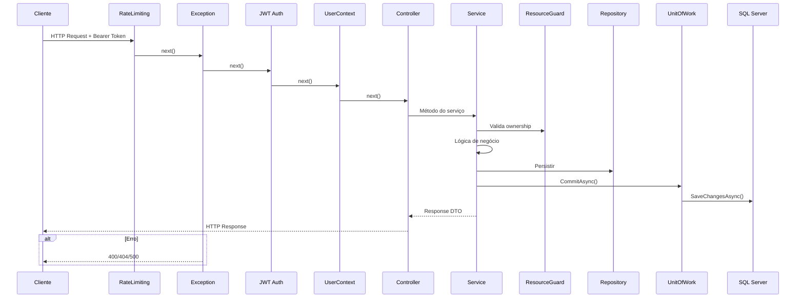

# 🚀 Endpoints da API

> **Camada:** API (`src/Monetis.API/Controllers/`)  
> **Base URL:** `https://localhost:5001` (desenvolvimento)  
> **Formato:** JSON  
> **Autenticação:** JWT Bearer Token

---

## Índice

1. [Visão Geral dos Endpoints](#1-visão-geral-dos-endpoints)
2. [Auth](#2-auth)
3. [Users](#3-users)
4. [Accounts](#4-accounts)
5. [Cards](#5-cards)
6. [Categories](#6-categories)
7. [Expenses](#7-expenses)
8. [Incomes](#8-incomes)
9. [Transfers](#9-transfers)
10. [Subscriptions](#10-subscriptions)

---

## 1. Visão Geral dos Endpoints

### Diagrama dos Endpoints

```mermaid
graph TB
    subgraph "Públicos (AllowAnonymous)"
        POST_LOGIN[POST /api/auth/login]
        POST_USER_CREATE[POST /api/users]
    end

    subgraph "Protegidos (Bearer Token)"
        subgraph "Users"
            U1[GET /api/users]
            U2[GET /api/users/{id}]
            U3[PUT /api/users/{id}]
            U4[DELETE /api/users/{id}]
        end
        subgraph "Accounts"
            A1[GET /api/accounts]
            A2[GET /api/accounts/{id}]
            A3[POST /api/accounts]
            A4[PUT /api/accounts/{id}]
            A5[DELETE /api/accounts/{id}]
        end
        subgraph "Expenses"
            E1[GET /api/expenses]
            E2[GET /api/expenses/{id}]
            E3[POST /api/expenses]
            E4[POST /api/expenses/installments]
            E5[POST /api/expenses/{id}/pay]
            E6[PUT /api/expenses/{id}]
            E7[POST /api/expenses/process-overdue]
        end
        subgraph "Others"
            O1[GET/POST/PUT/DEL /api/cards]
            O2[GET/POST/PUT/DEL /api/categories]
            O3[GET/POST/PUT/DEL /api/incomes]
            O4[GET/POST/PUT/DEL /api/subscriptions]
            O5[GET/POST/PUT/DEL /api/transfers]
        end
    end

    POST_LOGIN --> API
    POST_USER_CREATE --> API
    U1 --> API
    A1 --> API
    E1 --> API
    O1 --> API
```

### Resumo por Controller

| Controller | Endpoints | Autenticação |
|-----------|-----------|-------------|
| `AuthController` | 1 | `AllowAnonymous` |
| `UsersController` | 4 | Misto (POST anon, demais Bearer) |
| `AccountsController` | 5 | Bearer |
| `CardsController` | 4 | Bearer |
| `CategoriesController` | 4 | Bearer |
| `ExpensesController` | 7 | Bearer |
| `IncomesController` | 4 | Bearer |
| `TransfersController` | 4 | Bearer |
| `SubscriptionsController` | 4 | Bearer |
| **Total** | **37** | |

### Formato de Respostas

**Sucesso:**
```json
// 200 OK
{ "id": "guid", "name": "...", ... }

// 201 Created (Location header com URL do recurso)
{ "id": "guid", ... }

// 204 No Content (sem corpo)
```

**Erro (ExceptionMiddleware):**
```json
{
  "statusCode": 400,
  "message": "Account name is required",
  "errorCode": "BUSINESS_ERROR",
  "details": null,
  "stackTrace": null
}
```

**Códigos de Status:**
| Código | Significado |
|--------|-------------|
| `200` | OK (GET, POST) |
| `201` | Created (POST com novo recurso) |
| `204` | No Content (PUT, DELETE) |
| `400` | Bad Request (erro de negócio ou validação) |
| `401` | Unauthorized (token ausente/inválido) |
| `403` | Forbidden (sem permissão) |
| `404` | Not Found (recurso não encontrado) |
| `429` | Too Many Requests (rate limit excedido) |
| `500` | Internal Server Error |

---

## 2. Auth

**Controller:** `AuthController`  
**Base:** `/api/auth`

### `POST /api/auth/login`

Realiza login e retorna um token JWT.

- **Autenticação:** `AllowAnonymous`
- **Corpo da Requisição:**

```json
{
  "email": "usuario@email.com",
  "password": "Senha@123"
}
```

- **Resposta 200:**
```json
{
  "token": "eyJhbGciOiJIUzI1NiIs..."
}
```

- **Resposta 401:**
```json
{
  "statusCode": 401,
  "message": "Invalid credentials.",
  "errorCode": "BUSINESS_ERROR"
}
```

**Regras de Validação (LoginUserRequestValidator):**
- Email: obrigatório, formato válido, max 100 caracteres
- Password: obrigatório, 8-128 caracteres, deve conter: maiúscula, minúscula, número, caractere especial

**Fluxo:**
```
POST /api/auth/login
  → UserAuthService.LoginAsync()
    → UserRepository.GetUserByEmailAsync()
    → PasswordHasher.Verify()
    → TokenService.GenerateToken(userId, email)
  ← { token: "eyJ..." }
```

---

## 3. Users

**Controller:** `UsersController`  
**Base:** `/api/users`

### `GET /api/users`

Lista todos os usuários.

- **Autenticação:** Bearer Token
- **Resposta 200:**
```json
[
  {
    "id": "3fa85f64-5717-4562-b3fc-2c963f66afa6",
    "firstName": "João",
    "lastName": "Silva",
    "email": "joao@email.com"
  }
]
```

### `GET /api/users/{id}`

Obtém um usuário pelo ID.

- **Autenticação:** Bearer Token
- **Parâmetros:** `id` (Guid, route)
- **Resposta 200:** `UserResponse`
- **Resposta 404:** `"User not found."`

### `POST /api/users`

Cria um novo usuário.

- **Autenticação:** `AllowAnonymous`
- **Corpo da Requisição:**

```json
{
  "firstName": "João",
  "lastName": "Silva",
  "email": "joao@email.com",
  "password": "Senha@123"
}
```

- **Resposta 201:** `UserResponse` com `Location` header
- **Resposta 400:** Se email já existir (`UserAlreadyExistsException`)

**Regras de Validação (CreateUserRequestValidator):**
| Campo | Regras |
|-------|--------|
| `firstName` | Obrigatório, max 50 chars, letras/espaços/hífens/underscores |
| `lastName` | Obrigatório, max 50 chars, letras/espaços/hífens/underscores |
| `email` | Obrigatório, formato email, max 100 chars |
| `password` | Obrigatório, 8-128 chars, deve conter: maiúscula, minúscula, número, especial |

### `PUT /api/users/{id}`

Atualiza dados de um usuário.

- **Autenticação:** Bearer Token
- **Parâmetros:** `id` (Guid, route)
- **Corpo da Requisição:**
```json
{
  "firstName": "João",
  "lastName": "Silva",
  "email": "joao.novo@email.com"
}
```
- **Resposta 204:** No Content
- **Resposta 404:** `"User not found."`

### `DELETE /api/users/{id}`

Remove um usuário.

- **Autenticação:** Bearer Token
- **Parâmetros:** `id` (Guid, route)
- **Resposta 204:** No Content
- **Resposta 404:** `"User not found."`

---

## 4. Accounts

**Controller:** `AccountsController`  
**Base:** `/api/accounts`

### `GET /api/accounts`

Lista todas as contas do usuário autenticado.

- **Autenticação:** Bearer Token
- **Resposta 200:**
```json
[
  {
    "id": "guid",
    "name": "Conta Corrente",
    "userId": "guid",
    "type": "Checking",
    "balance": 1500.00
  }
]
```

### `GET /api/accounts/{id}`

Obtém uma conta pelo ID.

- **Autenticação:** Bearer Token
- **Parâmetros:** `id` (Guid, route)
- **Resposta 200:** `AccountResponse`
- **Resposta 404:** `Not Found`

### `POST /api/accounts`

Cria uma nova conta.

- **Autenticação:** Bearer Token
- **Corpo da Requisição:**
```json
{
  "name": "Nova Conta",
  "type": "Checking"
}
```
- **Resposta 201:** `AccountResponse`

### `PUT /api/accounts/{id}`

Atualiza o nome de uma conta.

- **Autenticação:** Bearer Token
- **Parâmetros:** `id` (Guid, route)
- **Corpo:**
```json
{
  "name": "Conta Atualizada"
}
```
- **Resposta 204:** No Content
- **Resposta 404:** `Not Found`

### `DELETE /api/accounts/{id}`

Remove uma conta.

- **Autenticação:** Bearer Token
- **Parâmetros:** `id` (Guid, route)
- **Resposta 204:** No Content

---

## 5. Cards

**Controller:** `CardsController`  
**Base:** `/api/cards`

### `GET /api/cards`

Lista todos os cartões.

- **Autenticação:** Bearer Token
- **Resposta 200:**
```json
[
  {
    "id": "guid",
    "name": "Cartão Nubank",
    "userId": "guid"
  }
]
```

### `GET /api/cards/{id}`

Obtém um cartão pelo ID.

- **Autenticação:** Bearer Token
- **Parâmetros:** `id` (Guid, route)
- **Resposta 200:** `CardResponse`
- **Resposta 404:** `Not Found`

### `POST /api/cards`

Cria um novo cartão.

- **Autenticação:** Bearer Token
- **Corpo:**
```json
{
  "name": "Cartão Inter"
}
```
- **Resposta 201:** `CardResponse`

### `PUT /api/cards/{id}`

Atualiza o nome de um cartão.

- **Autenticação:** Bearer Token
- **Parâmetros:** `id` (Guid, route)
- **Corpo:**
```json
{
  "name": "Cartão Atualizado"
}
```
- **Resposta 204:** No Content
- **Resposta 404:** `Not Found`

### `DELETE /api/cards/{id}`

Remove um cartão.

- **Autenticação:** Bearer Token
- **Parâmetros:** `id` (Guid, route)
- **Resposta 204:** No Content

---

## 6. Categories

**Controller:** `CategoriesController`  
**Base:** `/api/categories`

### `GET /api/categories`

Lista todas as categorias (sistema + do usuário).

- **Autenticação:** Bearer Token
- **Resposta 200:**
```json
[
  {
    "id": "28e61ce8-8149-4c81-a570-c0085eefa121",
    "name": "Alimentação",
    "userId": "00000000-0000-0000-0000-000000000000",
    "icon": "🍽️"
  }
]
```

### `GET /api/categories/{id}`

Obtém uma categoria pelo ID.

- **Autenticação:** Bearer Token
- **Parâmetros:** `id` (Guid, route)
- **Resposta 200:** `CategoryResponse`
- **Resposta 404:** `Not Found`

### `POST /api/categories`

Cria uma nova categoria personalizada.

- **Autenticação:** Bearer Token
- **Corpo:**
```json
{
  "name": "Assinaturas",
  "icon": "📺"
}
```
- **Resposta 201:** `CategoryResponse`

### `PUT /api/categories/{id}`

Atualiza nome e ícone de uma categoria.

- **Autenticação:** Bearer Token
- **Parâmetros:** `id` (Guid, route)
- **Corpo:**
```json
{
  "name": "Streaming",
  "icon": "🎬"
}
```
- **Resposta 204:** No Content
- **Resposta 404:** `Not Found`

### `DELETE /api/categories/{id}`

Remove uma categoria personalizada.

- **Autenticação:** Bearer Token
- **Parâmetros:** `id` (Guid, route)
- **Resposta 204:** No Content

> ⚠️ Categorias do sistema (UserId = null) não podem ser removidas.

---

## 7. Expenses

**Controller:** `ExpensesController`  
**Base:** `/api/expenses`

### `GET /api/expenses`

Lista todas as despesas do usuário.

- **Autenticação:** Bearer Token
- **Resposta 200:**
```json
[
  {
    "id": "guid",
    "accountId": "guid",
    "categoryId": "guid",
    "status": "Pending",
    "paidAt": null,
    "amount": 150.00,
    "description": "Supermercado",
    "dueDate": "2026-07-20T00:00:00Z",
    "paymentMethod": "Cash",
    "installmentNumber": null,
    "totalInstallments": null,
    "installmentGroupId": null,
    "creditCardId": null
  }
]
```

### `GET /api/expenses/{id}`

Obtém uma despesa pelo ID.

- **Autenticação:** Bearer Token
- **Parâmetros:** `id` (Guid, route)
- **Resposta 200:** `ExpenseResponse`
- **Resposta 404:** `Not Found`

### `POST /api/expenses`

Cria uma nova despesa.

- **Autenticação:** Bearer Token
- **Corpo:**
```json
{
  "accountId": "3fa85f64-...",
  "categoryId": "28e61ce8-...",
  "amount": 150.00,
  "description": "Supermercado",
  "dueDate": "2026-07-20T00:00:00Z",
  "paymentMethod": "Cash",
  "creditCardId": null
}
```
- **Resposta 201:** `ExpenseResponse`
- **Comportamento especial:** Se `paymentMethod` for `Cash`, `Debit` ou `Pix`, o valor é **automaticamente debitado** da conta e a despesa é marcada como `Paid`

### `POST /api/expenses/installments`

Cria despesas parceladas (2 a 24x).

- **Autenticação:** Bearer Token
- **Corpo:**
```json
{
  "accountId": "3fa85f64-...",
  "categoryId": "28e61ce8-...",
  "totalAmount": 1200.00,
  "description": "Curso Online",
  "firstDueDate": "2026-08-10T00:00:00Z",
  "numberOfInstallments": 12,
  "creditCardId": "guid-do-cartao"
}
```
- **Resposta 200:** Array de `ExpenseResponse` (12 despesas)
- **Regras:** parcelas 2-24, obrigatório cartão de crédito

### `POST /api/expenses/{id}/pay`

Paga uma despesa.

- **Autenticação:** Bearer Token
- **Parâmetros:** `id` (Guid, route)
- **Corpo:**
```json
{
  "paidAt": "2026-07-15T10:00:00Z",
  "accountId": "3fa85f64-..."
}
```
- **Resposta 200:** `ExpenseResponse`
- Se `accountId` for diferente do original, a despesa é movida para a nova conta

### `PUT /api/expenses/{id}`

Atualiza uma despesa pendente.

- **Autenticação:** Bearer Token
- **Parâmetros:** `id` (Guid, route)
- **Corpo:**
```json
{
  "categoryId": "guid",
  "amount": 200.00,
  "description": "Supermercado",
  "dueDate": "2026-07-25T00:00:00Z"
}
```
- **Resposta 200:** `ExpenseResponse`
- ⚠️ Não pode atualizar despesas pagas ou parcelas individuais

### `POST /api/expenses/process-overdue`

Processa despesas vencidas manualmente.

- **Autenticação:** Bearer Token
- **Resposta 204:** No Content
- Marca todas as despesas `Pending` com `DueDate < today` como `Overdue`

---

## 8. Incomes

**Controller:** `IncomesController`  
**Base:** `/api/incomes`

### `GET /api/incomes`

Lista todas as receitas.

- **Autenticação:** Bearer Token
- **Resposta 200:**
```json
[
  {
    "id": "guid",
    "accountId": "guid",
    "categoryId": "guid",
    "amount": 5000.00,
    "description": "Salário",
    "receivedAt": "2026-07-05T00:00:00Z"
  }
]
```

### `GET /api/incomes/{id}`

Obtém uma receita pelo ID.

- **Autenticação:** Bearer Token
- **Parâmetros:** `id` (Guid, route)
- **Resposta 200:** `IncomeResponse`
- **Resposta 404:** `Not Found`

### `POST /api/incomes`

Registra uma nova receita.

- **Autenticação:** Bearer Token
- **Corpo:**
```json
{
  "accountId": "3fa85f64-...",
  "categoryId": "96d53840-...",
  "amount": 5000.00,
  "description": "Salário",
  "receivedAt": "2026-07-05T00:00:00Z"
}
```
- **Resposta 201:** `IncomeResponse`
- **Comportamento especial:** O valor é **automaticamente depositado** na conta

### `PUT /api/incomes/{id}`

Atualiza uma receita.

- **Autenticação:** Bearer Token
- **Parâmetros:** `id` (Guid, route)
- **Corpo:**
```json
{
  "categoryId": "guid",
  "amount": 5500.00,
  "description": "Salário + Bônus",
  "receivedAt": "2026-07-05T00:00:00Z"
}
```
- **Resposta 204:** No Content
- **Comportamento especial:** Se o valor mudar, ajusta o saldo da conta (depósito/retirada da diferença)

### `DELETE /api/incomes/{id}`

Remove uma receita.

- **Autenticação:** Bearer Token
- **Parâmetros:** `id` (Guid, route)
- **Resposta 204:** No Content
- **Comportamento especial:** O valor é retirado da conta (`account.Withdraw(amount)`)

---

## 9. Transfers

**Controller:** `TransfersController`  
**Base:** `/api/transfers`

### `GET /api/transfers`

Lista todas as transferências.

- **Autenticação:** Bearer Token
- **Resposta 200:**
```json
[
  {
    "id": "guid",
    "accountId": "guid",
    "destinationAccountId": "guid",
    "amount": 500.00,
    "description": "Poupança",
    "transferredAt": "2026-07-10T00:00:00Z"
  }
]
```

### `GET /api/transfers/{id}`

Obtém uma transferência pelo ID.

- **Autenticação:** Bearer Token
- **Parâmetros:** `id` (Guid, route)
- **Resposta 200:** `TransferResponse`
- **Resposta 404:** `Not Found`

### `POST /api/transfers`

Cria uma nova transferência entre contas.

- **Autenticação:** Bearer Token
- **Corpo:**
```json
{
  "accountId": "guid-conta-origem",
  "destinationAccountId": "guid-conta-destino",
  "amount": 500.00,
  "description": "Transferência para poupança",
  "transferredAt": "2026-07-10T00:00:00Z"
}
```
- **Resposta 201:** `TransferResponse`
- **Regras:**
  - Conta origem ≠ conta destino
  - Ambas contas devem pertencer ao mesmo usuário
  - Saldo da origem deve ser suficiente
  - Data não pode ser futura
  - **A transferência é executada imediatamente:** débito na origem, crédito no destino

### `PUT /api/transfers/{id}`

Atualiza valor e descrição de uma transferência.

- **Autenticação:** Bearer Token
- **Parâmetros:** `id` (Guid, route)
- **Corpo:**
```json
{
  "amount": 600.00,
  "description": "Transferência atualizada"
}
```
- **Resposta 204:** No Content
- **Comportamento especial:** Se o valor mudar, ajusta os saldos (origem e destino)
- ⚠️ Transferências canceladas não podem ser atualizadas

### `DELETE /api/transfers/{id}`

Cancela uma transferência (mesmo dia apenas).

- **Autenticação:** Bearer Token
- **Parâmetros:** `id` (Guid, route)
- **Resposta 204:** No Content
- **Comportamento especial:** Estorna os valores (débito no destino, crédito na origem)
- ⚠️ Só pode cancelar no mesmo dia da transferência

---

## 10. Subscriptions

**Controller:** `SubscriptionsController`  
**Base:** `/api/subscriptions`

### `GET /api/subscriptions`

Lista todas as assinaturas.

- **Autenticação:** Bearer Token
- **Resposta 200:**
```json
[
  {
    "id": "guid",
    "amount": 29.90,
    "description": "Netflix",
    "frequency": "Monthly",
    "nextDueDate": "2026-08-15T00:00:00Z",
    "isActive": true
  }
]
```

### `GET /api/subscriptions/{id}`

Obtém uma assinatura pelo ID.

- **Autenticação:** Bearer Token
- **Parâmetros:** `id` (Guid, route)
- **Resposta 200:** `SubscriptionResponse`
- **Resposta 404:** `Not Found`

### `POST /api/subscriptions`

Cria uma nova assinatura.

- **Autenticação:** Bearer Token
- **Corpo:**
```json
{
  "accountId": "guid",
  "categoryId": "guid",
  "amount": 29.90,
  "description": "Netflix",
  "frequency": "Monthly",
  "nextDueDate": "2026-08-15T00:00:00Z",
  "paymentMethod": "CreditCard"
}
```
- **Resposta 201:** `SubscriptionResponse`
- **Comportamento especial:** Ao criar, **já gera a primeira despesa** automaticamente

### `PUT /api/subscriptions/{id}`

Atualiza uma assinatura.

- **Autenticação:** Bearer Token
- **Parâmetros:** `id` (Guid, route)
- **Corpo:**
```json
{
  "amount": 39.90,
  "description": "Netflix Premium",
  "frequency": "Monthly",
  "nextDueDate": "2026-08-15T00:00:00Z",
  "isActive": true
}
```
- **Resposta 204:** No Content
- **Resposta 404:** `Not Found`
- ⚠️ O método atual não altera `paymentMethod`, `accountId` ou `cardId`

### `DELETE /api/subscriptions/{id}`

Cancela (desativa) uma assinatura.

- **Autenticação:** Bearer Token
- **Parâmetros:** `id` (Guid, route)
- **Resposta 204:** No Content
- **Comportamento:** Apenas marca como inativa (`IsActive = false`), não remove do banco

---

## Fluxo de uma Requisição Típica (Autenticada)



---

> **Próximo:** [Voltar à Visão Geral](../00-visao-geral.md) *(ou consultar a seção de Middlewares na Fase 5 quando disponível)*
