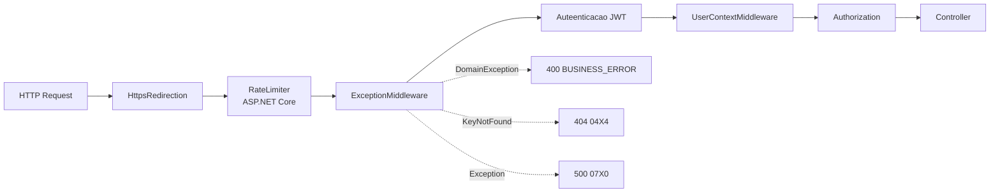
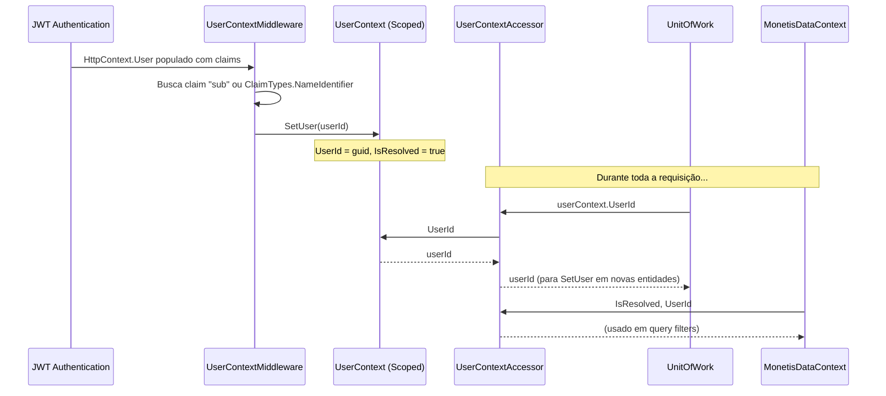

# 🛡️ Middlewares — Pipeline HTTP

> **Camada:** API (`src/Monetis.API/Middlewares/`)  
> **Propósito:** Interceptar requisições HTTP para adicionar comportamentos transversais

---

## Índice

1. [Pipeline de Middlewares](#1-pipeline-de-middlewares)
2. [ExceptionMiddleware](#2-exceptionmiddleware)
3. [RateLimitingMiddleware](#3-ratelimitingmiddleware)
4. [UserContextMiddleware](#4-usercontextmiddleware)

---

## 1. Pipeline de Middlewares

A ordem dos middlewares no `Program.cs` define o fluxo de processamento:



### Ordem no Program.cs

```csharp
app.UseHttpsRedirection();
app.UseRateLimiter();
app.UseMiddleware<ExceptionMiddleware>();
app.UseAuthentication();
app.UseMiddleware<UserContextMiddleware>();
app.UseAuthorization();
app.MapControllers();
```

| Ordem | Middleware | Função |
|-------|-----------|--------|
| 1º | HttpsRedirection | Redireciona HTTP → HTTPS |
| 2º | RateLimiter (ASPNET Core) | Limita 100 req/min por IP |
| 3º | ExceptionMiddleware | Captura exceções e retorna JSON padronizado |
| 4º | Authentication (JWT) | Valida o token Bearer |
| 5º | UserContextMiddleware | Extrai userId do token e popula UserContext |
| 6º | Authorization | Verifica permissões |
| 7º | Controller | Executa o endpoint |

---

## 2. ExceptionMiddleware

**Arquivo:** `src/Monetis.API/Middlewares/ExceptionMiddleware.cs`

Middleware global de tratamento de exceções. Captura todas as exceções não tratadas e retorna uma resposta JSON padronizada.

### Funcionamento

```csharp
public async Task InvokeAsync(HttpContext context)
{
    try
    {
        await next(context);
    }
    catch (DomainException ex)
    {
        logger.LogError(ex, ex.Message);
        await HandleExceptionAsync(context, ex);
    }
    catch (Exception e)
    {
        logger.LogError(e, e.Message);
        await HandleExceptionAsync(context, e);
    }
}
```

### Mapeamento de Exceções → HTTP

```csharp
var (statusCode, message, errorcode) = exception switch
{
    DomainException => (400, exception.Message, "BUSINESS_ERROR"),
    ArgumentException => (400, "Bad Request", "04X0"),
    KeyNotFoundException => (404, "Not Found", "04X4"),
    _ => (500, "Internal error", "07X0")
};
```

| Exceção | Status | Error Code | Exemplos |
|---------|--------|------------|---------|
| `DomainException` | 400 | `BUSINESS_ERROR` | Regras de negócio violadas (nome vazio, saldo insuficiente, etc.) |
| `ArgumentException` | 400 | `04X0` | Argumentos inválidos |
| `KeyNotFoundException` | 404 | `04X4` | Recurso não encontrado |
| Qualquer outra | 500 | `07X0` | Erro interno do servidor |

### Formato da Resposta

```json
{
  "statusCode": 400,
  "message": "Account name is required",
  "errorCode": "BUSINESS_ERROR",
  "details": null,
  "stackTrace": null
}
```

> 🔧 Em ambiente de desenvolvimento (`env.IsDevelopment()`), `details` e `stackTrace` são populados com `exception.ToString()` e `exception.StackTrace`.

---

## 3. RateLimitingMiddleware

**Arquivo:** `src/Monetis.API/Middlewares/RateLimitingMiddleware.cs`

Middleware customizado para limitar requisições por IP.

> ⚠️ **Nota:** Existem **duas camadas** de rate limiting no projeto:
> 1. **RateLimitingMiddleware** (custom) — 5 req / 10s por IP, usando `IMemoryCache`
> 2. **ASP.NET Core RateLimiter** (nativo) — 100 req / min, configurado no `Program.cs`

### Funcionamento (Middleware Custom)

```csharp
private const int RequestLimit = 5;
private static readonly TimeSpan TimeInterval = TimeSpan.FromSeconds(10);

var clientIp = context.Connection.RemoteIpAddress?.ToString() ?? "unknown";
var keyCache = $"RateLimit_{clientIp}";

if (cache.TryGetValue(keyCache, out int rateLimit))
{
    if (rateLimit >= RequestLimit)
    {
        context.Response.StatusCode = 429;
        await context.Response.WriteAsync("You have exceeded the limit of attempts...");
        return;
    }
    cache.Set(keyCache, rateLimit + 1);
}
else
{
    cache.Set(keyCache, 1, TimeInterval);
}
```

| Característica | Middleware Custom | ASP.NET Core Nativo |
|---------------|-------------------|---------------------|
| **Limite** | 5 req / 10s | 100 req / min |
| **Armazenamento** | `IMemoryCache` | Interno |
| **Código** | `Middlewares/RateLimitingMiddleware.cs` | `Program.cs` |

### 🐛 Dupla Camada de Rate Limiting

O middleware custom **não está registrado** no pipeline do `Program.cs`. Apenas o rate limiter nativo do ASP.NET Core está ativo. O middleware custom existe no código mas não é executado — pode ser removido ou ativado conforme necessidade.

---

## 4. UserContextMiddleware

**Arquivo:** `src/Monetis.API/Middlewares/UserContextMiddleware.cs`

Extrai o ID do usuário do token JWT e popula o `UserContext` scoped.

### Funcionamento

```csharp
public async Task InvokeAsync(HttpContext httpContext, UserContext userContext)
{
    var claim = httpContext.User.FindFirst(ClaimTypes.NameIdentifier)
                ?? httpContext.User.FindFirst("sub");

    if (claim != null && Guid.TryParse(claim.Value, out var userId))
    {
        userContext.SetUser(userId);
    }

    await next(httpContext);
}
```

### Fluxo



### Importância

Sem este middleware, o `UserContext` não seria populado e:
- O `UnitOfWork` não conseguiria atribuir `UserId` a novas entidades
- Os query filters multi-tenant não filtrariam corretamente
- O `UserResourceGuard` lançaria `UnauthorizedAccessException`

---

> **Próximo:** [Background Services](03-background-services.md)
