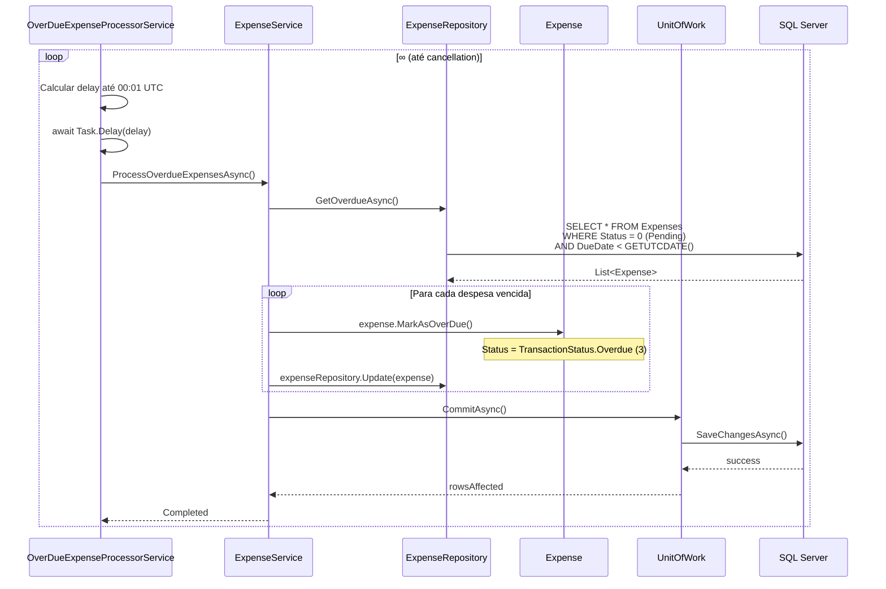

# ⏱️ Background Services

> **Camada:** API (`src/Monetis.API/BackgroundServices/`)  
> **Propósito:** Executar tarefas agendadas em segundo plano

---

## Índice

1. [OverDueExpenseProcessorService](#1-overdueexpenseprocessorservice)

---

## 1. OverDueExpenseProcessorService

**Arquivo:** `src/Monetis.API/BackgroundServices/OverDueExpenseProcessorService.cs`

Serviço em background que processa automaticamente despesas vencidas, marcando-as como `Overdue`.

### Registro

```csharp
// Program.cs
builder.Services.AddHostedService<OverDueExpenseProcessorService>();
```

### Funcionamento



### Código

```csharp
protected override async Task ExecuteAsync(CancellationToken stoppingToken)
{
    logger.LogInformation("Overdue Expense Processor started");

    while (!stoppingToken.IsCancellationRequested)
    {
        try
        {
            var now = DateTime.UtcNow;
            var nextRun = now.Date.AddDays(1).AddMinutes(1); // 00:01 UTC
            var delay = nextRun - now;

            if (delay <= TimeSpan.Zero)
                delay = TimeSpan.FromMinutes(1);

            await Task.Delay(delay, stoppingToken);

            using (var scope = serviceProvider.CreateScope())
            {
                var expenseService = scope.ServiceProvider
                    .GetRequiredService<IExpenseService>();

                await expenseService.ProcessOverdueExpensesAsync(stoppingToken);
            }
        }
        catch (Exception ex)
        {
            logger.LogError(ex, "Error processing overdue expenses");
            await Task.Delay(TimeSpan.FromHours(1), stoppingToken);
        }
    }
}
```

### Características

| Característica | Detalhe |
|---------------|---------|
| **Frequência** | Diário, à 00:01 UTC |
| **Delay** | Calculado: `(amanhã 00:01) - now` |
| **Se atrasado** | Executa em 1 minuto |
| **Em caso de erro** | Aguarda 1 hora e tenta novamente |
| **Scoping** | Cria um `IServiceScope` para resolver serviços scoped |

### Efeito

Apenas despesas com `Status == Pending && DueDate < today` são marcadas como `Overdue`. O método `MarkAsOverDue()` na entidade verifica internamente se `DueDate < DateTime.UtcNow.Date`.

---

> 💡 **Dica:** Este processo também pode ser disparado **manualmente** via `POST /api/expenses/process-overdue` (detalhes em [Endpoints](01-endpoints.md#post-apiexpensesprocess-overdue)).

---

> **Próximo:** [Configuração](04-configuracao.md)
