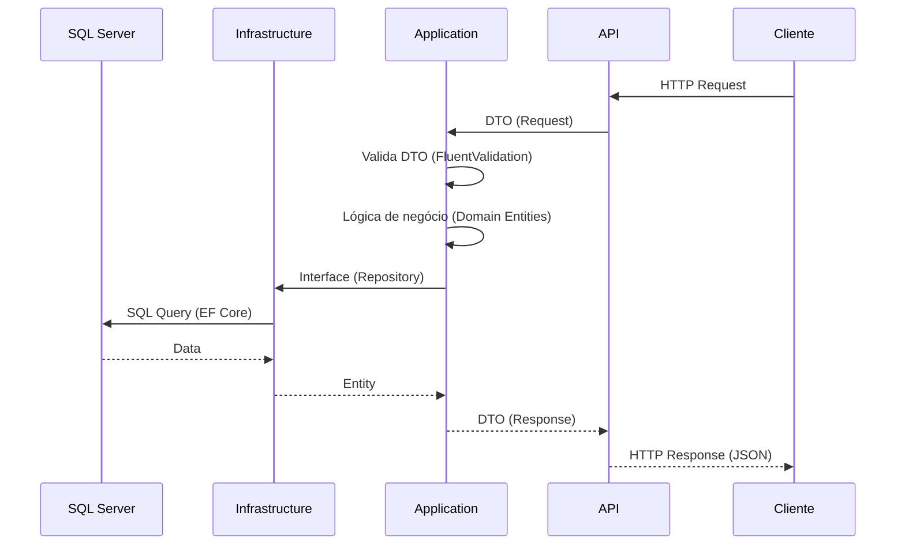

# 🏗️ Clean Architecture — Estrutura do Projeto

> **Camada:** Arquitetura  
> **Propósito:** Documentar os princípios arquiteturais e a organização do código

---

## Índice

1. [Visão Geral](#1-visão-geral)
2. [Diagrama da Arquitetura](#2-diagrama-da-arquitetura)
3. [Regras de Dependência](#3-regras-de-dependência)
4. [Fluxo de Dados entre Camadas](#4-fluxo-de-dados-entre-camadas)

---

## 1. Visão Geral

O projeto Monetis segue os princípios da **Clean Architecture** (também conhecida como Arquitetura Hexagonal ou Ports & Adapters), com 4 camadas bem definidas.

### Camadas

| Camada | Projeto | Responsabilidade |
|--------|---------|-----------------|
| **Domain** | `Monetis.Domain` | Regras de negócio, entidades, enums, exceções |
| **Application** | `Monetis.Application` | Casos de uso, serviços, DTOs, validação, interfaces |
| **Infrastructure** | `Monetis.Infrastructure` | Implementações (EF Core, JWT, hash) |
| **API** | `Monetis.API` | Controllers, middlewares, configuração |

---

## 2. Diagrama da Arquitetura

```mermaid
graph TB
    subgraph "Monetis.API (Presentation)"
        API[Controllers<br/>Middlewares<br/>Program.cs]
    end

    subgraph "Monetis.Application"
        APP[Services<br/>DTOs<br/>Validators<br/>Abstractions<br/>(Interfaces)]
    end

    subgraph "Monetis.Domain"
        DOM[Entities<br/>Enums<br/>Exceptions<br/>(Regras de Negócio)]
    end

    subgraph "Monetis.Infrastructure"
        INF[Persistence<br/>Security<br/>Migrations<br/>(Implementações)]
    end

    API -->|"Depende de"| APP
    APP -->|"Depende de"| DOM
    INF -->|"Implementa"| APP
    INF -->|"Depende de"| DOM
    API -->|"Depende de"| INF

    style DOM fill:#e1f5fe,stroke:#0288d1
    style APP fill:#fff3e0,stroke:#f57c00
    style INF fill:#f3e5f5,stroke:#7b1fa2
    style API fill:#e8f5e9,stroke:#388e3c
```

### 2.1 Camada de Domínio (Núcleo)

**Dependências:** Nenhuma  
**Projeto:** `Monetis.Domain`

Contém o **coração do sistema** — regras de negócio que não dependem de frameworks ou infraestrutura.

- **Entities:** `User`, `Account`, `Card`, `Category`, `Transaction`, `Expense`, `Income`, `Transfer`, `Subscription`
- **Base classes:** `BaseEntity`, `UserOwnedEntity`
- **Enums:** `AccountType`, `Frequency`, `PaymentMethod`, `TransactionStatus`
- **Exceptions:** ~60 exceções de domínio herdando de `DomainException`

### 2.2 Camada de Aplicação (Casos de Uso)

**Dependências:** Domain  
**Projeto:** `Monetis.Application`

Orquestra os casos de uso do sistema, definindo **interfaces** (portas) que a infraestrutura implementa:

- **Services:** `UserService`, `ExpenseService`, `TransferService`, etc.
- **DTOs:** Contratos de entrada/saída (records)
- **Validators:** Regras de validação com FluentValidation
- **Abstractions:** Interfaces para repositórios, segurança, serviços

### 2.3 Camada de Infraestrutura (Implementações)

**Dependências:** Application, Domain  
**Projeto:** `Monetis.Infrastructure`

Implementa as interfaces definidas na Application:

- **Persistence:** EF Core DbContext, repositories, migrations
- **Security:** Password hashing, JWT, user context
- **External concerns:** SQL Server

### 2.4 Camada de API (Apresentação)

**Dependências:** Application, Infrastructure  
**Projeto:** `Monetis.API`

Ponto de entrada da aplicação:

- **Controllers:** Endpoints REST
- **Middlewares:** Exception handling, rate limiting, user context
- **Background Services:** Processamento de despesas vencidas

---

## 3. Regras de Dependência

### Direção das Dependências

```
API → Application → Domain ← Infrastructure
```

- **Seta para dentro:** Dependências apontam para o centro (Domain)
- **Domain:** Não sabe da existência de nenhuma outra camada
- **Application:** Só conhece Domain
- **Infrastructure:** Conhece Application e Domain
- **API:** Conhece Application e Infrastructure

### Princípios Aplicados

| Princípio | Descrição | Exemplo |
|-----------|-----------|---------|
| **Inversão de Dependência (DIP)** | Módulos de alto nível não dependem de módulos de baixo nível. Ambos dependem de abstrações. | Application define `IUserRepository`, Infrastructure implementa |
| **Separação de Responsabilidades (SRP)** | Cada camada tem uma única responsabilidade bem definida | Domain = regras, Application = casos de uso, Infrastructure = implementações |
| **Domínio Rico** | Lógica de negócio dentro das entidades, não espalhada pelos serviços | `Account.Withdraw()`, `Expense.Pay()`, `Transfer.Cancel()` |

---

## 4. Fluxo de Dados entre Camadas



### Exemplo: Criar Conta

```
1. HTTP POST /api/accounts { name, type }       → API
2. CreateAccountRequest                          → Controller
3. IAccountService.CreateAsync(request)          → Application
4. new Account(name, type)                        → Domain Entity
5. IAccountRepository.Create(account)             → Interface
6. BaseRepository<Account>.Create(account)        → Infrastructure
7. IUnitOfWork.CommitAsync()                      → Interface
8. UnitOfWork.CommitAsync() → SaveChanges()       → Infrastructure
9. AccountResponse { id, name, type, balance }    → API
10. 201 Created + Location header                 → HTTP Response
```

---

> **Próximo:** [Fluxo de Dados](02-fluxo-de-dados.md)
