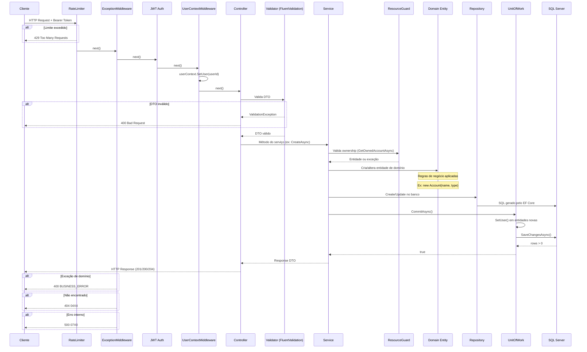

# 🔄 Fluxo de Dados — Ciclo de Vida de uma Requisição

> **Camada:** Arquitetura  
> **Propósito:** Documentar o fluxo completo de uma requisição HTTP através de todas as camadas

---

## Índice

1. [Fluxo Completo (Diagrama)](#1-fluxo-completo-diagrama)
2. [Etapas Detalhadas](#2-etapas-detalhadas)
3. [Exemplo: Criação de Despesa](#3-exemplo-criação-de-despesa)

---

## 1. Fluxo Completo (Diagrama)



---

## 2. Etapas Detalhadas

### Etapa 1: Pipeline HTTP

| Ordem | Componente | Ação | Possível Resultado |
|-------|-----------|------|-------------------|
| 1 | Rate Limiter | Verifica se IP excedeu 100 req/min | 429 Too Many Requests |
| 2 | ExceptionMiddleware | Envolve todo o pipeline em try/catch | Captura exceções não tratadas |
| 3 | JWT Authentication | Valida token Bearer | 401 Unauthorized |
| 4 | UserContextMiddleware | Extrai userId do claim e popula UserContext | Segue para controller |
| 5 | Authorization | Verifica permissões | 403 Forbidden |
| 6 | Controller | Executa o endpoint | 200/201/204/400/404 |

### Etapa 2: Controller → Validação

O controller recebe o DTO e, se configurado, o FluentValidation valida automaticamente:

```csharp
[HttpPost]
public async Task<ActionResult<AccountResponse>> Create(
    [FromBody] CreateAccountRequest request,
    CancellationToken cancellationToken)
{
    // Se request for inválido, ASP.NET Core retorna 400 automaticamente
    var account = await accountService.CreateAsync(request, cancellationToken);
    return CreatedAtAction(nameof(GetById), new { id = account.Id }, account);
}
```

### Etapa 3: Service → ResourceGuard

O service valida se o recurso pertence ao usuário:

```csharp
var account = await userResourceGuard.GetOwnedAccountAsync(accountId, cancellationToken);
// Lança KeyNotFoundException se não existir
// O ExceptionMiddleware converte para 404
```

### Etapa 4: Service → Domain Entity

O service cria ou altera entidades, aplicando regras de negócio:

```csharp
var account = new Account(createDto.Name, createDto.Type);
// Construtor valida: nome não vazio, type válido
// Se inválido, lança DomainException → 400
```

### Etapa 5: Service → Repository + UnitOfWork

O service persiste a entidade:

```csharp
accountRepository.Create(account);
await unitOfWork.CommitAsync(cancellationToken);
// UnitOfWork.SetUser() atribui UserId automaticamente
// SaveChangesAsync() persiste no banco
```

### Etapa 6: Controller → Response

O controller mapeia a entidade para DTO e retorna:

```csharp
return new AccountResponse(account.Id, account.Name, account.UserId, account.Type, account.Balance);
// → 201 Created com Location header
```

---

## 3. Exemplo: Criação de Despesa

### Passo a passo completo

```
1. Cliente envia:
   POST /api/expenses
   Authorization: Bearer eyJ...
   {
     "accountId": "guid-1",
     "categoryId": "guid-2",
     "amount": 150.00,
     "description": "Supermercado",
     "dueDate": "2026-07-20T00:00:00Z",
     "paymentMethod": "Cash"
   }

2. Pipeline:
   → RateLimiter: OK (86 req/min)
   → ExceptionMiddleware: OK (try)
   → JWT Auth: Token válido
   → UserContextMiddleware: userId = "user-123"
   → Authorization: OK
   → ExpensesController.Create(request)

3. ExpensesController:
   → FluentValidation: CreateExpenseRequestValidator
     - AccountId: não vazio ✓
     - CategoryId: não vazio ✓
     - Amount: > 0 ✓
     - Description: ≤ 200 chars ✓
     - PaymentMethod: IsInEnum ✓
   → ExpenseService.CreateExpenseAsync(request)

4. ExpenseService:
   → RG.GetOwnedAccountAsync(guid-1)
   → RG.GetVisibleCategoryAsync(guid-2)
   → new Expense(guid-1, guid-2, 150.00, "Supermercado", ..., Cash)
   → account.Withdraw(150.00)  // Cash = IsPaidInCash
   → expense.Pay(UtcNow, account.Id)
   → expenseRepository.Create(expense)
   → unitOfWork.CommitAsync()
     → SetUser(expense, "user-123")
     → db.SaveChangesAsync()

5. Retorno:
   ← 201 Created
   ← Location: /api/expenses/{novo-guid}
   ← { id: "...", status: "Paid", amount: 150.00, ... }
```

---

> **Próximo:** [Decisões Técnicas](03-decisoes-tecnicas.md)
