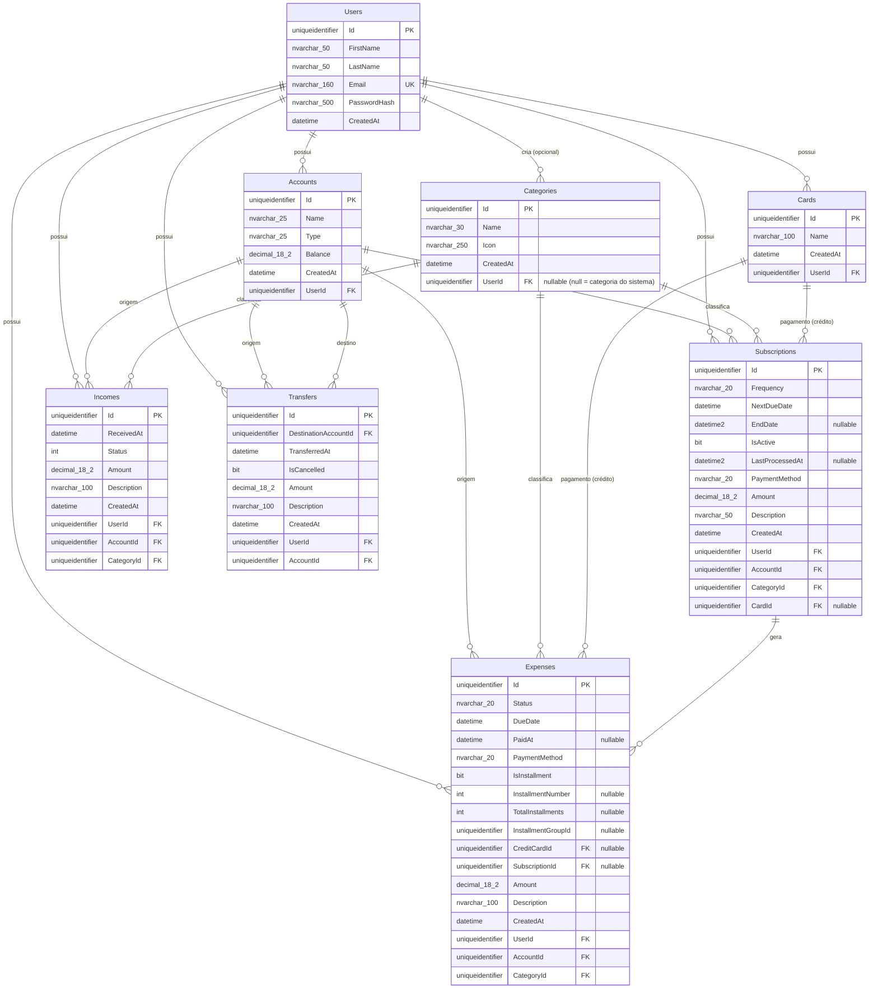

# 🗄️ Diagrama ERD — Banco de Dados

> **Provedor:** SQL Server
> **ORM:** Entity Framework Core (TPC — Table Per Concrete Type)
> **Migration:** `20260507163326_InitialCreate`

---

## 1. Diagrama Visual

---

## 2. Tabelas Detalhadas

### Users

| Coluna | Tipo | Restrições | Descrição |
|--------|------|-----------|-----------|
| `Id` | `uniqueidentifier` | PK, `ValueGeneratedNever` | ID do usuário |
| `FirstName` | `nvarchar(50)` | NOT NULL | Nome |
| `LastName` | `nvarchar(50)` | NOT NULL | Sobrenome |
| `Email` | `nvarchar(160)` | NOT NULL, **UK** | Email (único) |
| `PasswordHash` | `nvarchar(500)` | NOT NULL | Hash da senha |
| `CreatedAt` | `datetime` | NOT NULL | Data de criação |

**Índices:** `IX_Users_Email` (único)

---

### Accounts

| Coluna | Tipo | Restrições | Descrição |
|--------|------|-----------|-----------|
| `Id` | `uniqueidentifier` | PK | ID da conta |
| `Name` | `nvarchar(25)` | NOT NULL | Nome da conta |
| `Type` | `nvarchar(25)` | NOT NULL | Checking/Saving/CreditCard |
| `Balance` | `decimal(18,2)` | NOT NULL | Saldo atual |
| `CreatedAt` | `datetime` | NOT NULL | Data de criação |
| `UserId` | `uniqueidentifier` | FK → Users, **CASCADE** | Dono da conta |

**Índices:** `IX_Accounts_UserId`

---

### Cards

| Coluna | Tipo | Restrições | Descrição |
|--------|------|-----------|-----------|
| `Id` | `uniqueidentifier` | PK | ID do cartão |
| `Name` | `nvarchar(100)` | NOT NULL | Nome do cartão |
| `CreatedAt` | `datetime` | NOT NULL | Data de criação |
| `UserId` | `uniqueidentifier` | FK → Users, **CASCADE** | Dono do cartão |

**Índices:** `IX_Cards_UserId`, `IX_Cards_UserId_Name`

---

### Categories

| Coluna | Tipo | Restrições | Descrição |
|--------|------|-----------|-----------|
| `Id` | `uniqueidentifier` | PK | ID da categoria |
| `Name` | `nvarchar(30)` | NOT NULL | Nome da categoria |
| `Icon` | `nvarchar(250)` | NOT NULL | Emoji/ícone |
| `CreatedAt` | `datetime` | NOT NULL | Data de criação |
| `UserId` | `uniqueidentifier` | FK → Users, **nullable** | Dono (null = categoria do sistema) |

**Índices:** `IX_Categories_UserId`

> 💡 Categorias do sistema têm `UserId = null` e são visíveis para todos os usuários.

---

### Expenses

| Coluna | Tipo | Restrições | Descrição |
|--------|------|-----------|-----------|
| `Id` | `uniqueidentifier` | PK | ID da despesa |
| `Status` | `nvarchar(20)` | NOT NULL | Pending/Paid/Overdue/Cancelled |
| `DueDate` | `datetime` | NOT NULL | Data de vencimento |
| `PaidAt` | `datetime` | nullable | Data de pagamento |
| `PaymentMethod` | `nvarchar(20)` | NOT NULL | Cash/Debit/CreditCard/Pix/Transfer |
| `IsInstallment` | `bit` | NOT NULL | É parcela? |
| `InstallmentNumber` | `int` | nullable | Número da parcela |
| `TotalInstallments` | `int` | nullable | Total de parcelas |
| `InstallmentGroupId` | `uniqueidentifier` | nullable | Grupo de parcelas |
| `CreditCardId` | `uniqueidentifier` | FK → Cards, nullable | Cartão de crédito |
| `SubscriptionId` | `uniqueidentifier` | FK → Subscriptions, nullable | Assinatura geradora |
| `Amount` | `decimal(18,2)` | NOT NULL | Valor |
| `Description` | `nvarchar(100)` | NOT NULL | Descrição |
| `CreatedAt` | `datetime` | NOT NULL | Data de criação |
| `UserId` | `uniqueidentifier` | FK → Users, **CASCADE** | Dono |
| `AccountId` | `uniqueidentifier` | FK → Accounts, **RESTRICT** | Conta de origem |
| `CategoryId` | `uniqueidentifier` | FK → Categories, **RESTRICT** | Categoria |

**Índices:** `IX_Expenses_AccountId`, `IX_Expenses_CategoryId`, `IX_Expenses_CreditCardId`, `IX_Expenses_InstallmentGroupId`, `IX_Expenses_SubscriptionId`, `IX_Expenses_UserId`

---

### Incomes

| Coluna | Tipo | Restrições | Descrição |
|--------|------|-----------|-----------|
| `Id` | `uniqueidentifier` | PK | ID da receita |
| `ReceivedAt` | `datetime` | NOT NULL | Data de recebimento |
| `Status` | `int` | NOT NULL | Pending/Paid/Cancelled |
| `Amount` | `decimal(18,2)` | NOT NULL | Valor |
| `Description` | `nvarchar(100)` | NOT NULL | Descrição |
| `CreatedAt` | `datetime` | NOT NULL | Data de criação |
| `UserId` | `uniqueidentifier` | FK → Users, **CASCADE** | Dono |
| `AccountId` | `uniqueidentifier` | FK → Accounts, **RESTRICT** | Conta de destino |
| `CategoryId` | `uniqueidentifier` | FK → Categories, **RESTRICT** | Categoria |

**Índices:** `IX_Incomes_AccountId`, `IX_Incomes_CategoryId`, `IX_Incomes_UserId`

---

### Transfers

| Coluna | Tipo | Restrições | Descrição |
|--------|------|-----------|-----------|
| `Id` | `uniqueidentifier` | PK | ID da transferência |
| `DestinationAccountId` | `uniqueidentifier` | FK → Accounts, **RESTRICT** | Conta destino |
| `TransferredAt` | `datetime` | NOT NULL | Data da transferência |
| `IsCancelled` | `bit` | NOT NULL | Foi cancelada? |
| `Amount` | `decimal(18,2)` | NOT NULL | Valor |
| `Description` | `nvarchar(100)` | NOT NULL | Descrição |
| `CreatedAt` | `datetime` | NOT NULL | Data de criação |
| `UserId` | `uniqueidentifier` | FK → Users, **CASCADE** | Dono |
| `AccountId` | `uniqueidentifier` | FK → Accounts, **RESTRICT** | Conta origem |

**Índices:** `IX_Transfers_AccountId`, `IX_Transfers_DestinationAccountId`, `IX_Transfers_UserId`

---

### Subscriptions

| Coluna | Tipo | Restrições | Descrição |
|--------|------|-----------|-----------|
| `Id` | `uniqueidentifier` | PK | ID da assinatura |
| `Frequency` | `nvarchar(20)` | NOT NULL | Weekly/Monthly/Yearly/etc |
| `NextDueDate` | `datetime` | NOT NULL | Próximo vencimento |
| `EndDate` | `datetime2` | nullable | Data de término |
| `IsActive` | `bit` | NOT NULL | Está ativa? |
| `LastProcessedAt` | `datetime2` | nullable | Último processamento |
| `PaymentMethod` | `nvarchar(20)` | NOT NULL | Forma de pagamento |
| `Amount` | `decimal(18,2)` | NOT NULL | Valor da recorrência |
| `Description` | `nvarchar(50)` | NOT NULL | Descrição |
| `CreatedAt` | `datetime` | NOT NULL | Data de criação |
| `UserId` | `uniqueidentifier` | FK → Users, **CASCADE** | Dono |
| `AccountId` | `uniqueidentifier` | FK → Accounts, **RESTRICT** | Conta de débito |
| `CategoryId` | `uniqueidentifier` | FK → Categories, **RESTRICT** | Categoria |
| `CardId` | `uniqueidentifier` | FK → Cards, nullable, **RESTRICT** | Cartão de crédito |

**Índices:** `IX_Subscriptions_UserId`, `IX_Subscriptions_UserId_IsActive`, `IX_Subscriptions_NextDueDate`, `IX_Subscriptions_CardId`

---

## 3. Relacionamentos

| De | Para | FK | Delete Behavior |
|----|------|----|-----------------|
| Users | Accounts | `UserId` | Cascade |
| Users | Cards | `UserId` | Cascade |
| Users | Categories | `UserId` | NoAction (nullable) |
| Users | Subscriptions | `UserId` | Cascade |
| Users | Expenses | `UserId` | Cascade |
| Users | Incomes | `UserId` | Cascade |
| Users | Transfers | `UserId` | Cascade |
| Accounts | Expenses | `AccountId` | Restrict |
| Accounts | Incomes | `AccountId` | Restrict |
| Accounts | Transfers | `AccountId` | Restrict |
| Accounts | Transfers | `DestinationAccountId` | Restrict |
| Accounts | Subscriptions | `AccountId` | Restrict |
| Categories | Expenses | `CategoryId` | Restrict |
| Categories | Incomes | `CategoryId` | Restrict |
| Categories | Subscriptions | `CategoryId` | Restrict |
| Cards | Expenses | `CreditCardId` | Restrict |
| Cards | Subscriptions | `CardId` | Restrict |
| Subscriptions | Expenses | `SubscriptionId` | SetNull |

---

## 4. Categorias do Sistema (Seed)

| Nome | Ícone | ID |
|------|-------|----|
| Alimentação | 🍽️ | `28e61ce8-8149-4c81-a570-c0085eefa121` |
| Transporte | 🚗 | `e29e79d5-7844-491f-a9bd-9e744890555b` |
| Salário | 💰 | `96d53840-9752-4f2b-a522-c7357cdc4986` |

---

> **Próximo:** [Voltar à Visão Geral](../00-visao-geral.md)
