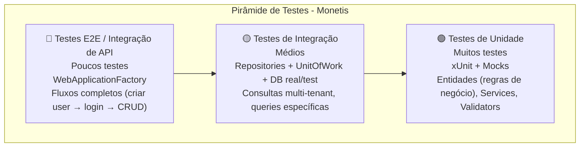

# 🧪 Estratégia de Testes

> **Framework:** xUnit  
> **Mocks:** (a definir — Moq / NSubstitute)  
> **Integração:** WebApplicationFactory (Microsoft.AspNetCore.Mvc.Testing)  
> **BD em memória:** SQLite In-Memory ou EF Core InMemory

---

## Índice

1. [Pirâmide de Testes](#1-pirâmide-de-testes)
2. [Testes Unitários](#2-testes-unitários)
3. [Testes de Integração](#3-testes-de-integração)
4. [Testes E2E](#4-testes-e2e)
5. [Ferramentas Recomendadas](#5-ferramentas-recomendadas)
6. [Configuração do Projeto de Testes](#6-configuração-do-projeto-de-testes)

---

## 1. Pirâmide de Testes



| Nível | Quantidade | Velocidade | Cobertura |
|-------|-----------|------------|-----------|
| Unitário | Muitos (~200+) | ⚡ Rápido (ms) | Regras de negócio individuais |
| Integração | Médios (~50) | ⚡ Médio (s) | Interação entre camadas |
| E2E | Poucos (~15) | 🐢 Lento (min) | Fluxos completos |

---

## 2. Testes Unitários

### 2.1 O que testar

**Entidades de Domínio (mais crítico):**
- `Account.Deposit()` e `Account.Withdraw()` — valores válidos e inválidos
- `Account.Update()` — nome válido e inválido
- `Account.AdjustBalance()` — razão válida e inválida
- `Expense.Pay()` — transições de estado
- `Expense.MarkAsOverDue()` — regra de data
- `Expense.Update()` — despesa paga não pode ser atualizada
- `Expense.CreateInstallment()` — range de parcelas, criação do grupo
- `Income.CreatePaid()` e `Income.Schedule()` — validação de data
- `Income.ConfirmReceipt()` e `Income.Cancel()` — transições de estado
- `Transfer` constructor — validações (contas diferentes, mesmo user, saldo)
- `Transfer.Cancel()` — mesmo dia, já cancelada
- `Subscription.Process()` — cálculo de próxima data, geração de despesa
- `Subscription.Cancel()` e `Subscription.Reactivate()`
- `User.Update()` e `User.ChangePassword()` — validações
- `Category.CreateSystemCategory()` — factory method
- `UserOwnedEntity.SetUser()` — só pode ser chamado uma vez
- `BaseEntity` — Id e CreatedAt são gerados corretamente

**Services (com mocks):**
- `UserService.CreateAsync()` — email duplicado
- `AccountService.CreateAsync()` — criação com validação
- `ExpenseService.CreateExpenseAsync()` — pagamento à vista vs crédito
- `ExpenseService.PayExpenseAsync()` — conta diferente
- `ExpenseService.ProcessOverdueExpensesAsync()` — processa vencidas
- `TransferService.CreateAsync()` — saldo insuficiente
- `TransferService.DeleteAsync()` — cancelamento no mesmo dia
- `SubscriptionService.CreateAsync()` — já gera 1ª despesa

**Validators:**
- Testar cada validator com dados válidos (deve passar)
- Testar cada validator com dados inválidos (deve falhar com mensagem correta)

### 2.2 Exemplo de estrutura de teste

```csharp
public class AccountTests
{
    [Fact]
    public void Deposit_WithPositiveAmount_ShouldIncreaseBalance()
    {
        // Arrange
        var account = new Account("Conta Corrente", AccountType.Checking);

        // Act
        account.Deposit(100);

        // Assert
        Assert.Equal(100, account.Balance);
    }

    [Fact]
    public void Deposit_WithNegativeAmount_ShouldThrowException()
    {
        // Arrange
        var account = new Account("Conta Corrente", AccountType.Checking);

        // Act & Assert
        Assert.Throws<AccountAmountMustBePositiveException>(
            () => account.Deposit(-50));
    }
}
```

---

## 3. Testes de Integração

### 3.1 O que testar

**Repositories:**
- CRUD básico (Create, Read, Update, Delete)
- Queries específicas:
  - `ExpenseRepository.GetOverdueAsync()` — apenas despesas vencidas
  - `ExpenseRepository.GetByPeriodAsync()` — filtro por data
  - `ExpenseRepository.GetByCategoryAsync()` — filtro por categoria
  - `UserRepository.GetUserByEmailAsync()` — busca por email
  - `TransferRepository.GetByIdWithAccountsAsync()` — Include correto

**UnitOfWork:**
- `CommitAsync()` seta `UserId` em entidades `UserOwnedEntity` novas
- `CommitAsync()` salva no banco
- `Dispose()` — problema conhecido (NotImplementedException)

**Multi-tenancy:**
- Usuário A cria conta → Usuário B não vê a conta
- Categorias do sistema são visíveis para todos
- Categorias do usuário são visíveis apenas para o dono

### 3.2 Setup sugerido

```csharp
public class RepositoryTestBase : IDisposable
{
    private readonly DbConnection _connection;
    protected readonly MonetisDataContext Context;
    protected readonly Guid TestUserId = Guid.NewGuid();

    public RepositoryTestBase()
    {
        _connection = new SqliteConnection("DataSource=:memory:");
        _connection.Open();

        var options = new DbContextOptionsBuilder<MonetisDataContext>()
            .UseSqlite(_connection)
            .Options;

        Context = new MonetisDataContext(options);
        Context.Database.EnsureCreated();

        // Seed usuário de teste
        var user = new User("Test", "User", "test@email.com", "hash");
        Context.Users.Add(user);
        Context.SaveChanges();
    }

    public void Dispose()
    {
        Context.Dispose();
        _connection.Dispose();
    }
}
```

---

## 4. Testes E2E

### 4.1 O que testar

Fluxos completos usando `WebApplicationFactory`:

| Cenário | Fluxo |
|---------|-------|
| **Registro e Login** | POST /api/users → POST /api/auth/login → obtém token |
| **CRUD de Conta** | POST /api/accounts → GET /api/accounts → PUT → DELETE |
| **Criar e pagar despesa** | Criar conta → criar despesa à vista → verificar saldo |
| **Criar despesa parcelada** | Criar cartão → criar parcelas → verificar N despesas |
| **Transferência entre contas** | Criar 2 contas → transferir → verificar saldos |
| **Cancelar transferência** | Criar transferência → cancelar → verificar estorno |
| **Assinatura gera despesa** | Criar subscription → verificar 1ª despesa criada |
| **Autenticação** | Request sem token → 401 |
| **Multi-tenancy** | User A cria → User B não vê |
| **Rate limiting** | Exceder limite → 429 |

### 4.2 Setup sugerido

```csharp
public class ApiTestBase : IClassFixture<WebApplicationFactory<Program>>
{
    protected readonly HttpClient Client;
    protected readonly WebApplicationFactory<Program> Factory;

    public ApiTestBase(WebApplicationFactory<Program> factory)
    {
        Factory = factory.WithWebHostBuilder(builder =>
        {
            builder.ConfigureServices(services =>
            {
                // Substituir DbContext real por InMemory
                var descriptor = services.SingleOrDefault(
                    d => d.ServiceType == typeof(DbContextOptions<MonetisDataContext>));
                if (descriptor != null)
                    services.Remove(descriptor);

                services.AddDbContext<MonetisDataContext>(options =>
                {
                    options.UseInMemoryDatabase("TestDb");
                });
            });
        });

        Client = Factory.CreateClient();
    }

    protected async Task<string> GetTokenAsync()
    {
        // Criar user e fazer login
        var createResponse = await Client.PostAsJsonAsync("/api/users", new
        {
            firstName = "Test",
            lastName = "User",
            email = $"test{Guid.NewGuid()}@email.com",
            password = "Test@123"
        });

        var user = await createResponse.Content.ReadFromJsonAsync<UserResponse>();

        var loginResponse = await Client.PostAsJsonAsync("/api/auth/login", new
        {
            email = user.Email,
            password = "Test@123"
        });

        var token = await loginResponse.Content.ReadFromJsonAsync<LoginResponse>();
        return token.Token;
    }

    protected void SetAuthHeader(string token)
    {
        Client.DefaultRequestHeaders.Authorization =
            new AuthenticationHeaderValue("Bearer", token);
    }
}
```

---

## 5. Ferramentas Recomendadas

| Ferramenta | Finalidade | Status |
|-----------|-----------|--------|
| **xUnit** | Framework de testes | ✅ Definido |
| **FluentAssertions** | Asserções mais legíveis | 🔶 Recomendado |
| **Moq** | Mock de dependências | 🔶 Recomendado |
| **Bogus** | Geração de dados falsos | 🔶 Recomendado |
| **SQLite In-Memory** | Banco de testes de integração | 🔶 Recomendado |
| **WebApplicationFactory** | Testes E2E da API | 🔶 Necessário |

---

## 6. Configuração do Projeto de Testes

Estrutura sugerida:

```
tests/
├── Monetis.Domain.Tests/           # Testes de unidade (domínio)
│   ├── Entities/
│   │   ├── AccountTests.cs
│   │   ├── ExpenseTests.cs
│   │   ├── IncomeTests.cs
│   │   ├── TransferTests.cs
│   │   ├── SubscriptionTests.cs
│   │   └── UserTests.cs
│   ├── Enums/
│   │   └── PaymentMethodTests.cs
│   └── Monetis.Domain.Tests.csproj
│
├── Monetis.Application.Tests/      # Testes de unidade (aplicação)
│   ├── Services/
│   │   ├── AccountServiceTests.cs
│   │   ├── ExpenseServiceTests.cs
│   │   └── ...
│   └── Validators/
│       ├── CreateAccountValidatorTests.cs
│       ├── CreateExpenseValidatorTests.cs
│       └── ...
│   └── Monetis.Application.Tests.csproj
│
└── Monetis.API.Tests/              # Testes de integração / E2E
    ├── Integration/
    │   ├── RepositoryTests.cs
    │   └── UnitOfWorkTests.cs
    └── E2E/
        ├── AuthFlowTests.cs
        ├── AccountFlowTests.cs
        ├── ExpenseFlowTests.cs
        └── ...
    └── Monetis.API.Tests.csproj
```

---

> **Próximo:** [Cenários Principais de Teste](02-cenarios-principais.md)
