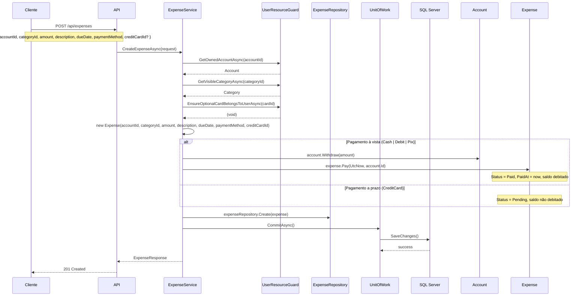
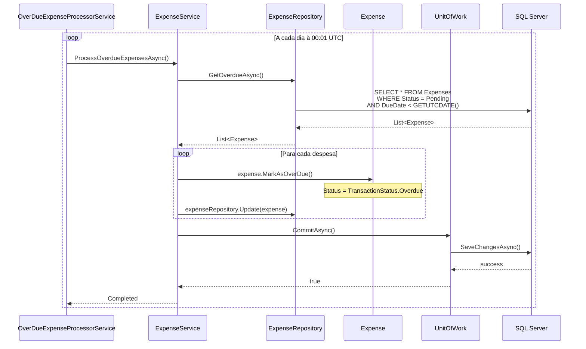

# 💸 Cenários de Negócio — Despesas e Receitas

> **Camada:** Domain / Application  
> **Cenários:** BZ-01, BZ-03, BZ-04, BZ-05, BZ-06, BZ-07, BZ-08  
> **Entidades:** Expense, Income, Account

---

## Índice

1. [BZ-01: Registrar despesa simples](#bz-01-registrar-despesa-simples)
2. [BZ-03: Pagar despesa pendente](#bz-03-pagar-despesa-pendente)
3. [BZ-04: Atualizar despesa pendente](#bz-04-atualizar-despesa-pendente)
4. [BZ-05: Processar despesas vencidas (automático)](#bz-05-processar-despesas-vencidas-automático)
5. [BZ-06: Registrar receita](#bz-06-registrar-receita)
6. [BZ-07: Confirmar recebimento de receita agendada](#bz-07-confirmar-recebimento-de-receita-agendada)
7. [BZ-08: Cancelar receita pendente](#bz-08-cancelar-receita-pendente)

---

## BZ-01: Registrar despesa simples

### Descrição
Usuário registra uma despesa única associada a uma conta e categoria.

### Fluxo Principal



### Regras de Negócio

| Regra | Descrição |
|-------|-----------|
| Conta deve existir e pertencer ao usuário | Validado por `UserResourceGuard.GetOwnedAccountAsync()` |
| Categoria deve existir (sistema ou do usuário) | Validado por `UserResourceGuard.GetVisibleCategoryAsync()` |
| Cartão de crédito, se informado, deve existir | Validado por `UserResourceGuard.EnsureOptionalCardBelongsToUserAsync()` |
| Se pagamento em crédito, CreditCardId é obrigatório | DomainException: `ExpenseCreditCardRequiredException` |
| Se pagamento NÃO é crédito, CreditCardId deve ser null | DomainException: `ExpenseCreditCardOnlyForCreditCardPaymentException` |
| DueDate não pode ser anterior a 1 ano atrás | DomainException: `ExpenseDueDateTooOldException` |

### Efeitos Colaterais
- **Pagamento à vista:** Saldo da conta é debitado (`account.Withdraw(amount)`) e despesa fica `Paid`
- **Pagamento a prazo:** Saldo não é alterado, despesa fica `Pending`

### Exceções

| Exceção | Quando |
|---------|--------|
| `KeyNotFoundException` | Conta ou categoria não encontrada |
| `ExpenseCreditCardRequiredException` | CreditCard sem cartão informado |
| `ExpenseCreditCardOnlyForCreditCardPaymentException` | Cartão informado sem ser crédito |
| `ExpenseDueDateTooOldException` | DueDate muito antiga |

---

## BZ-03: Pagar despesa pendente

### Descrição
Usuário efetua o pagamento de uma despesa que estava pendente. Pode opcionalmente mudar a conta de débito.

### Fluxo Principal

```
POST /api/expenses/{id}/pay
Body: { "paidAt": "2026-07-15T10:00:00Z", "accountId": "guid-da-conta" }
```

1. Buscar despesa por ID (`Repository.GetByIdAsync`)
2. Se `accountId` no request for diferente do original, usar a nova conta (`RG.GetOwnedAccountAsync`)
3. Se despesa for à vista ou parcelada: debitar valor da conta (`account.Withdraw(amount)`)
4. `expense.Pay(paidAt, targetAccountId)` — altera status para `Paid`
5. `Repository.Update(expense)` + `Commit()`

### Regras

| Regra | Exceção |
|-------|---------|
| Não pode pagar despesa já paga | `ExpenseAlreadyPaidException` |
| Conta de destino deve existir e pertencer ao usuário | `KeyNotFoundException` |

### Efeitos Colaterais
- Saldo da conta é debitado se despesa for à vista ou parcelada
- AccountId da despesa pode ser alterado para uma conta diferente

---

## BZ-04: Atualizar despesa pendente

### Descrição
Usuário atualiza dados de uma despesa que ainda está pendente.

### Fluxo Principal

```
PUT /api/expenses/{id}
Body: { "categoryId": "guid", "amount": 200.00, "description": "Supermercado", "dueDate": "2026-07-25" }
```

1. Buscar despesa por ID
2. Validar categoria (`RG.GetVisibleCategoryAsync`)
3. `expense.Update(categoryId, amount, description, dueDate)`
4. `Repository.Update(expense)` + `Commit()`

### Regras

| Regra | Exceção |
|-------|---------|
| Não pode atualizar despesa paga | `PaidExpenseCannotBeUpdatedException` |
| Não pode atualizar parcela individual | `InstallmentExpenseCannotBeUpdatedException` |
| CategoryId obrigatório | `ExpenseCategoryRequiredException` |

---

## BZ-05: Processar despesas vencidas (automático)

### Descrição
Processo automático (background service) que marca despesas vencidas como `Overdue`.

### Fluxo Principal



### Regras
- Apenas despesas com `Status == Pending && DueDate < today` são marcadas
- O método `MarkAsOverDue()` verifica internamente se `DueDate < today`
- Também pode ser chamado manualmente via `POST /api/expenses/process-overdue`

---

## BZ-06: Registrar receita

### Descrição
Usuário registra uma receita já recebida. O valor é automaticamente depositado na conta.

### Fluxo Principal

```
POST /api/incomes
Body: { "accountId": "guid", "categoryId": "guid", "amount": 5000.00, "description": "Salário", "receivedAt": "2026-07-05T00:00:00Z" }
```

1. `RG.GetOwnedAccountAsync(accountId)` + `RG.GetVisibleCategoryAsync(categoryId)`
2. `Income.CreatePaid(accountId, categoryId, amount, description, receivedAt)` — valida receivedAt ≤ today
3. `account.Deposit(amount)` — saldo é creditado
4. `Repository.Create(income)` + `Commit()`

### Regras

| Regra | Exceção |
|-------|---------|
| ReceivedAt não pode ser futura | `IncomeReceivedDateInFutureException` |
| CategoryId obrigatório | `IncomeCategoryRequiredException` |
| Amount > 0 | `IncomeAmountMustBePositiveException` |

### Efeitos Colaterais
- **Saldo da conta é creditado** com o valor da receita

---

## BZ-07: Confirmar recebimento de receita agendada

### Descrição
Usuário confirma o recebimento de uma receita que estava agendada (Status = Pending).

### Fluxo

```
income.ConfirmReceipt(actualDate)
```

1. Verificar se `Status != Paid` → se já paga, lança `IncomeAlreadyReceivedException`
2. Atualizar `ReceivedAt = actualDate ?? DateTime.UtcNow`
3. Atualizar `Status = Paid`

> ⚠️ **Nota:** Funcionalidade existe apenas no domínio (entidade `Income`), não exposta via API. Candidata a implementação futura.

---

## BZ-08: Cancelar receita pendente

### Descrição
Usuário cancela uma receita que estava agendada (ainda não recebida).

### Fluxo

```
income.Cancel()
```

1. Verificar se `Status != Paid` → se já recebida, lança `ReceivedIncomeCannotBeCancelledException`
2. Atualizar `Status = Cancelled`

> ⚠️ **Nota:** Funcionalidade existe apenas no domínio (entidade `Income`), não exposta via API ou service. Candidata a implementação futura.

---

## Mapa de Endpoints

| Cenário | Método | Endpoint | Controller |
|---------|--------|----------|------------|
| BZ-01 | `POST` | `/api/expenses` | ExpensesController |
| BZ-03 | `POST` | `/api/expenses/{id}/pay` | ExpensesController |
| BZ-04 | `PUT` | `/api/expenses/{id}` | ExpensesController |
| BZ-05 | `POST` | `/api/expenses/process-overdue` | ExpensesController |
| BZ-06 | `POST` | `/api/incomes` | IncomesController |
| BZ-07 | — | (não exposto) | — |
| BZ-08 | — | (não exposto) | — |

---

> **Próximo:** [Transferências](02-transferencias.md)
