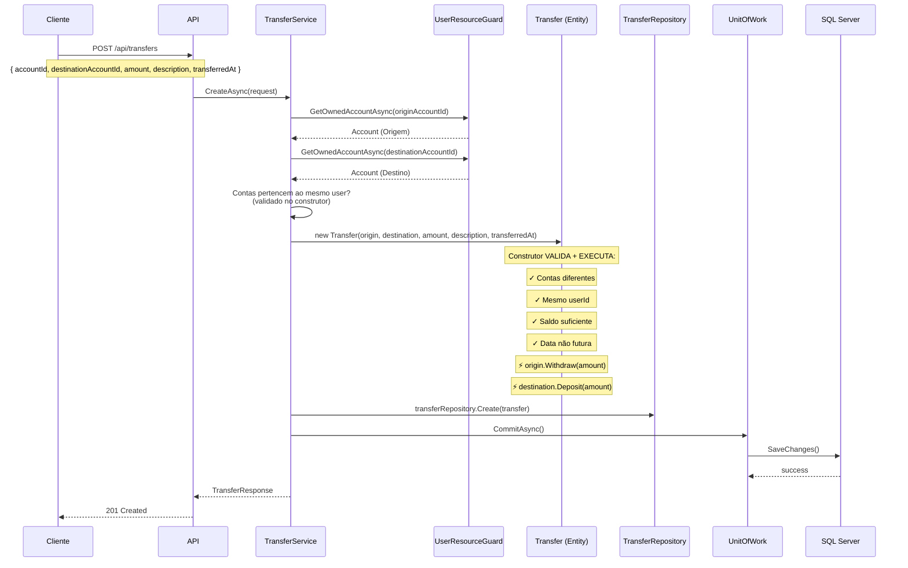
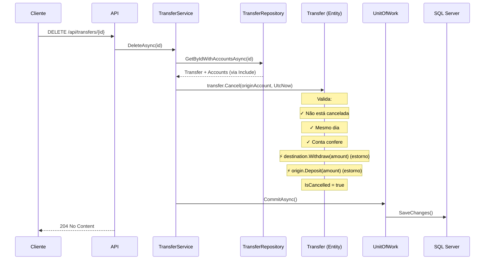

# 🔄 Cenários de Negócio — Transferências e Ajustes de Saldo

> **Camada:** Domain / Application  
> **Cenários:** BZ-09, BZ-10, BZ-17  
> **Entidades:** Transfer, Account

---

## Índice

1. [BZ-09: Transferir entre contas do mesmo usuário](#bz-09-transferir-entre-contas-do-mesmo-usuário)
2. [BZ-10: Cancelar transferência no mesmo dia](#bz-10-cancelar-transferência-no-mesmo-dia)
3. [BZ-17: Ajustar saldo de conta manualmente](#bz-17-ajustar-saldo-de-conta-manualmente)

---

## BZ-09: Transferir entre contas do mesmo usuário

### Descrição
Usuário transfere um valor entre duas contas de sua propriedade. A transferência é executada imediatamente.

### Fluxo Principal



### Regras de Negócio

| Regra | Validação | Exceção |
|-------|-----------|---------|
| Conta origem ≠ conta destino | Construtor Transfer | `TransferAccountsMustBeDifferentException` |
| Ambas contas do mesmo usuário | Construtor Transfer | `TransferAccountsMustBelongToSameUserException` |
| Saldo origem ≥ amount | Construtor Transfer | `TransferInsufficientFundsException(balance, amount)` |
| Amount > 0 | Construtor Transfer | `TransferAmountMustBePositiveException` |
| Data não futura (tolerância 5 min) | Construtor Transfer | `TransferDateInFutureException` |

### Efeitos Colaterais

| Conta | Operação | Saldo |
|-------|----------|-------|
| Origem | `Withdraw(amount)` | ↓ Reduz |
| Destino | `Deposit(amount)` | ↑ Aumenta |

> ⚠️ **Importante:** A movimentação financeira acontece **dentro do construtor** da entidade `Transfer`, não no service. Isso garante que a transferência é atômica com a criação da entidade.

### Atualizar transferência (PUT)

```
PUT /api/transfers/{id}
Body: { "amount": 600.00, "description": "Atualizado" }
```

**Comportamento especial:** Se o valor mudar, os saldos de origem e destino são ajustados pela diferença.

| Situação | Efeito |
|----------|--------|
| Novo valor > valor original | Origem: saque adicional; Destino: depósito adicional |
| Novo valor < valor original | Origem: depósito do excesso; Destino: saque do excesso |

### Exceções

| Exceção | Quando |
|---------|--------|
| `InvalidOperationException` | Tentar atualizar transferência cancelada |

---

## BZ-10: Cancelar transferência no mesmo dia

### Descrição
Usuário desfaz uma transferência realizada no mesmo dia. Os valores são estornados.

### Fluxo Principal

```
DELETE /api/transfers/{id}
```



### Regras de Cancelamento

| Regra | Exceção |
|-------|---------|
| Só pode cancelar no mesmo dia | `TransferCancellationSameDayOnlyException` |
| Não pode cancelar duas vezes | `TransferAlreadyCancelledException` |
| Conta de origem deve ser a mesma da transferência | `TransferOriginAccountMismatchException` |

### Efeitos Colaterais (Estorno)

| Conta | Operação | Saldo |
|-------|----------|-------|
| Destino | `Withdraw(amount)` | ↓ Reduz (estorno) |
| Origem | `Deposit(amount)` | ↑ Aumenta (estorno) |

> ⚠️ O cancelamento reverte **exatamente** a transferência original, movendo o valor de volta.

---

## BZ-17: Ajustar saldo de conta manualmente

### Descrição
Usuário ajusta manualmente o saldo de uma conta, informando uma razão para o ajuste.

### Fluxo

```
account.AdjustBalance(newBalance, reason)
```

1. `account.AdjustBalance(1500.00, "Correção de saldo bancário")`
2. Valida que `reason` tem no mínimo 5 caracteres
3. Define `Balance = newBalance` diretamente

### Regras

| Regra | Exceção |
|-------|---------|
| Razão deve ter ≥ 5 caracteres | `AccountAdjustmentReasonInvalidException` |

### Exemplo de Uso

```
Saldo atual: 1000.00
AdjustBalance(1500.00, "Correção de saldo após extrato bancário")
Saldo após: 1500.00
```

> ⚠️ **Nota:** Este método existe na entidade `Account` mas **não possui endpoint REST dedicado**. É usado internamente pelo sistema ou pode ser exposto futuramente.

---

## Mapa de Endpoints

| Cenário | Método | Endpoint | Controller |
|---------|--------|----------|------------|
| BZ-09 | `POST` | `/api/transfers` | TransfersController |
| BZ-09 (update) | `PUT` | `/api/transfers/{id}` | TransfersController |
| BZ-10 | `DELETE` | `/api/transfers/{id}` | TransfersController |
| BZ-17 | — | (não exposto) | — |

---

> **Próximo:** [Assinaturas](03-assinaturas.md)
