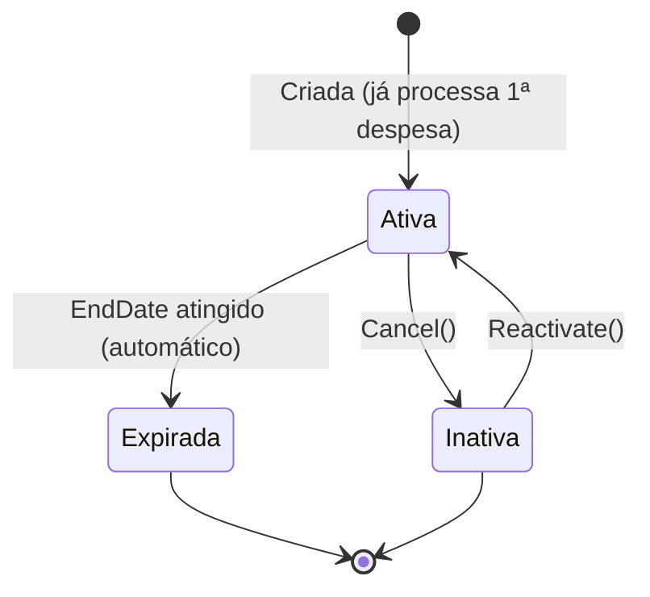
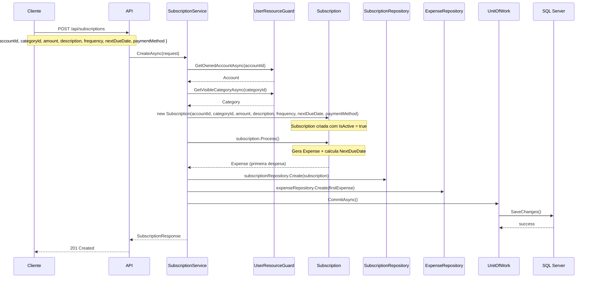
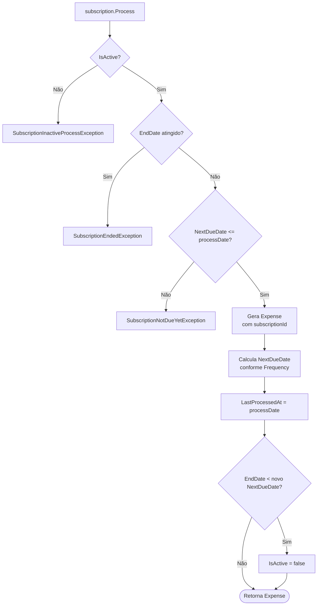

# 🔁 Cenários de Negócio — Assinaturas

> **Camada:** Domain / Application  
> **Cenários:** BZ-11, BZ-12, BZ-13, BZ-14  
> **Entidade:** Subscription, Expense, Account

---

## Índice

1. [BZ-11: Criar assinatura](#bz-11-criar-assinatura)
2. [BZ-12: Processar ciclo de assinatura](#bz-12-processar-ciclo-de-assinatura)
3. [BZ-13: Cancelar assinatura](#bz-13-cancelar-assinatura)
4. [BZ-14: Reativar assinatura](#bz-14-reativar-assinatura)

---

## Diagrama de Ciclo de Vida da Assinatura



---

## BZ-11: Criar assinatura

### Descrição
Usuário cria uma assinatura recorrente. **Já gera a primeira despesa automaticamente.**

### Fluxo Principal



### Regras de Negócio

| Regra | Exceção |
|-------|---------|
| AccountId obrigatório e deve pertencer ao usuário | `KeyNotFoundException` |
| CategoryId obrigatório | `SubscriptionCategoryRequiredException` |
| Amount > 0 | `SubscriptionAmountMustBePositiveException` |
| Description obrigatória, max 200 chars | `SubscriptionDescriptionInvalidException` |
| Se for crédito, CardId obrigatório | `SubscriptionCardRequiredException` |
| Se não for crédito, CardId deve ser null | `SubscriptionCardOnlyForCreditCardPaymentException` |

### Efeitos Colaterais

| Efeito | Detalhes |
|--------|----------|
| 🆕 **Despesa gerada** | 1ª Expense criada com dueDate = nextDueDate |
| 📅 **NextDueDate avançado** | Calculado conforme a Frequency |
| 💳 **Sem débito automático** | A despesa gerada fica Pending (não debita) |

### Cálculo do NextDueDate (após Process)

| Frequency | Próxima Data |
|-----------|-------------|
| `Weekly` | current + 7 dias |
| `Biweekly` | current + 15 dias |
| `Monthly` | current + 1 mês |
| `Bimonthly` | current + 2 meses |
| `Quarterly` | current + 3 meses |
| `Semiannual` | current + 6 meses |
| `Yearly` | current + 1 ano |

### Request de Exemplo

```json
{
  "accountId": "3fa85f64-...",
  "categoryId": "28e61ce8-...",
  "amount": 29.90,
  "description": "Netflix",
  "frequency": "Monthly",
  "nextDueDate": "2026-08-15T00:00:00Z",
  "paymentMethod": "CreditCard"
}
```

---

## BZ-12: Processar ciclo de assinatura

### Descrição
Processa o vencimento da assinatura, gerando uma nova despesa e avançando a data. Este processo normalmente ocorre automaticamente ou pode ser chamado sob demanda.

### Fluxo

```
subscription.Process(processingDate?)
```



### Regras

| Regra | Exceção |
|-------|---------|
| Assinatura deve estar ativa | `SubscriptionInactiveProcessException` |
| Não pode processar após EndDate | `SubscriptionEndedException` |
| Não pode processar antes do vencimento | `SubscriptionNotDueYetException(NextDueDate)` |

### Efeitos Colaterais
- Nova `Expense` gerada com `SubscriptionId` vinculado
- `LastProcessedAt` atualizado
- `NextDueDate` avançado conforme frequência
- Se `EndDate` foi atingido, `IsActive = false`

---

## BZ-13: Cancelar assinatura

### Descrição
Usuário desativa uma assinatura. Ela para de gerar novas despesas.

### Fluxo

```
DELETE /api/subscriptions/{id}
```

1. `Repository.GetByIdAsync(id)` → `KeyNotFoundException` se não existir
2. `subscription.Cancel()` → `IsActive = false`
3. `Commit()`

### Regras

| Regra | Descrição |
|-------|-----------|
| Assinatura não é removida do banco | Apenas `IsActive = false` |
| Despesas já geradas continuam existindo | Não afeta Expenses já criadas |
| Subscription pode ser reativada | Até o EndDate |

---

## BZ-14: Reativar assinatura

### Descrição
Usuário reativa uma assinatura que estava inativa.

### Fluxo

```
subscription.Reactivate(newNextDueDate?)
```

1. Verifica se `EndDate` não foi atingido → `SubscriptionCannotReactivateAfterEndDateException`
2. `IsActive = true`
3. Se `newNextDueDate` foi informado → usa esse valor
4. Se não foi informado e `NextDueDate < today` → recalcula a partir de hoje

### Regras

| Regra | Exceção |
|-------|---------|
| Não pode reativar se EndDate já passou | `SubscriptionCannotReactivateAfterEndDateException` |

> ⚠️ **Nota:** Não há um endpoint REST dedicado para reativação. A reativação pode ser feita via `SubscriptionService.UpdateAsync` definindo `IsActive = true`.

---

## Mapa de Endpoints

| Cenário | Método | Endpoint | Controller |
|---------|--------|----------|------------|
| BZ-11 | `POST` | `/api/subscriptions` | SubscriptionsController |
| BZ-12 | — | (via domain, não exposto) | — |
| BZ-13 | `DELETE` | `/api/subscriptions/{id}` | SubscriptionsController |
| BZ-14 | `PUT` | `/api/subscriptions/{id}` (com `isActive: true`) | SubscriptionsController |

---

> **Próximo:** [Parcelamentos](04-instalmentos.md)
