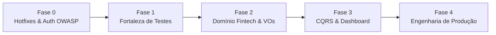

# 📋 Master Checklist de Evolução — Monetis

> **Documento Único de Controle e Rastreamento**  
> **Objetivo:** Centralizar em um único lugar o status real do projeto, bugs pendentes, novas funcionalidades de fintech, melhorias de arquitetura e a trilha prática passo a passo para o seu laboratório pessoal de desenvolvimento.  
> **Status do Repositório:** Em desenvolvimento ativo — foco em escrita manual e Clean Architecture em .NET 10.

---

## 🗺️ Visão Geral das Fases

---

## 🟢 1. Onde Estou (Concluído & Validado no Código)

Itens que já foram implementados e validados diretamente no repositório:

- [x] **SDK travado:** `global.json` configurado na versão `10.0.111` com `latestFeature`.
- [x] **Padronização de código:** `.editorconfig` completo com regras C# 13 e estilo de codificação.
- [x] **Centralização de compilação:** `Directory.Build.props` com `<TreatWarningsAsErrors>true</TreatWarningsAsErrors>`, `Nullable: enable`, `AnalysisLevel: latest` e `AnalysisMode: Recommended`.
- [x] **Central Package Management (CPM):** `Directory.Packages.props` centralizando versões de todos os pacotes NuGet.
- [x] **Stack de Testes Unitários configurada:** `xunit`, `xunit.runner.visualstudio` e `FluentAssertions (7.2.0)` configurados com global usings no projeto `tests/Monetis.Domain.Tests`.
- [x] **B-001 (UnitOfWork):** `IUnitOfWork` limpo (remoção de `IDisposable`), delegando o ciclo de vida ao container de injeção de dependência do ASP.NET Core.
- [x] **B-002 (Alteração de Senha):** `UserAuthService.ChangePasswordLoggedInAsync` corrigido para buscar por `UserId` (`GetByIdAsync`), com adição de `userRepository.Update(user)` e criação do fluxo `ChangePasswordLoggedOutAsync`.
- [x] **Exceptions genéricas em Services:** `ExpenseService`, `CardService` e `CategoryService` atualizados para lançar `KeyNotFoundException` específica em vez de `Exception` genérica.
- [x] **Otimização de Regex:** `User.EmailRegex` refatorado para método parcial com `[GeneratedRegex]`.
- [x] **Performance de Multi-Tenancy:** `ModelBuilderExtensions` otimizado com cache estático de `MethodInfo` para filtros globais de query.

---

## 🔴 2. Fase 0 — Hotfixes Críticos & Segurança Imediata

Correções pontuais e segurança de sessão antes de refatorações estruturais.

### 2.1 Segurança & Multi-Tenancy
- [ ] **B-008 — Validação de Ownership no `UserResourceGuard`:**
  - *Arquivo:* `src/Monetis.Application/Services/UserResourceGuard.cs`
  - *Problema:* `GetOwnedAccountAsync` e `GetOwnedCardAsync` buscam a entidade mas nunca validam `entity.UserId != CurrentUserId`.
  - *Ação:* Adicionar `if (account.UserId != CurrentUserId) throw new KeyNotFoundException(...);` em ambos os métodos.
- [ ] **SEC-001 & SEC-002 — Endpoints de Usuários (`UsersController`):**
  - *Arquivo:* `src/Monetis.API/Controllers/UsersController.cs`
  - *Ação:* Remover o endpoint `GET /api/users` (GetAll) ou restringi-lo a Admin; adicionar verificação `if (id != UserId) return Forbid();` nos métodos `GetById`, `Update` e `Delete`.
- [ ] **SEC-006 — Chave JWT Fail-Fast:**
  - *Arquivo:* `src/Monetis.Infrastructure/Security/TokenService.cs`
  - *Ação:* Lançar exceção clara no startup ou na geração caso `jwtKey.Length < 32`.
- [ ] **SEC-008 — Vazamento de `UserId` nos DTOs:**
  - *Arquivos:* `AccountDtos.cs`, `CardDtos.cs`, `CategoryDtos.cs`
  - *Ação:* Remover `UserId` dos DTOs de resposta públicos.

### 2.2 Autenticação Avançada (Refresh Tokens com Rotação - Padrão OWASP)
- [ ] **Redução da Validade do JWT:** Reduzir o tempo de expiração do access token de 2 dias para **15 minutos**.
- [ ] **Tabela `RefreshTokens`:**
  - Criar entidade `RefreshToken` (`Id`, `UserId`, `TokenHash`, `ExpiresAt`, `CreatedAt`, `RevokedAt`, `ReplacedByTokenHash`).
  - Suporte a múltiplos dispositivos (celular, web, etc.).
- [ ] **Rotação de Tokens & Detecção de Roubo:**
  - Endpoint `POST /api/auth/refresh`: gera novo par (JWT + RefreshToken) e revoga o anterior.
  - Se um token já revogado for reutilizado, revoga imediatamente todas as sessões ativas do usuário (detecção de replay attack).
- [ ] **Endpoint `POST /api/auth/revoke`:** Permite logout explícito revogando o refresh token.

### 2.3 Bugs Funcionais & Pipeline HTTP
- [ ] **B-004 — Propagação de Campos no Update de Assinatura:**
  - *Arquivos:* `SubscriptionDtos.cs`, `SubscriptionService.cs`, `SubscriptionValidator.cs`
  - *Ação:* Incluir campos opcionais em `UpdateSubscriptionRequest` (`PaymentMethod`, `AccountId`, `CardId`, `EndDate`) e repassar na chamada `subscription.Update(...)`.
- [ ] **B-007 — Remoção de `catch (Exception)` nos Controllers:**
  - *Arquivos:* `ExpensesController.cs` e `IncomesController.cs`
  - *Ação:* Deletar os blocos `catch (Exception ex)` locais e deixar o `ExceptionMiddleware` tratar de forma centralizada.
- [ ] **M-07 / BUG-006 — Mapeamento 401 no `ExceptionMiddleware`:**
  - *Arquivo:* `src/Monetis.API/Middlewares/ExceptionMiddleware.cs`
  - *Ação:* Adicionar caso para `UnauthorizedAccessException => (StatusCodes.Status401Unauthorized, exception.Message, "UNAUTHORIZED")`.
- [ ] **ARC-001 — Limpeza de Injeção Duplicada de `UserContext`:**
  - *Arquivo:* `src/Monetis.API/Program.cs`
  - *Ação:* Remover registro redundante na linha 20 (já existente em `Infrastructure/DependencyInjection.cs`).
- [ ] **B-003 — Limpeza de Rate Limiting:**
  - *Arquivo:* `src/Monetis.API/Middlewares/RateLimitingMiddleware.cs`
  - *Ação:* Deletar o middleware customizado não registrado e ativar a política nativa nos controllers com `.RequireRateLimiting("GlobalPolicy")`.
- [ ] **B-005 & B-006 — Comparação de Vencimento e Justificativa de Filtro:**
  - *Arquivos:* `Expense.cs` e `ExpenseRepository.cs`
  - *Ação:* Padronizar comparação por data (`DueDate.Date <= DateTime.UtcNow.Date`) e adicionar comentário justificando o uso intencional de `IgnoreQueryFilters()`.

### 2.4 Unificação de Limites de Strings (Integridade no Banco)
- [ ] **B-010 — Descrição de Transação:** Alterar `TransactionConfiguration.cs` para `nvarchar(200)` e gerar migration.
- [ ] **B-011 — Descrição de Assinatura:** Padronizar em 100 caracteres (`SubscriptionConfiguration.cs` para `nvarchar(100)` e `Subscription.cs` `<= 100`).
- [ ] **CODE-012 — Nome de Conta:** Alinhar `AccountValidator.cs` para `MaximumLength(25)` para coincidir com a entidade.
- [ ] **ARC-007 — Validação em `Category.Update`:** Chamar `ValidateCategory(name, icon)` no método de atualização.

---

## 🛡️ 3. Fase 1 — Qualidade & Fortaleza de Testes (TDD)

Rede de segurança fundamental do projeto. Cada funcionalidade deve nascer acompanhada de testes.

### 3.1 Testes Unitários de Domínio (`tests/Monetis.Domain.Tests`)
- [ ] **Missão A1 — Testes da Entidade `Account` (`AccountTests.cs`):**
  - Criação com saldo zero e propriedades válidas.
  - Exceções de validação: nome nulo/vazio e nome > 25 caracteres.
  - `Deposit` positivo aumenta saldo; valor <= 0 lança `AccountAmountMustBePositiveException`.
  - `Withdraw` positivo diminui saldo; validação de saldo negativo (`IsNegative` e `GetNegativeAmount`).
  - `AdjustBalance` com motivo >= 5 caracteres altera saldo; motivo inválido falha.
- [ ] **Missão A2 — Cenários Parametrizados com `[Theory]`:**
  - `ExpenseInstallmentTests.cs`:
    - Parcelamentos válidos (2x, 6x, 12x, 24x).
    - Intervalo inválido (< 2x ou > 24x) lança `ExpenseInstallmentRangeException`.
    - **O Teste do Centavo:** R$ 100,00 em 3x deve gerar 1ª parcela de R$ 33,34 e outras duas de R$ 33,33 (soma exata de R$ 100,00).
    - Sufixo `(i/N)` na descrição.
  - `TransferTests.cs`:
    - Transferência debita origem e credita destino.
    - Cancelamento no mesmo dia reverte saldos; após o mesmo dia lança `TransferCancelExpiredException`.
    - Transferência cancelada bloqueia novas alterações.
  - `SubscriptionTests.cs`:
    - Método `Process()` avança `NextDueDate` por frequência (`Daily`, `Weekly`, `Monthly`, `Yearly`).
    - Geração da primeira despesa vinculada.
    - Limite de `EndDate` atingido inativa a assinatura.
- [ ] **Demais Entidades:**
  - `UserTests.cs` (validação de e-mail, nomes, troca de senha).
  - `CategoryTests.cs` e `CardTests.cs` (validações de criação e atualização).

### 3.2 Testes de Aplicação (`tests/Monetis.Application.Tests`)
- [ ] Criar projeto de testes para a camada Application.
- [ ] Configurar fakes/mocks usando **NSubstitute** e **FluentAssertions**.
- [ ] Testar serviços orquestradores (`AccountService`, `ExpenseService`, `TransferService`, `SubscriptionService`):
  - Caminho feliz de cada caso de uso.
  - Comportamento ao não encontrar recurso (`KeyNotFoundException`).
  - Verificação de chamada atômica ao `unitOfWork.CommitAsync()`.
- [ ] Testes isolados de todos os validadores FluentValidation (`AccountValidator`, `ExpenseValidator`, etc.).

### 3.3 Testes de Arquitetura (`tests/Monetis.Architecture.Tests`)
- [ ] Criar projeto de testes de arquitetura com pacote `NetArchTest.Rules`.
- [ ] Provar que `Monetis.Domain` não possui nenhuma dependência externa de projeto.
- [ ] Provar que `Monetis.Application` referencia apenas `Domain`.
- [ ] Provar que `Monetis.Infrastructure` não é referenciada por `Application` nem por `Domain`.
- [ ] Provar que todas as entidades herdam de `BaseEntity` ou `UserOwnedEntity`.

### 3.4 Testes de Integração com SQL Server Real (`tests/Monetis.API.IntegrationTests`)
- [ ] Criar projeto com `Microsoft.AspNetCore.Mvc.Testing` (`WebApplicationFactory<Program>`).
- [ ] Integrar **Testcontainers** com imagem `mcr.microsoft.com/mssql/server:2022-latest`.
- [ ] Rodar migrations automaticamente no container antes dos testes.
- [ ] **Teste de Fogo de Multi-Tenancy:** Garantir que o Usuário A nunca consegue ler ou alterar dados do Usuário B via API.
- [ ] Fluxo completo de autenticação (Cadastro -> Login -> Token JWT -> Chamada autenticada).

---

## 💳 4. Fase 2 — Domínio Fintech Rico & Value Objects

Evoluir as entidades do Monetis para refletirem o funcionamento real de um banco digital e eliminar tipos primitivos crus.

### 4.1 Value Objects (Combater Primitive Obsession)
- [ ] **Value Object `Money` (`src/Monetis.Domain/ValueObjects/Money.cs`):**
  - Encapsula valor decimal com 2 casas decimais e validações.
  - Operadores sobrecarregados (`+`, `-`, `*`, `/`, `>`, `<`).
  - Métodos utilitários: `IsZero`, `IsPositive`, `Abs`.
  - Configurar **Value Converter** no EF Core (`HasConversion(...)`).
  - Migrar `Account.Balance` e `Transaction.Amount`.
- [ ] **Value Object `Email` (`src/Monetis.Domain/ValueObjects/Email.cs`):**
  - Garante formato válido e normalização em minúsculas na criação.
- [ ] **Value Object `Description` / `AccountName`:**
  - Torna-se a fonte única da verdade para tamanhos máximos de texto.

### 4.2 Inteligência no Cartão de Crédito & Faturas (`Card` e `CardInvoice`)
- [ ] **Evolução da Entidade `Card`:**
  - Adicionar propriedades: `Limit` (limite total), `ClosingDay` (1 a 31) e `DueDay` (1 a 31).
  - Método de domínio para calcular `AvailableLimit` (Limite menos despesas da fatura aberta e parcelas futuras).
  - Validação: não permitir compras que excedam o limite disponível.
- [ ] **Entidade de Primeira Classe `CardInvoice` (Fatura de Cartão):**
  - Propriedades: `CardId`, `Month`, `Year`, `ClosingDate`, `DueDate`, `TotalAmount`, `PaidAmount`, `Status` (`Open`, `Closed`, `Paid`, `Overdue`).
  - Associação com `Expense`: despesas no cartão vinculam-se à fatura aberta correspondente.
  - Operações de domínio:
    - `Close()`: Fecha a fatura na data de fechamento, congelando os lançamentos.
    - `Pay(Account account, decimal amount)`: Liquida a fatura total ou parcialmente, gerando débito na conta informada.

### 4.3 Orçamentos por Categoria (`Budget`)
- [ ] **Entidade `Budget`:**
  - Propriedades: `CategoryId`, `Month`, `Year`, `AmountLimit`, `UserId`.
  - Métodos para consulta: cálculo de `SpentAmount` (somatório de despesas da categoria no mês), `RemainingAmount` e `PercentageUsed`.
  - Regra de domínio: alerta quando os gastos ultrapassam 80% e 100% do teto estipulado.

### 4.4 Metas Financeiras / Cofrinhos (`FinancialGoal` / Caixinhas)
- [ ] **Entidade `FinancialGoal`:**
  - Propriedades: `Name`, `TargetAmount`, `CurrentAmount`, `TargetDate`, `AccountId` (conta de vínculo).
  - Operação `Deposit(Account account, decimal amount)`: Realiza débito real na conta de origem (`account.Withdraw`) e soma ao saldo da meta.
  - Operação `Withdraw(Account account, decimal amount)`: Retira da meta e devolve o saldo para a conta informada (`account.Deposit`).
  - Validação: impede saques de valor superior ao saldo acumulado na meta.

### 4.5 Receitas Recorrentes (`RecurringIncome` — Salário Automático)
- [ ] **Entidade `RecurringIncome`:**
  - Espelha a arquitetura de `Subscription` para receitas.
  - Propriedades: `AccountId`, `CategoryId`, `Amount`, `Description`, `Frequency`, `NextDueDate`, `IsActive`.
  - Método `Process()`: Gera a receita correspondente, avança a data e deposita na conta.
- [ ] **Background Service:** Serviço agendado para processar automaticamente receitas recorrentes vencidas (ex: salário no 5º dia útil).

### 4.6 Sistema de Classificação Transversal (`Tag`)
- [ ] **Entidade `Tag`:** `Name`, `Color`, `UserId`.
- [ ] **Relacionamento Many-to-Many:** Vínculo de tags com `Transaction` (permitindo filtrar despesas como `#viagem`, `#trabalho`, etc.).

---

## 📊 5. Fase 3 — CQRS com MediatR & Dashboard Analítico

Separar escrita (Commands) de leitura (Queries) e disponibilizar métricas financeiras de alta velocidade.

### 5.1 Pipeline MediatR & Handlers
- [ ] Adicionar pacote `MediatR` em `Monetis.Application`.
- [ ] **ValidationBehavior:** Executa automaticamente validadores FluentValidation antes do handler.
- [ ] **LoggingBehavior:** Mede duração de execução de cada comando/query com `Stopwatch`.
- [ ] **TransactionBehavior:** Coordena o `CommitAsync()` automático em comandos que alteram estado.
- [ ] Migração de Controllers para despachar via `Mediator.Send(...)`.

### 5.2 Serviço de Leitura Dedicado (`IDashboardQueryService`)
- [ ] Criar serviço analítico com consultas otimizadas usando EF Core `AsNoTracking()` e projeção direta para DTO:
  - **`GET /api/dashboard/summary`:** Saldo total consolidado, total de receitas do mês, total de despesas do mês e saldo líquido.
  - **`GET /api/dashboard/category-spending`:** Somatório de despesas agrupadas por categoria com cálculo percentual.
  - **`GET /api/dashboard/upcoming-bills`:** Listagem de despesas, assinaturas e faturas a vencer nos próximos 7, 15 ou 30 dias.
  - **`GET /api/reports/monthly?year=&month=`:** Relatório contábil consolidado do mês para impressão/exportação.

---

## 🚀 6. Fase 4 — Engenharia de Produção ("Projeto Buffado")

Padrões corporativos de confiabilidade, observabilidade e infraestrutura.

### 6.1 Soft Delete & Auditoria Automática (EF Core Interceptor)
- [ ] **Auditoria Temporal em `BaseEntity`:** Propriedades `CreatedAt` e `UpdatedAt`.
- [ ] **Soft Delete em `BaseEntity`:** Propriedades `IsDeleted` e `DeletedAt`.
- [ ] **`SaveChangesInterceptor` Automático:**
  - Intercepta `EntityState.Deleted` e transforma em `EntityState.Modified` com `IsDeleted = true` e `DeletedAt = DateTime.UtcNow`.
  - Intercepta `EntityState.Added` e preenche `CreatedAt = DateTime.UtcNow`.
  - Intercepta `EntityState.Modified` e atualiza `UpdatedAt = DateTime.UtcNow`.
- [ ] **Filtro Global:** Integrar `e => !e.IsDeleted` no `ApplyMultiTenantFilters` para que consultas nunca retornem registros deletados acidentalmente.

### 6.2 Observabilidade & Resiliência
- [ ] **Logging Estruturado com Serilog:** Output em JSON formatado com `UserId`, `CorrelationId` e rota.
- [ ] **Health Checks (`/health`):** Verificação de conectividade com o SQL Server.
- [ ] **Concorrência Otimista em `Account`:** Coluna `[Timestamp] public byte[] RowVersion { get; private set; }` para evitar lost updates em débitos concorrentes.
- [ ] **Transações Explícitas de Banco:** Uso de `IDbContextTransaction` em operações compostas (`TransferService`, pagamento de fatura, aportes em metas).
- [ ] **Retry Policy:** `EnableRetryOnFailure()` ativado na conexão do EF Core.

### 6.3 Confiabilidade na API & Recursos Extras
- [ ] **Chave de Idempotência (`Idempotency-Key`):** Header HTTP em endpoints transacionais para evitar duplicações em retries de rede.
- [ ] **Problem Details (RFC 7807):** Formato padrão da indústria para retorno de erros na API.
- [ ] **Response Compression:** Compactação Gzip/Brotli para payloads JSON.
- [ ] **Paginação Padrão (`PagedResult<T>`):** Em todas as consultas de listagem (`Page`, `PageSize`, `TotalPages`).
- [ ] **Exportação de Dados Financeiros:** Endpoints para download de extratos em formato CSV e OFX.
- [ ] **Segurança HTTP:** Configuração de Security Headers (`X-Frame-Options`, `CSP`), HSTS e CORS restritivo.
- [ ] **Pipeline CI/CD no GitHub Actions:** Workflow `.github/workflows/ci.yml` automatizando restore, build (warnings as errors) e testes unitários/integração.
