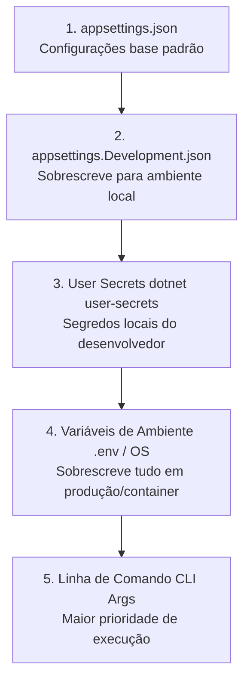

# 📐 Guia de Padrões, Governança e Configurações — Monetis

> **Objetivo:** Estabelecer as convenções, ferramentas de governança de código e estratégias profissionais de configuração e gestão de segredos utilizadas em times de alta maturidade no ecossistema .NET.

---

## 🗺️ Índice

1. [Hierarquia de Configurações e Gestão de Segredos (.NET vs .env)](#1-hierarquia-de-configurações-e-gestão-de-segredos-net-vs-env)
2. [Padronização de Código com `.editorconfig`](#2-padronização-de-código-com-editorconfig)
3. [Centralização de Build com `Directory.Build.props`](#3-centralização-de-build-com-directorybuildprops)
4. [Central Package Management (CPM) com `Directory.Packages.props`](#4-central-package-management-cpm-com-directorypackagesprops)
5. [Controle de SDK com `global.json`](#5-controle-de-sdk-com-globaljson)
6. [Análise Estática de Código (Roslyn Analyzers & Linter)](#6-análise-estática-de-código-roslyn-analyzers--linter)
7. [Automação e Git Hooks (Husky.Net & `dotnet format`)](#7-automação-e-git-hooks-huskynet--dotnet-format)
8. [Padrões de Commits (Conventional Commits)](#8-padrões-de-commits-conventional-commits)
9. [Checklist Geral de Governança para o Monetis](#9-checklist-geral-de-governança-para-o-monetis)

---

## 1. Hierarquia de Configurações e Gestão de Segredos (.NET vs .env)

No ecossistema .NET, as configurações seguem uma **cadeia hierárquica cumulativa com sobreposição (override)**. 

### 1.1 A Ordem de Precedência Padrão do ASP.NET Core



O valor que está mais abaixo na cadeia **sempre vence** e substitui o anterior.

---

### 1.2 Por que não se deve comitar segredos no `appsettings.json`?
O `appsettings.json` é versionado no Git. Se você colocar uma senha de banco ou chave JWT real nele, essa credencial ficará gravada no histórico para sempre.

**Boa prática:**
* `appsettings.json` $\rightarrow$ Valores genéricos ou vazios (placeholders).
* `appsettings.Development.json` $\rightarrow$ Configurações de desenvolvimento local (banco Docker local, log verbose).
* **Para senhas e chaves locais:** Usar o **.NET User Secrets**.
* **Para containers/nuvem:** Usar **Variáveis de Ambiente** ou arquivos `.env`.

---

### 1.3 Como transformar `.env` em Variáveis do .NET (A Regra dos Dois Underscores `__`)

No .NET, a hierarquia de objetos do JSON é convertida em variáveis de ambiente trocando o `:` ou a estrutura aninhada por **dois underscores (`__`)**.

#### No JSON (`appsettings.json`):
```json
{
  "ConnectionStrings": {
    "MonetisConnection": "Server=localhost;Database=MonetisDb;..."
  },
  "Jwt": {
    "Key": "MinhaChaveSecreta12345678901234567890",
    "Issuer": "Monetis",
    "Audience": "MonetisUsers"
  }
}
```

#### No arquivo `.env` ou Variáveis de Ambiente do Sistema:
```env
ConnectionStrings__MonetisConnection="Server=localhost;Database=MonetisDb;User Id=sa;Password=SenhaForte123!;TrustServerCertificate=True;"
Jwt__Key="SuaChaveSuperSecretaComNoMinimo32Caracteres!"
Jwt__Issuer="Monetis"
Jwt__Audience="MonetisUsers"
```

O ASP.NET Core faz o binding automático dessas variáveis para `builder.Configuration["Jwt:Key"]` ou `builder.Configuration.GetConnectionString("MonetisConnection")` de forma transparente.

---

### 1.4 Três formas de usar `.env` e Segredos no dia a dia

#### Opção A: O jeito nativo do .NET — `dotnet user-secrets` (Recomendado para Dev Local)
Não cria nenhum arquivo dentro do projeto, salvando os segredos fora da pasta do repositório (na pasta do usuário no Windows/Linux):
```bash
# Habilitar no projeto da API
dotnet user-secrets init --project src/Monetis.API

# Adicionar segredos sem comitar no Git
dotnet user-secrets set "ConnectionStrings:MonetisConnection" "Server=localhost;Database=MonetisDb;..." --project src/Monetis.API
dotnet user-secrets set "Jwt:Key" "ChaveSeguraLocalDe32CaracteresMinimo!" --project src/Monetis.API
```

#### Opção B: Usar `.env` com Docker Compose (Recomendado para Containers)
Crie um arquivo `.env` na raiz (adicionado ao `.gitignore`) e um `.env.example` versionado. O `docker-compose.yml` carrega as variáveis automaticamente:
```yaml
# docker-compose.yml
services:
  monetis-api:
    image: monetis-api
    environment:
      - ConnectionStrings__MonetisConnection=${ConnectionStrings__MonetisConnection}
      - Jwt__Key=${Jwt__Key}
```

#### Opção C: Usar o pacote `DotNetEnv` (Se quiser que o .NET leia `.env` no startup)
Se você preferir que o próprio .NET leia um arquivo `.env` local na raiz:
1. Instale o pacote: `dotnet add src/Monetis.API package DotNetEnv`
2. No início do `Program.cs`:
   ```csharp
   DotNetEnv.Env.Load();
   ```

---

## 2. Padronização de Código com `.editorconfig`

O `.editorconfig` garante que todos os desenvolvedores e IDEs (Rider, Visual Studio, VS Code) usem as mesmas regras de código.

### Exemplo de `.editorconfig` recomendado para o Monetis:
```ini
# Configuração raiz
root = true

[*]
indent_style = space
indent_size = 4
end_of_line = lf
charset = utf-8
trim_trailing_whitespace = true
insert_final_newline = true

[*.cs]
# Convenções C#
csharp_style_var_for_built_in_types = true:suggestion
csharp_style_var_when_type_is_apparent = true:suggestion
dotnet_style_qualification_for_field = false:suggestion
dotnet_style_qualification_for_property = false:suggestion

# Naming Conventions (Regras de Nomes)
dotnet_naming_rule.interface_should_be_prefixed_with_i.severity = warning
dotnet_naming_rule.interface_should_be_prefixed_with_i.symbols = interface_types
dotnet_naming_rule.interface_should_be_prefixed_with_i.style = prefix_with_i

dotnet_naming_symbols.interface_types.applicable_kinds = interface
dotnet_naming_style.prefix_with_i.required_prefix = I
dotnet_naming_style.prefix_with_i.capitalization = pascal_case

# Campos privados devem começar com _ (ex: _repository)
dotnet_naming_rule.private_fields_should_begin_with_underscore.severity = suggestion
dotnet_naming_rule.private_fields_should_begin_with_underscore.symbols = private_fields
dotnet_naming_rule.private_fields_should_begin_with_underscore.style = begin_with_underscore

dotnet_naming_symbols.private_fields.applicable_kinds = field
dotnet_naming_symbols.private_fields.applicable_accessibilities = private
dotnet_naming_style.begin_with_underscore.required_prefix = _
dotnet_naming_style.begin_with_underscore.capitalization = camel_case
```

---

## 3. Centralização de Build com `Directory.Build.props`

Em vez de repetir configurações em cada `.csproj` (`Monetis.Domain.csproj`, `Monetis.Application.csproj`, etc.), crie um único arquivo `Directory.Build.props` na raiz.

```xml
<Project>
  <PropertyGroup>
    <TargetFramework>net10.0</TargetFramework>
    <Nullable>enable</Nullable>
    <ImplicitUsings>enable</ImplicitUsings>
    <TreatWarningsAsErrors>true</TreatWarningsAsErrors>
    <AnalysisLevel>latest-recommended</AnalysisLevel>
    <EnforceCodeStyleInBuild>true</EnforceCodeStyleInBuild>
  </PropertyGroup>
</Project>
```

> **Por que `<TreatWarningsAsErrors>true</TreatWarningsAsErrors>` é incrível?**  
> Ele impede que qualquer aviso de código (warning) seja ignorado. Se você deixar uma variável nula sem tratamento ou um import não utilizado, a compilação falha na hora, forçando disciplina e qualidade de código contínua.

---

## 4. Central Package Management (CPM) com `Directory.Packages.props`

Em soluções com vários projetos, cada `.csproj` costuma ter versões diferentes do mesmo pacote NuGet (ex: EF Core 10.0.0 em um e 10.0.2 em outro).

O **Central Package Management (CPM)** é o padrão corporativo moderno da Microsoft para definir as versões dos pacotes em **um único arquivo central**.

### Na raiz da solução (`Directory.Packages.props`):
```xml
<Project>
  <PropertyGroup>
    <ManagePackageVersionsCentrally>true</ManagePackageVersionsCentrally>
  </PropertyGroup>
  <ItemGroup>
    <!-- Versões centralizadas -->
    <PackageVersion Include="Microsoft.EntityFrameworkCore" Version="10.0.0" />
    <PackageVersion Include="Microsoft.EntityFrameworkCore.SqlServer" Version="10.0.0" />
    <PackageVersion Include="FluentValidation" Version="11.11.0" />
    <PackageVersion Include="FluentAssertions" Version="8.0.0" />
    <PackageVersion Include="xunit" Version="2.9.3" />
    <PackageVersion Include="NetArchTest.Rules" Version="1.3.2" />
  </ItemGroup>
</Project>
```

### Dentro dos arquivos `.csproj`:
Você apenas referencia o pacote **sem colocar a tag `Version`**:
```xml
<ItemGroup>
  <PackageReference Include="FluentValidation" />
</ItemGroup>
```

---

## 5. Controle de SDK com `global.json`

Garante que qualquer pessoa que clone o repositório ou qualquer pipeline de CI/CD utilize a versão correta do .NET SDK.

```bash
dotnet new globaljson --sdk-version 10.0.100 --roll-forward latestFeature
```

Resultado no `global.json`:
```json
{
  "sdk": {
    "version": "10.0.100",
    "rollForward": "latestFeature"
  }
}
```

---

## 6. Análise Estática de Código (Roslyn Analyzers & Linter)

Adicionar analisadores estáticos no `Directory.Build.props` transforma a compilação em uma revisão automatizada de código.

### Analisadores recomendados:
1. **`SonarAnalyzer.CSharp`** — Detecta bugs de concorrência, code smells, problemas de segurança e más práticas de OO.
2. **`Roslynator.Analyzers`** — Sugere refatorações e simplificações de sintaxe C#.

Adicione ao `Directory.Build.props`:
```xml
<ItemGroup>
  <PackageReference Include="SonarAnalyzer.CSharp" PrivateAssets="all" Condition="$(MSBuildProjectExtension) == '.csproj'" />
</ItemGroup>
```

---

## 7. Automação e Git Hooks (Husky.Net & `dotnet format`)

Para evitar que código fora do padrão seja comitado no Git:

1. **`dotnet format`**: O comando nativo do .NET que ajusta indentação, quebras de linha e regras do `.editorconfig` em toda a solução:
   ```bash
   dotnet format Monetis.slnx
   ```
2. **Husky.Net (Pre-commit Hook)**: Executa o `dotnet format` e os testes unitários automaticamente antes de permitir a conclusão do `git commit`. Se algo estiver errado, o commit é cancelado com um aviso explicativo.

---

## 8. Padrões de Commits (Conventional Commits)

Adotar mensagens de commit padronizadas facilita a geração automática de `CHANGELOG.md` e a leitura do histórico do projeto.

| Tipo | Finalidade | Exemplo |
| :--- | :--- | :--- |
| `feat:` | Nova funcionalidade para o usuário | `feat(expense): adicionar calculo de parcelas com ajuste de centavos` |
| `fix:` | Correção de bug | `fix(uow): implementar dispose correto no unit of work` |
| `test:` | Adição ou refatoração de testes | `test(account): adicionar testes unitarios de deposito e saque` |
| `refactor:` | Mudança de código que não altera comportamento | `refactor(controllers): remover try catch e migrar para exception middleware` |
| `docs:` | Alterações em documentação | `docs: adicionar guia de padroes e governanca` |
| `chore:` | Ajustes de build, configs ou pacotes | `chore: configurar editorconfig e directory build props` |

---

## 9. Checklist Geral de Governança para o Monetis

- [ ] **Configurações & Segredos:**
  - [ ] `.env.example` criado na raiz do repositório.
  - [ ] `.gitignore` conferido para garantir que `.env`, `appsettings.Production.json` e pastas de segredos não sejam comitados.
  - [ ] Segredos locais configurados via `dotnet user-secrets`.
- [ ] **Governança de Código:**
  - [ ] `.editorconfig` criado na raiz.
  - [ ] `Directory.Build.props` criado com `<TreatWarningsAsErrors>true</TreatWarningsAsErrors>`.
  - [ ] `global.json` criado travando o SDK .NET 10.
  - [ ] `SonarAnalyzer.CSharp` ativado para análise estática de código.
- [ ] **Qualidade Contínua:**
  - [ ] `dotnet format` rodando sem erros.
  - [ ] Commits seguindo o padrão Conventional Commits.
