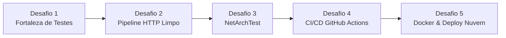

# ⚔️ Trilha de Desafios Práticos — Monetis (Boss Fights)

> **Objetivo:** Uma sequência prática de 5 desafios progressivos para transformar o Monetis em um projeto profissional e resiliente, cobrindo testes unitários, testes de arquitetura, pipeline HTTP limpo, CI/CD no GitHub Actions e deploy conteinerizado.
>
> **Público:** Laboratório de estudos e evolução prática (Estágio ➔ Júnior ➔ Pleno).

---

## 🗺️ Visão Geral da Trilha



---

## 🛡️ Desafio 1: A Fortaleza do Domínio (Testes Unitários & Cenários de Borda)

- **Objetivo Real de Mercado:** Garantir que as regras financeiras críticas (cálculo de saldo, parcelamentos, centavos e estornos) sejam 100% testadas e imunes a regressões.
- **Ferramentas:** `xUnit`, `FluentAssertions`.

### 📦 O que fazer (Passo a Passo)
1. Criar o projeto de testes na pasta `tests/Monetis.Domain.Tests`:
   ```bash
   dotnet new xunit -o tests/Monetis.Domain.Tests
   dotnet sln add tests/Monetis.Domain.Tests/Monetis.Domain.Tests.csproj
   dotnet add tests/Monetis.Domain.Tests reference src/Monetis.Domain/Monetis.Domain.csproj
   dotnet add tests/Monetis.Domain.Tests package FluentAssertions
   ```
2. **Testar `Account` (`AccountTests.cs`):**
   - Depósito positivo aumenta saldo; depósito <= 0 lança `AccountAmountMustBePositiveException`.
   - Saque positivo diminui saldo; saque <= 0 lança `AccountAmountMustBePositiveException`.
   - `AdjustBalance` com justificativa válida atualiza saldo; justificativa curta (< 5 caracteres) lança `AccountAdjustmentReasonInvalidException`.
3. **Testar `Expense.CreateInstallment` com `[Theory]` (`ExpenseInstallmentTests.cs`):**
   - Parcelamentos válidos (ex.: 2x, 6x, 12x, 24x).
   - Tentativa de parcelar em 1x ou mais de 24x deve lançar `ExpenseInstallmentRangeException`.

### 💥 O Teste de Fogo (Como quebrar de propósito)
* **O Bug do Centavo:** Crie um teste com valor total de **R$ 100,00 em 3 parcelas**.
  - A 1ª parcela deve ser **R$ 33,34** e as outras duas **R$ 33,33**.
  - A soma das 3 parcelas geradas deve ser **exatamente R$ 100,00** (nunca R$ 99,99).
* **Validação de Cartão Obrigatório:** Tentar criar parcelamento com `creditCardId` vazio (`Guid.Empty`) deve falhar.

### ✅ Critério de Vitória (DoD)
- [ ] Rodar `dotnet test` e obter 100% dos testes verdes.
- [ ] Nenhum método da entidade `Account` ou regra de parcelamento de `Expense` sem cobertura.

---

## 🧹 Desafio 2: Limpeza do Pipeline HTTP & "Zero try/catch nos Controllers"

- **Objetivo Real de Mercado:** Deixar os Controllers finos (Single Responsibility) e padronizar todas as respostas de erro da API no formato **RFC 7807 (Problem Details)** através de um middleware global.
- **Ferramentas:** ASP.NET Core Middleware, `ProblemDetails`.

### 📦 O que fazer (Passo a Passo)
1. **Limpar os Controllers:**
   - Remover todos os blocos `try/catch` manuais de `ExpensesController`, `IncomesController`, `AccountsController`, etc.
   - O Controller deve conter apenas a chamada ao serviço e o retorno HTTP (`Ok`, `CreatedAtAction`, `NoContent`).
2. **Aprimorar o `ExceptionMiddleware.cs`:**
   - Mapear cada tipo de exceção para seu respectivo status code:
     - `DomainException` ➔ `400 Bad Request` (com código de erro `BUSINESS_ERROR` e mensagem amigável).
     - `ArgumentException` ➔ `400 Bad Request`.
     - `KeyNotFoundException` ➔ `404 Not Found`.
     - `UnauthorizedAccessException` ➔ `401 Unauthorized`.
     - `Exception` (genérica) ➔ `500 Internal Server Error`.
   - Garantir que detalhes sensíveis (StackTrace) só apareçam se `env.IsDevelopment()` for verdadeiro.

### 💥 O Teste de Fogo (Como quebrar de propósito)
* Force um `throw new InvalidOperationException("Erro inesperado no banco")` dentro de um Service.
* Faça a requisição via Swagger/Scalar ou Postman.
* A API **NÃO PODE** responder `400 Bad Request`. Ela deve responder `500 Internal Server Error` com payload JSON padronizado.

### ✅ Critério de Vitória (DoD)
- [ ] Nenhum controller possui `try/catch`.
- [ ] Erros de negócio retornam 400, recursos inexistentes retornam 404 e falhas de sistema retornam 500.

---

## 🏛️ Desafio 3: Testes de Arquitetura (NetArchTest — "O Guardião das Camadas")

- **Objetivo Real de Mercado:** Impedir violações acidentais da Clean Architecture em tempo de compilação/teste (ex.: impedir que o Domínio importe o EF Core ou que a Aplicação dependa da API).
- **Ferramentas:** `NetArchTest.Rules`, `xUnit`.

### 📦 O que fazer (Passo a Passo)
1. Criar o projeto `tests/Monetis.Architecture.Tests`:
   ```bash
   dotnet new xunit -o tests/Monetis.Architecture.Tests
   dotnet sln add tests/Monetis.Architecture.Tests/Monetis.Architecture.Tests.csproj
   dotnet add tests/Monetis.Architecture.Tests package NetArchTest.Rules
   dotnet add tests/Monetis.Architecture.Tests reference src/Monetis.Domain/Monetis.Domain.csproj
   dotnet add tests/Monetis.Architecture.Tests reference src/Monetis.Application/Monetis.Application.csproj
   dotnet add tests/Monetis.Architecture.Tests reference src/Monetis.Infrastructure/Monetis.Infrastructure.csproj
   dotnet add tests/Monetis.Architecture.Tests reference src/Monetis.API/Monetis.API.csproj
   ```
2. **Escrever as regras de arquitetura:**
   - `Domain` não pode depender de `Application`, `Infrastructure` ou `API`.
   - `Application` não pode depender de `Infrastructure` nem de `API`.
   - `Infrastructure` não pode depender de `API`.
   - Todas as classes de entidades devem herdar de `BaseEntity` ou `UserOwnedEntity`.

### 💥 O Teste de Fogo (Como quebrar de propósito)
* Adicione temporariamente um `using Monetis.Infrastructure;` ou crie uma referência indevida dentro de `Monetis.Domain`.
* Execute `dotnet test` e comprove que o teste de arquitetura **falha** imediatamente acusando a violação.

### ✅ Critério de Vitória (DoD)
- [ ] Regras de dependência da Clean Architecture validadas via código.
- [ ] Testes de arquitetura rodando no comando `dotnet test`.

---

## ⚙️ Desafio 4: A Esteira Inquebrável (CI/CD no GitHub Actions)

- **Objetivo Real de Mercado:** Automatizar a validação de cada commit e Pull Request para garantir que nenhum código quebrado chegue à branch principal (`main`).
- **Ferramentas:** GitHub Actions, YAML.

### 📦 O que fazer (Passo a Passo)
1. Criar o arquivo `.github/workflows/ci.yml`:
   - Configurar trigger para `push` e `pull_request` nas branches `main` e `develop`.
   - Configurar o runner com `ubuntu-latest`.
   - Passos:
     1. Checkout do código (`actions/checkout`).
     2. Instalar o .NET SDK 10 (`actions/setup-dotnet`).
     3. Restaurar dependências (`dotnet restore`).
     4. Compilar a solução (`dotnet build --no-restore --configuration Release`).
     5. Executar todos os testes (`dotnet test --no-build --configuration Release --verbosity normal`).
2. Configurar **Branch Protection Rule** no GitHub para exigir que a esteira de CI passe antes do merge.

### 💥 O Teste de Fogo (Como quebrar de propósito)
* Crie uma branch `fix/teste-falha`, altere um teste para falhar (`Assert.True(false)`) e abra um Pull Request.
* Verifique o GitHub Actions bloqueando o merge com status vermelho (❌).
* Corrija o teste, envie novo commit e veja o check ficar verde (✅).

### ✅ Critério de Vitória (DoD)
- [ ] Workflow rodando com sucesso no GitHub Actions.
- [ ] Badge de status de build adicionada ao `README.md` principal do repositório.

---

## 🐳 Desafio 5: Dockerização & Deploy na Nuvem (API no Ar)

- **Objetivo Real de Mercado:** Empacotar a aplicação em containers prontos para produção e publicá-la em um ambiente de nuvem real acessível pela internet.
- **Ferramentas:** Docker, `docker-compose`, Provedor de Cloud (Render, Fly.io, Azure ou Railway).

### 📦 O que fazer (Passo a Passo)
1. **Criar `Dockerfile` multi-stage build para a API:**
   - Estágio de Build: usar imagem SDK do .NET 10.
   - Estágio de Runtime: usar imagem ASP.NET do .NET 10 (enxuta e segura).
2. **Criar `docker-compose.yml` local:**
   - Serviço da API (`Monetis.API`).
   - Serviço de Banco de Dados (`SQL Server` ou `PostgreSQL`).
   - Healthcheck para garantir que a API só inicialize após o banco estar pronto.
3. **Deploy em Nuvem Gratuita/Acessível:**
   - Criar conta no Render/Fly.io/Azure.
   - Configurar as variáveis de ambiente de produção (`ConnectionStrings__MonetisConnection`, `Jwt__Key`, etc.).
   - Publicar e testar.

### 💥 O Teste de Fogo (Como quebrar de propósito)
* Suba a aplicação sem a chave JWT (`Jwt__Key`) configurada e verifique se a API falha no startup com mensagem clara (Fail-Fast), sem ficar rodando em estado zumbi.

### ✅ Critério de Vitória (DoD)
- [ ] `docker compose up --build` sobe todo o ambiente localmente sem erros.
- [ ] Documentação OpenAPI / Scalar acessível publicamente via URL HTTPS na internet.

---

## 🏆 Checklist de Progresso da Trilha

- [ ] **Desafio 1 Concluído:** Testes unitários do domínio verdes (`Account` e `Expense.CreateInstallment`).
- [ ] **Desafio 2 Concluído:** Controllers sem `try/catch` e `ExceptionMiddleware` padronizado.
- [ ] **Desafio 3 Concluído:** Testes de arquitetura `NetArchTest` ativos.
- [ ] **Desafio 4 Concluído:** GitHub Actions validando PRs automaticamente.
- [ ] **Desafio 5 Concluído:** Container Docker funcional e API rodando na nuvem.
